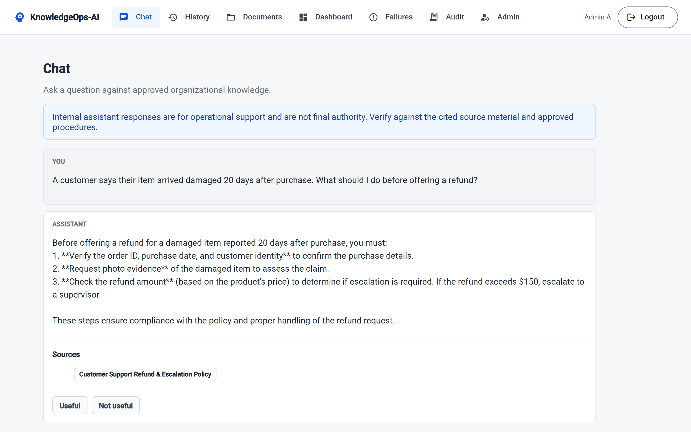
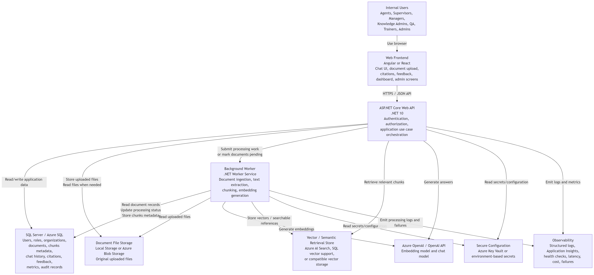
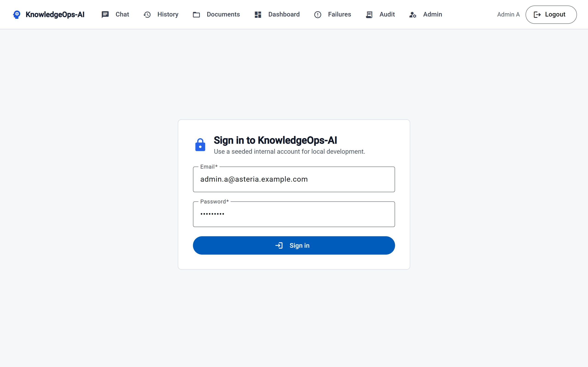
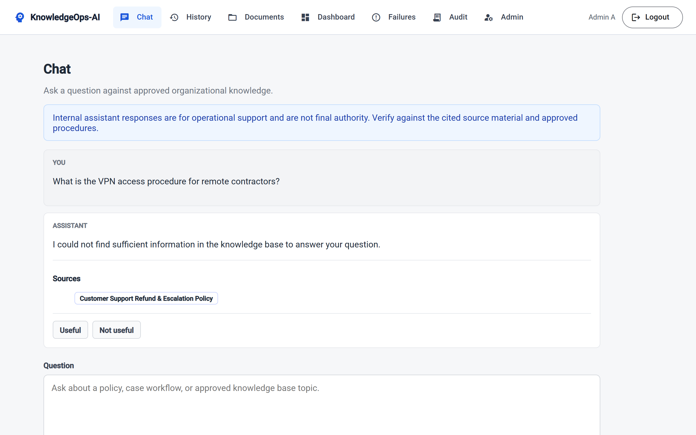
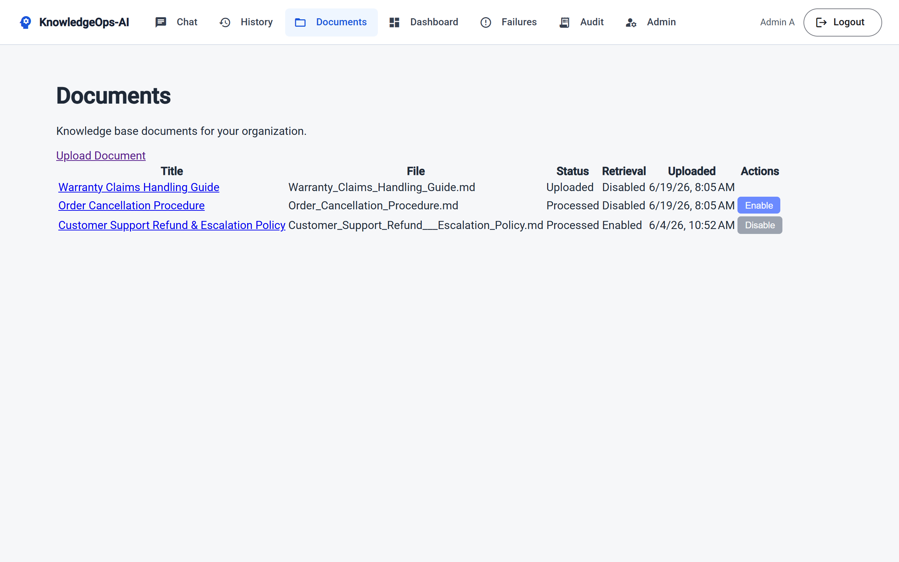
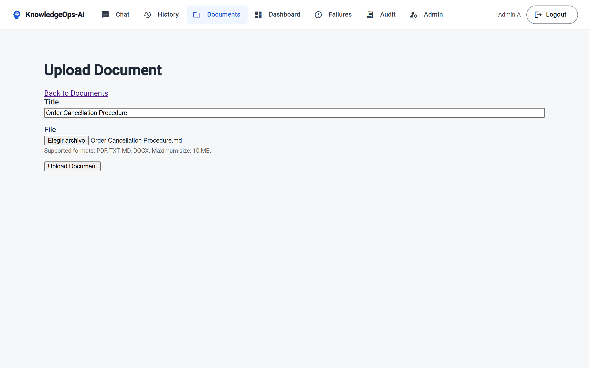
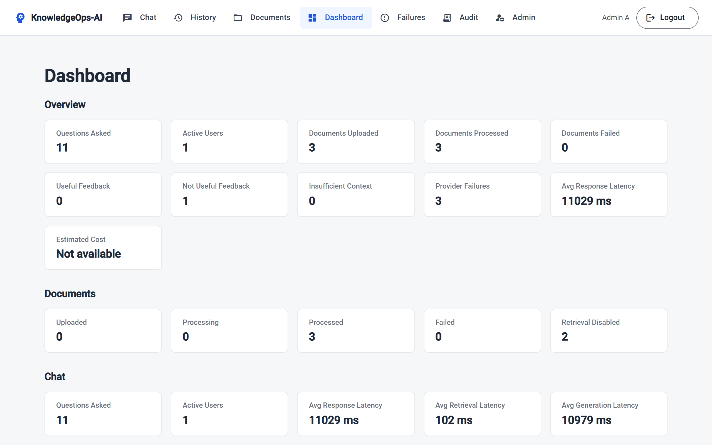
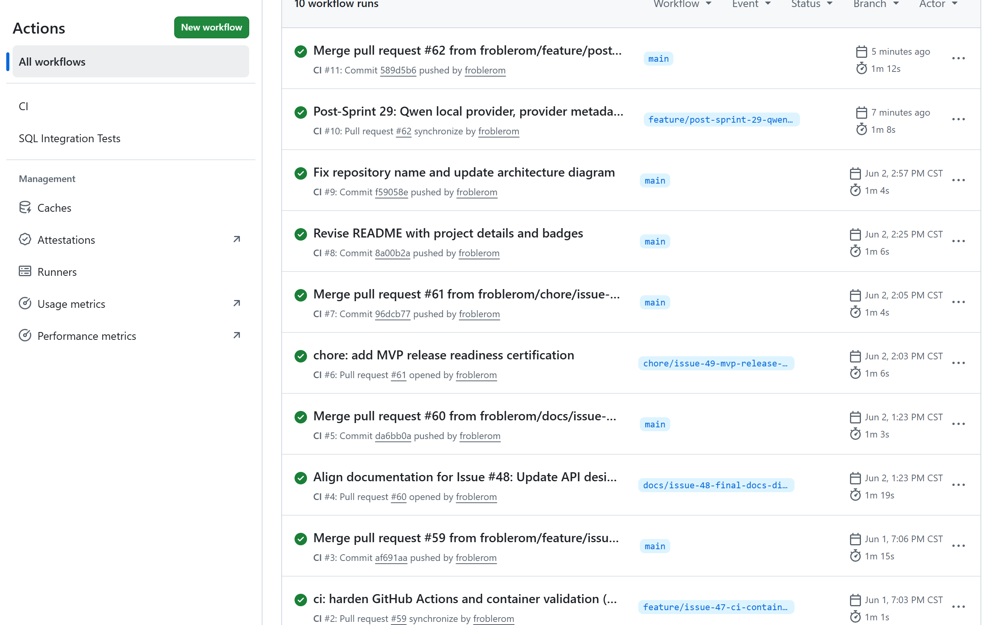

# KnowledgeOps-AI

> An enterprise-grade AI knowledge assistant for contact centers — built with .NET 10, Angular, SQL Server, and RAG.

[](https://github.com/froblerom/knowledgeops-ai/actions/workflows/ci.yml)
[](https://dotnet.microsoft.com/)
[](https://angular.dev/)
[](https://www.microsoft.com/en-us/sql-server)
[](https://www.docker.com/)

KnowledgeOps-AI helps contact center teams turn fragmented internal documentation into a reliable, conversational, and cited knowledge assistant. Agents ask questions in plain language; the system retrieves relevant document sections, generates grounded AI answers, and shows exactly which source was used — so nothing is invented.

---



---

## The Problem

Contact center teams depend on dozens of documents: refund policies, escalation procedures, troubleshooting guides, compliance rules, and training manuals. That knowledge lives in shared drives, PDFs, legacy portals, and email threads. Agents spend time searching instead of helping customers. New hires rely on supervisors for questions already answered in writing. No one knows which document is current. Managers have no visibility into recurring knowledge gaps.

## The Solution

KnowledgeOps-AI gives organizations a single interface to upload internal documents, process them into searchable knowledge, and query them through a RAG-powered assistant. Every answer is grounded in retrieved document chunks and comes with source citations. When the system cannot find a relevant source, it says so — rather than inventing a policy.

---

## Tech Stack

| Layer | Technology |
|---|---|
| Backend API | .NET 10 · ASP.NET Core Web API |
| Architecture | Clean Architecture (Domain / Application / Infrastructure / API) |
| Background processing | .NET Worker Service |
| Database | SQL Server 2022 (Docker) · Entity Framework Core |
| Frontend | Angular 19 · TypeScript |
| AI / Answer generation | Demo provider (deterministic, extractive, CI-safe) · OpenAI API · Local OpenAI-compatible (Ollama / Qwen) · Pluggable provider abstraction |
| AI / Embeddings | Fake deterministic embedding provider (CI-safe, no API key) · Pluggable interface |
| Retrieval | Vector similarity search over stored chunk embeddings |
| Auth | JWT · BCrypt · RBAC permission matrix |
| DevOps | Docker Compose · GitHub Actions CI |
| Testing | xUnit · Demo answer provider + Fake embedding provider (no live AI calls in CI) |

---

## Architecture Overview



For C4 system context, component diagrams, ERD, and RAG flow see [docs/12-c4-architecture.md](docs/12-c4-architecture.md).

---

## Implemented Features (MVP)

### Authentication & Authorization
- JWT login with BCrypt password hashing
- Five roles: `Agent`, `Supervisor`, `KnowledgeAdmin`, `Manager`, `Admin`
- Permission-based authorization via policy provider
- Organization-scoped data isolation — users can only access their own organization's data and documents

### Document Management
- Document upload (TXT, Markdown) — PDF and DOCX uploads are accepted but fail during processing; full extractor support is Phase 2
- Document metadata storage and processing status tracking (`Uploaded → Processing → Processed / Failed`)
- Document list and detail views with processing status

### Async Document Processing Pipeline
- Background Worker service picks up uploaded documents and processes them asynchronously
- Text extraction, document chunking, and embedding generation
- Provider abstraction supports Demo (deterministic, extractive, CI-safe), OpenAI API, or a local OpenAI-compatible endpoint (e.g. Ollama running Qwen)
- Failure reason storage and admin visibility into failed documents

### RAG Chat Assistant
- Natural-language questions answered from internal documents
- Semantic retrieval of relevant chunks with organization scope filtering
- Grounded prompt construction — the AI is given only retrieved context, not external knowledge
- Source citations returned with each answer (document title, chunk reference)
- Insufficient-context response when no relevant source is found — the assistant does not invent answers

### Chat History
- Chat sessions and interactions stored per user and organization
- Chat history page and interaction detail view

### Answer Feedback
- Users can mark any answer as `Useful` or `Not Useful`
- Feedback persisted for dashboard metrics and future quality review

### Operational Dashboard
- Questions asked, active users, average latency, estimated AI cost
- Documents uploaded / processed / failed
- Useful and not-useful feedback counts
- Insufficient-context question count
- Role-restricted visibility (Manager / Admin)

### Admin
- User management: create, update role, deactivate
- Audit log viewer
- Processing failures view

### Observability & DevOps
- Structured audit event logging
- Correlation ID middleware
- Health check endpoint
- GitHub Actions CI with backend restore / build / test and frontend install / build / test
- Demo answer provider + Fake embedding provider in CI — no external API calls, no secrets required
- Docker Compose stack (SQL Server)
- EF Core migrations with fictional seed data (two organizations, seven users, five roles)

---

## Planned Features (Not Yet Implemented)

### Phase 2 — Governance & Quality
- Document version management and replacement
- Document tags, categories, effective and expiration dates
- Admin retry for failed document processing
- Enhanced feedback with optional comments and reason categories
- Answer flagging for supervisor / QA review
- Richer dashboard: trends over time, most-used documents, knowledge gap signals
- Citation preview with highlighted source text
- Knowledge gap review workflow for administrators

### Phase 3 — Enterprise Maturity
- Azure Blob Storage (currently local filesystem)
- Azure Application Insights integration
- Azure Entra ID / SSO authentication
- Production Azure deployment with Infrastructure as Code
- Advanced analytics: topic clustering, cost forecasting, team-level insights
- External integrations: SharePoint, Confluence, ServiceNow, Zendesk
- Real-time agent assist
- Multi-language document support

---

## Getting Started

### Prerequisites

| Tool | Version |
|---|---|
| .NET SDK | 10.0 (see `global.json`) |
| Node.js / npm | npm 11+ |
| Docker Desktop | 20.10+ (Linux containers) |
| Docker Compose | v2+ |

### 1. Clone and configure

```bash
git clone https://github.com/froblerom/knowledgeops-ai.git
cd knowledgeops-ai
cp .env.example .env
# Edit .env — set KNOWLEDGEOPS_SQL_PASSWORD to a strong local password
```

### 2. Start SQL Server

```bash
docker compose up -d sqlserver
docker compose ps   # wait for "healthy"
```

### 3. Apply migrations

```powershell
$env:ConnectionStrings__DefaultConnection = "Server=localhost,1433;Database=KnowledgeOpsLocal;User Id=sa;Password=<your-local-password>;TrustServerCertificate=True;Encrypt=True"

dotnet tool run dotnet-ef database update `
  --project src/KnowledgeOps.Infrastructure/KnowledgeOps.Infrastructure.csproj `
  --startup-project src/KnowledgeOps.Infrastructure/KnowledgeOps.Infrastructure.csproj
```

### 4. Run the API

```bash
dotnet run --project src/KnowledgeOps.Api/KnowledgeOps.Api.csproj
# http://localhost:5194
```

### 5. Run the Worker

```bash
dotnet run --project src/KnowledgeOps.Worker/KnowledgeOps.Worker.csproj
```

### 6. Run the frontend

```bash
cd frontend
npm install
npm start
# http://localhost:4200
```

> **AI provider:** The default is `Demo` — a deterministic, extractive answer generator; no API keys needed. To use a real provider, set `Ai:AnswerProvider` to `OpenAI` (supply `Ai__OpenAI__ApiKey` via `dotnet user-secrets` or environment variable) or `LocalOpenAICompatible` (supply `Ai__LocalOpenAICompatible__BaseUrl`, e.g. an Ollama endpoint running `qwen3:8b`). Never commit API keys.

---

## Demo Users

Two fictional organizations are seeded. Passwords are not seeded — provision them locally via the Admin API or a direct SQL update. See [docs/demo-data.md](docs/demo-data.md) for the credential bootstrap procedure.

**Asteria Support Group** — covers all five roles

| Display Name | Email | Role |
|---|---|---|
| Admin A | admin.a@asteria.example.com | Admin |
| KnowledgeAdmin A | knowledgeadmin.a@asteria.example.com | KnowledgeAdmin |
| Manager A | manager.a@asteria.example.com | Manager |
| Supervisor A | supervisor.a@asteria.example.com | Supervisor |
| Agent A | agent.a@asteria.example.com | Agent |

**Boreal Contact Services** — separate organization for isolation testing

| Display Name | Email | Role |
|---|---|---|
| Admin B | admin.b@boreal.example.com | Admin |
| Agent B | agent.b@boreal.example.com | Agent |

> Agents from Asteria cannot access documents or chat sessions from Boreal, and vice versa.

---

## Running Tests

### Backend

```bash
dotnet msbuild KnowledgeOpsAI.sln -t:Build -p:Configuration=Release
dotnet test KnowledgeOpsAI.sln --configuration Release
```

### Frontend

```bash
cd frontend
npm run test
npm run build
```

> CI runs both suites on every push with no live AI calls. See [.github/workflows/ci.yml](.github/workflows/ci.yml).


---

## Project Structure

```
knowdledgeops_ai/
├── src/
│   ├── KnowledgeOps.Domain/          # Entities, value objects — no dependencies
│   ├── KnowledgeOps.Application/     # Use cases, interfaces, orchestration
│   ├── KnowledgeOps.Infrastructure/  # EF Core, JWT, AI providers, file storage
│   ├── KnowledgeOps.Api/             # Controllers, middleware, DI composition
│   └── KnowledgeOps.Worker/          # Background document processing service
├── frontend/                         # Angular 19 SPA
├── tests/                            # Unit, integration, E2E tests
├── docs/                             # Architecture, business context, ADRs
├── .github/workflows/                # CI pipelines
├── docker-compose.yml
└── .env.example
```

---

## Documentation

| Document | Description |
|---|---|
| [Executive Summary](docs/00-executive-summary.md) | Business problem, value, and technical vision |
| [Scope & Roadmap](docs/05-scope-and-roadmap.md) | MVP scope, Phase 2 / 3 plans, out-of-scope boundaries |
| [C4 Architecture](docs/12-c4-architecture.md) | System context, container, and component diagrams |
| [Local Development](docs/local-development.md) | Full local setup guide (legacy) |
| [Local Setup Guide](docs/local-setup-guide.md) | Streamlined onboarding guide for new contributors |
| [Demo Data](docs/demo-data.md) | Seed organizations, users, credential bootstrap |
| [Security & Permissions](docs/16-security-and-permissions.md) | RBAC model and permission matrix |
| [Architecture Decisions](docs/decisions/) | ADRs for SQL Server, Angular, RBAC, EF Core, RAG, Clean Architecture |
| [Portfolio Review Guide](docs/portfolio-review-guide.md) | 5- and 15-minute reviewer paths through the codebase |

---

## Demo Walkthrough

This project is designed to be reviewed through a screenshot-based demo flow:

1. **Login** — authenticated internal access (see [Screenshots](#screenshots) below)
2. **Grounded RAG answer** — answer with citations and per-chunk source references
3. **Insufficient context** — safe refusal when documents do not support an answer
4. **Document list** — processing lifecycle visibility (`Uploaded → Processing → Processed / Failed`)
5. **Document upload** — ingestion entry point
6. **Dashboard** — usage, latency, estimated AI cost, feedback, and document metrics
7. **CI** — automated validation through GitHub Actions (no live AI calls, no secrets)

---

## Screenshots

| Login | Chat — grounded answer |
|---|---|
|  |  |

| Chat — insufficient context | Document list + processing status |
|---|---|
|  |  |

| Document upload | Dashboard metrics |
|---|---|
|  |  |

| CI — GitHub Actions |
|---|
|  |

<!-- admin-users.png not yet captured — add to docs/screenshots/ to re-enable -->

---

## Known Limitations

This project is a **portfolio-grade MVP**, not a production deployment. Honest limitations:

- **No cloud deployment.** The stack runs locally via Docker Compose. Azure hosting, Blob Storage, and Application Insights are planned for Phase 2–3.
- **No enterprise SSO.** Authentication uses local JWT + BCrypt. Azure Entra ID is Phase 3.
- **No document replacement or versioning.** Uploading a new version requires deleting the old document first.
- **Retry-processing for failed documents is Phase 2.** Re-enabling retrieval (`POST /api/v1/documents/{id}/enable`) is already implemented; retrying a failed processing job is not yet.
- **No real AI calls in CI.** The Demo answer provider and Fake embedding provider are deterministic and test the orchestration layer; they do not validate retrieval or generation quality against a live model.
- **No real-time agent assist.** This is an explicit Phase 3 feature, out of scope for MVP.

---

## Why This Project Demonstrates Senior-Level Engineering

KnowledgeOps-AI was designed and built as a senior-level portfolio project in a realistic enterprise context — not a generic CRUD app with an LLM bolted on. Each decision was made for a reason:

- **Business-driven scope with documented boundaries.** Features are tied to a defined business problem and roadmap. Phase 2 / Phase 3 items are explicit non-scope, not forgotten work.
- **Clean Architecture across five projects.** Domain has zero dependencies; Application depends only on Domain; Infrastructure and API are the outermost rings. The Worker host registers only `AddApplicationCore()` — it cannot accidentally receive `ICurrentUser` because it has no HTTP request context.
- **Pluggable AI provider abstraction.** Swapping from Demo to OpenAI to Ollama/Qwen requires only a config change — no code change. The embedding interface is similarly abstracted.
- **Async document processing with a dedicated Worker.** Upload and processing are decoupled: the API returns immediately, the Worker processes in the background, and processing failures are surfaced to admins without blocking the upload path.
- **Multi-tenant data isolation enforced at the application layer,** not just at the query level. Every service method receives an `OrganizationId` from the authenticated actor, not from the request body.
- **RBAC with a permission matrix, not just role guards.** `KnowledgeOpsPermissions` defines granular string constants; `RolePermissionMatrix` maps roles to permission sets; endpoints declare `[RequirePermission(...)]`. Adding a new role requires touching one file.
- **RAG orchestration with grounded prompts, citations, and safe refusal.** The assistant is given only retrieved context — not external knowledge. When no relevant chunk is found it says so, rather than hallucinating.
- **Observability from the start:** structured audit events, correlation ID middleware, health check endpoint with sanitized AI provider diagnostics (no API keys in output).
- **CI with deterministic AI providers.** The full test suite runs on GitHub Actions with no secrets, no external API calls, and no flakiness from model responses.

---

*Built by Fred Roblero · [LinkedIn](https://www.linkedin.com/in/fred-roblerom/) · [GitHub](https://github.com/froblerom/knowledgeops-ai)*
