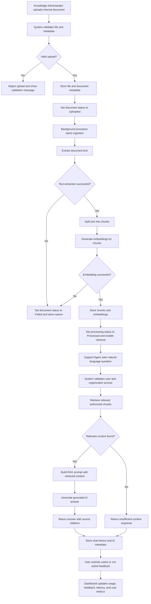
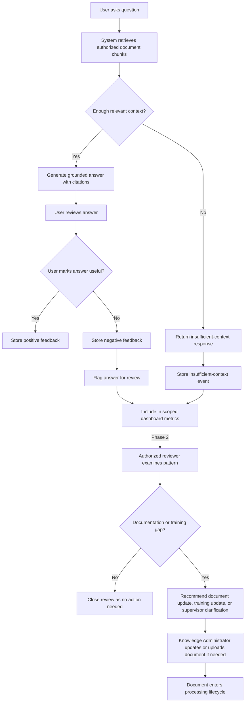
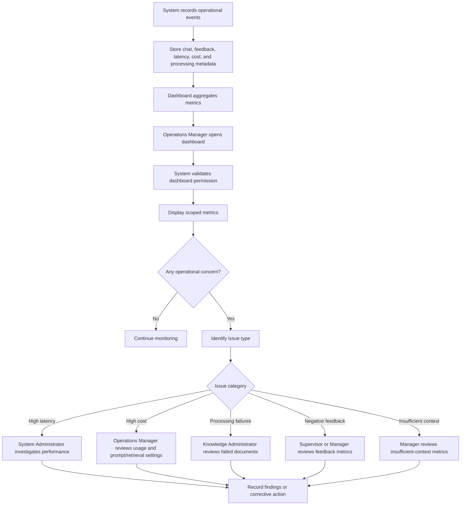
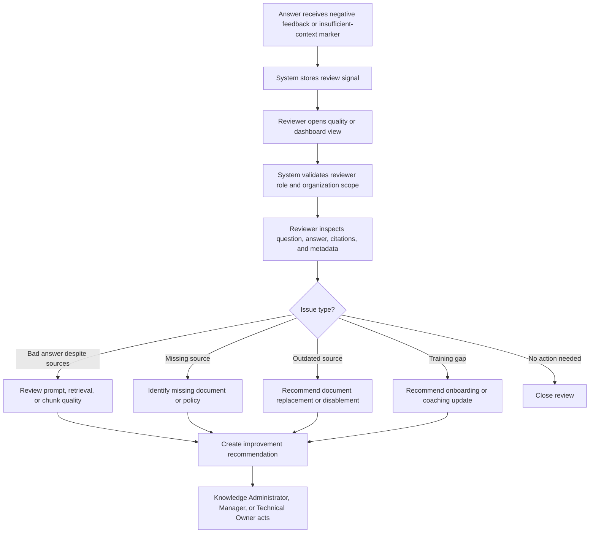
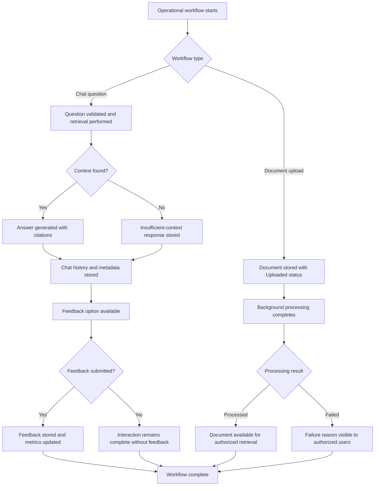
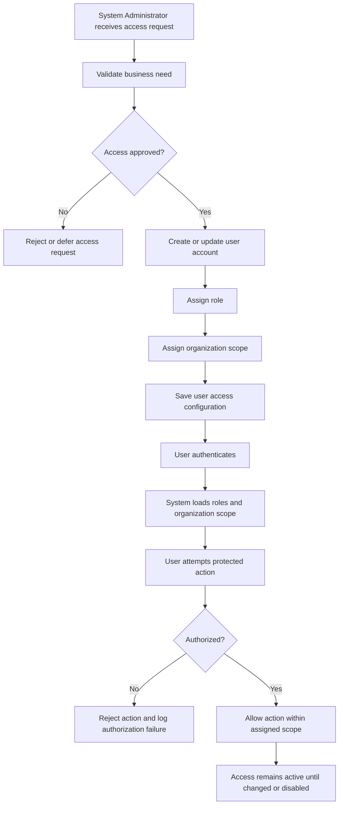

# Business Process Flows

## 1. Purpose

This document describes the main operational workflows supported by **KnowledgeOps-AI**.

The purpose of this document is to show how the system supports real business operations, not only software screens. Business process flows help human developers, AI coding agents, reviewers, and stakeholders understand sequence, ownership, decision points, exceptions, and completion states.

KnowledgeOps-AI is an enterprise AI-powered internal knowledge assistant for contact centers and support operations. The system helps users upload internal documents, process them into searchable knowledge, ask questions through a Retrieval-Augmented Generation (RAG) assistant, receive grounded answers with citations, submit feedback, and monitor operational usage.

---

## 2. Process Flow Notation

The process diagrams in this document use **Mermaid flowchart syntax**.

These diagrams are intended to be readable in Markdown-compatible tools that support Mermaid rendering.

Where Mermaid rendering is not available, the numbered process steps below each diagram should be treated as the authoritative plain-text workflow.

### Rendered Artifact Paths

Mermaid in this document is the source of truth. When rendered artifacts are maintained, use:

- `docs/diagrams/business-process/primary-lifecycle-process.png`
- `docs/diagrams/business-process/escalation-exception-process.png`
- `docs/diagrams/business-process/monitoring-operational-process.png`
- `docs/diagrams/business-process/approval-review-process.png`
- `docs/diagrams/business-process/closure-completion-process.png`
- `docs/diagrams/business-process/user-access-management-process.png`

---

## 3. Process Ownership Overview

| Process | Primary Owner | Supporting Actors | System Components |
|---|---|---|---|
| Primary Lifecycle Process | Knowledge Administrator / Support Agent | Background Processor, AI Assistant, Operations Manager | Document Management, Processing Pipeline, Retrieval, RAG Chat, Dashboard |
| Escalation or Exception Process | Support Agent / Supervisor | Knowledge Administrator, Manager | RAG Chat, Insufficient Context Tracking, Feedback, Dashboard Metrics |
| Monitoring or Operational Support Process | Operations Manager | System Administrator, Knowledge Administrator, Supervisor | Dashboard, Logs, Metrics, Processing Status |
| Approval or Review Process (Phase 2) | Supervisor / Manager | Knowledge Administrator, Admin | Feedback Review, Citation Review, Knowledge Gap Review |
| Closure or Completion Process | Knowledge Administrator / Operations Manager | Support Agent, Supervisor, AI Assistant | Document Status, Chat Completion, Feedback, Metrics |
| User Access Management Process | System Administrator | Operations Manager, Compliance Reviewer | Authentication, Roles, Organization Scope, Authorization |

---

# 4. Primary Lifecycle Process

## 4.1 Purpose

The Primary Lifecycle Process describes the complete operational flow from document upload to user question, answer generation, feedback, and dashboard visibility.

This is the central workflow of KnowledgeOps-AI.

It connects:

- Document ingestion.
- Background processing.
- Chunking.
- Embedding generation.
- Semantic retrieval.
- RAG answer generation.
- Source citations.
- Feedback.
- Operational metrics.

## 4.2 Process Diagram

## 4.3 Plain-Text Process Steps

1. A Knowledge Administrator uploads an internal document.
2. The system validates file type, file size, metadata, user role, and organization scope.
3. If validation fails, the upload is rejected with a clear message.
4. If validation succeeds, the system stores the file and document metadata.
5. The document is assigned the `Uploaded` status.
6. The background processor starts document ingestion.
7. The system extracts text from the document.
8. If text extraction fails, the document is marked as `Failed` and a failure reason is stored.
9. If text extraction succeeds, the system splits the extracted text into chunks.
10. The system generates embeddings for each chunk.
11. If embedding generation fails, the document is marked as `Failed`.
12. If embedding generation succeeds, chunks and embeddings are stored.
13. The document is marked as `Processed`.
14. A Support Agent asks a natural-language question.
15. The system validates the user identity, role, and organization scope.
16. The system retrieves relevant chunks from authorized processed documents.
17. If no relevant context is found, the system returns an insufficient-context response.
18. If relevant context is found, the system builds a RAG prompt using retrieved context.
19. The AI provider generates a grounded answer.
20. The system returns the answer with source citations.
21. The system stores chat history, retrieval metadata, latency, estimated cost, and sources used.
22. The user may submit useful or not useful feedback.
23. Dashboard metrics are updated for operational review.

## 4.4 Key Decision Points

| Decision Point | Question | Outcome |
|---|---|---|
| Upload validation | Is the uploaded document valid? | Accept or reject upload. |
| Text extraction | Can useful text be extracted? | Continue processing or mark failed. |
| Embedding generation | Can embeddings be created? | Continue indexing or mark failed. |
| Access validation | Can the user access this document or data? | Allow or reject action. |
| Retrieval quality | Was relevant context found? | Generate grounded answer or return insufficient-context response. |
| Feedback submission | Did the user rate the answer? | Update feedback metrics. |

## 4.5 Process Completion

The primary lifecycle is complete when:

- Documents are processed or failed with visible status.
- Users can ask questions against processed documents.
- Answers include citations when sources are found.
- Insufficient context is handled safely when sources are not found.
- Feedback and operational metadata are stored.
- Dashboard metrics reflect activity.

---

# 5. Escalation or Exception Process

## 5.1 Purpose

The Escalation or Exception Process describes how the system handles cases where the assistant cannot answer safely, the answer receives negative feedback, document processing fails, or human review is required.

This process prevents the AI assistant from pretending to know unsupported information.

## 5.2 Process Diagram

## 5.3 Plain-Text Process Steps

1. A user asks a question.
2. The system retrieves authorized document chunks.
3. The system evaluates whether enough relevant context exists.
4. If context exists, the system generates a grounded answer with citations.
5. The user reviews the answer.
6. If the answer is useful, positive feedback is stored.
7. If the answer is not useful, negative feedback is stored.
8. Negative feedback may flag the answer for review.
9. If context is insufficient, the system returns a safe insufficient-context response.
10. The insufficient-context event is stored.
11. In MVP, the event contributes to scoped dashboard metrics.
12. In Phase 2, an authorized reviewer may inspect the pattern through a dedicated review workflow.
13. The reviewer determines whether the issue indicates a documentation or training gap.
14. If no action is required, the review can be closed.
15. If action is required, the reviewer recommends document updates, training updates, or supervisor clarification.
16. A Knowledge Administrator updates or uploads the relevant document.
17. The document enters the normal processing lifecycle.

## 5.4 Key Exception Types

| Exception Type | Owner | System Response | Business Response |
|---|---|---|---|
| Insufficient context | AI Assistant | Return safe response and store event. | Review as possible knowledge gap. |
| Negative feedback | Support Agent | Store not useful feedback. | Review scoped feedback metrics. |
| Document processing failure | Knowledge Administrator | Mark document as failed and store reason. | Replace, correct, or retry document later. |
| Unauthorized access attempt | System Administrator | Reject request and log failure. | Review access configuration if needed. |
| AI provider failure | System Administrator | Return safe failure message and log event. | Investigate provider or configuration issue. |

## 5.5 Process Completion

The exception process is complete when:

- The unsafe or failed condition is recorded.
- The user receives a safe and clear response.
- The issue is visible to authorized reviewers.
- A human owner determines whether follow-up is required.
- Required document or training updates are initiated when applicable.

---

# 6. Monitoring or Operational Support Process

## 6.1 Purpose

The Monitoring or Operational Support Process describes how operations stakeholders review system usage, reliability, latency, cost, document processing, feedback, and insufficient-context metrics.

In the MVP, this process represents operational monitoring and performance visibility only.

## 6.2 Process Diagram

## 6.3 Plain-Text Process Steps

1. The system records operational events from document processing, retrieval, AI generation, feedback, and authorization.
2. The system stores metadata such as latency, estimated cost, processing status, feedback counts, and insufficient-context events.
3. The dashboard aggregates scoped metrics.
4. An Operations Manager opens the dashboard.
5. The system validates dashboard access.
6. The system displays metrics according to role and organization scope.
7. The Operations Manager reviews whether any operational concern exists.
8. If no concern exists, monitoring continues.
9. If a concern exists, the issue is categorized.
10. High latency is reviewed by the System Administrator.
11. High estimated cost is reviewed by the Operations Manager or technical owner.
12. Document processing failures are reviewed by the Knowledge Administrator.
13. Negative feedback metrics are reviewed by a Supervisor or Manager under MVP permissions.
14. Insufficient-context counts are reviewed by a Manager; dedicated knowledge-gap review is Phase 2.
15. Findings or corrective actions are recorded according to the relevant workflow.

## 6.4 Monitored Signals

| Signal | Meaning | Primary Reviewer |
|---|---|---|
| Question count | Measures assistant usage. | Operations Manager |
| Active users | Measures adoption. | Operations Manager |
| Average response latency | Measures user experience and performance. | System Administrator |
| Estimated AI cost | Measures AI operating cost. | Operations Manager / System Administrator |
| Documents uploaded | Measures knowledge ingestion activity. | Knowledge Administrator |
| Documents processed | Measures ingestion success. | Knowledge Administrator |
| Processing failures | Indicates document ingestion issues. | Knowledge Administrator |
| Useful feedback count | Indicates positive answer value. | Manager |
| Not useful feedback count | Indicates potential quality issues. | Supervisor / Manager |
| Insufficient-context count | Indicates possible knowledge gaps. | Manager |
| Authorization failures | Indicates access issues or misuse. | System Administrator |

## 6.5 Process Completion

The monitoring process is complete when:

- Metrics are visible to authorized roles.
- Operational concerns are categorized.
- The correct owner is assigned or implied.
- Follow-up action is taken through the appropriate process.
- Metrics continue to update as new activity occurs.

---

# 7. Approval or Review Process

## 7.1 Purpose

The Approval or Review Process describes a Phase 2 workflow in which feedback, citations, insufficient-context events, and recurring issues may be reviewed by authorized users.

In the MVP, the system captures feedback and insufficient-context counts for scoped dashboard display; it does not require this queue, categorization, assignment, decision, or resolution workflow.

## 7.2 Process Diagram

## 7.3 Plain-Text Process Steps

1. A chat answer receives negative feedback or an insufficient-context marker.
2. The system stores the review signal.
3. In Phase 2, a user assigned an approved review role opens the relevant review view.
4. The system validates role and organization scope.
5. The reviewer inspects the question, answer, citations, retrieved context, and available metadata.
6. The reviewer categorizes the issue.
7. If the answer was poor despite sources, retrieval, prompt, or chunk quality may need improvement.
8. If the source is missing, a new document or policy may need to be uploaded.
9. If the source is outdated, the document may need replacement or disablement.
10. If the issue indicates a training gap, onboarding or coaching material may need updating.
11. If no action is needed, the review can be closed.
12. The appropriate owner acts on the recommendation.

## 7.4 Review Categories

| Review Category | Meaning | Likely Owner |
|---|---|---|
| Poor answer quality | Answer did not satisfy the user even though sources existed. | Supervisor / Applied AI Developer |
| Missing documentation | No source exists for the question. | Knowledge Administrator |
| Outdated source | Source exists but should no longer be used. | Knowledge Administrator |
| Weak retrieval | Relevant document exists but was not retrieved. | Applied AI Developer |
| Training gap | Agents repeatedly ask a topic that training should cover. | Manager / Training stakeholder |
| Policy ambiguity | Documentation exists but is unclear or contradictory. | Supervisor / Operations Manager |
| No action needed | Feedback does not indicate a systemic issue. | Reviewer |

## 7.5 Process Completion

The review process is complete when:

- The signal has been inspected.
- The issue category is identified.
- A follow-up owner is clear.
- No-action cases are closed.
- Document, training, or technical improvement actions are initiated where needed.

---

# 8. Closure or Completion Process

## 8.1 Purpose

The Closure or Completion Process defines when key operational workflows are considered complete.

This matters because KnowledgeOps-AI has asynchronous workflows. A document upload is not complete just because a file was submitted. A question is not fully complete until answer generation, citations, metadata, and feedback opportunities are handled.

## 8.2 Process Diagram

## 8.3 Completion Rules

| Workflow | Completion State |
|---|---|
| Document upload | File and metadata are stored, and document enters processing lifecycle. |
| Document processing success | Document status is `Processed`, and chunks are available for authorized retrieval. |
| Document processing failure | Document status is `Failed`, and failure reason is visible to authorized users. |
| Chat question with answer | Answer, citations, history, and metadata are stored. |
| Chat question without context | Insufficient-context response and metadata are stored. |
| Feedback submission | Feedback is stored and associated with the chat interaction. |
| Dashboard update | Metrics reflect the relevant stored events. |
| Access management update | User role or organization scope changes are saved and enforced. |

## 8.4 Process Completion Criteria

An operational process is complete when:

- The system state is updated.
- The correct owner can see the outcome.
- Relevant metadata is stored.
- Access rules remain enforced.
- Exceptions are visible to authorized roles.
- Metrics reflect the completed event where applicable.

---

# 9. User Access Management Process

## 9.1 Purpose

The User Access Management Process defines how users, roles, and organization boundaries are managed.

This process is critical because KnowledgeOps-AI handles internal documents that may contain sensitive operational, client, employee, or compliance-related information.

## 9.2 Process Diagram

## 9.3 Plain-Text Process Steps

1. A System Administrator receives or identifies a user access request.
2. The administrator validates the business need for access.
3. If access is not approved, the request is rejected or deferred.
4. If access is approved, the administrator creates or updates the user account.
5. The administrator assigns the appropriate role.
6. The administrator assigns the correct organization or access scope.
7. The system saves the access configuration.
8. The user authenticates.
9. The system loads the user’s role and organization scope.
10. The user attempts a protected action.
11. The system evaluates authorization.
12. If unauthorized, the action is rejected and logged.
13. If authorized, the action is allowed within assigned scope.
14. Access remains active until changed, revoked, or disabled.

## 9.4 Role-to-Process Matrix

| Role | Document Upload | Document Status | Chat | Citations | Feedback | Dashboard | User Management | Health |
|---|---:|---:|---:|---:|---:|---:|---:|---:|
| Agent | No | No | Yes | Yes | Yes | No | No | Basic public status only |
| Supervisor | No | No | Yes | Yes | Yes | Feedback metrics only | No | Basic public status only |
| KnowledgeAdmin | Yes | Yes | Yes | Yes | Yes | Document metrics | No | Basic public status only |
| Manager | No | Yes | Yes | Yes | Yes | Yes | No | Basic public status only |
| Admin | Yes | Yes | Yes | Yes | Yes | Yes | Yes | Yes |

## 9.5 Access Decision Points

| Decision Point | Question | System Action |
|---|---|---|
| Authentication | Is the user logged in? | Allow or reject protected access. |
| Role authorization | Does the user role allow the action? | Allow or reject action. |
| Organization scope | Does the data belong to the user’s organization scope? | Return scoped data or reject access. |
| Retrieval access | Are candidate chunks from authorized documents? | Include or exclude chunks. |
| Dashboard access | Can this user view metrics? | Display scoped dashboard or reject access. |
| Health access | Can this user view operational health? | Display or reject health information. |

## 9.6 Process Completion

The user access management process is complete when:

- The user has a valid account.
- The user has assigned roles.
- The user has an organization scope.
- Protected actions enforce role and organization rules.
- Unauthorized attempts are rejected and logged.
- Access can be changed or revoked by an administrator.

---

# 10. Cross-Process Business Rules

The following rules apply across all business process flows.

| Rule | Description |
|---|---|
| Authenticated access required | Protected functionality requires authenticated users. |
| Role permissions apply | Users may only perform actions allowed by their roles. |
| Organization boundaries apply | Users may only access data within their authorized organization scope. |
| Processed documents only | Documents must be processed before retrieval. |
| Failed documents excluded | Failed documents must not be used as retrieval sources. |
| Retrieval-disabled documents excluded | Documents where `is_retrieval_enabled = false` must not be used as retrieval sources. |
| Retrieval respects authorization | Retrieval must not leak unauthorized chunks. |
| Answers should be grounded | AI answers should use retrieved internal document context. |
| Citations required for grounded answers | Answers based on retrieved chunks must include source citations. |
| Insufficient context disclosed | The system must state when available documents do not support an answer. |
| AI is not final authority | The assistant supports human decision-making and does not replace human judgment. |
| Feedback belongs to chat | Feedback must be associated with a stored chat interaction. |
| Metrics respect access boundaries | Dashboard data must be scoped by role and organization. |
| Sensitive content protected | Logs, errors, and metrics must avoid unnecessary exposure of sensitive content. |

---

# 11. Process-to-Use-Case Traceability

| Business Process | Related Use Cases |
|---|---|
| Primary Lifecycle Process | UC-003, UC-004, UC-005, UC-006, UC-007, UC-008, UC-009, UC-010, UC-012 |
| Escalation or Exception Process | UC-008, UC-010, UC-013, UC-014, UC-015 |
| Monitoring or Operational Support Process | UC-012, UC-015; UC-013 is Phase 2 |
| Approval or Review Process | UC-009, UC-010, UC-013, UC-014 |
| Closure or Completion Process | UC-003, UC-004, UC-006, UC-008, UC-010, UC-012 |
| User Access Management Process | UC-001, UC-002, UC-016 |

---

# 12. Process-to-Requirement Traceability

| Business Process | Related Requirements |
|---|---|
| Primary Lifecycle Process | FR-011 to FR-086 |
| Escalation or Exception Process | FR-024, FR-055 to FR-057, FR-068 to FR-075, FR-084, FR-091, FR-096 |
| Monitoring or Operational Support Process | FR-076 to FR-086, FR-090 to FR-099 |
| Approval or Review Process | FR-058 to FR-075, FR-083, FR-084 |
| Closure or Completion Process | FR-019 to FR-038, FR-047 to FR-075 |
| User Access Management Process | FR-001 to FR-010, FR-087 to FR-089 |

---

# 13. Summary

The business process flows for KnowledgeOps-AI show how the system supports operational work in contact centers and support organizations.

The primary lifecycle begins with controlled document upload and ends with users receiving grounded answers, reviewing citations, submitting feedback, and generating measurable operational signals.

The exception, monitoring, review, closure, and access management processes ensure that the system remains safe, auditable, measurable, and aligned with business operations.

These process flows should guide implementation planning, API design, frontend screen design, testing strategy, and AI agent behavior throughout the project.
