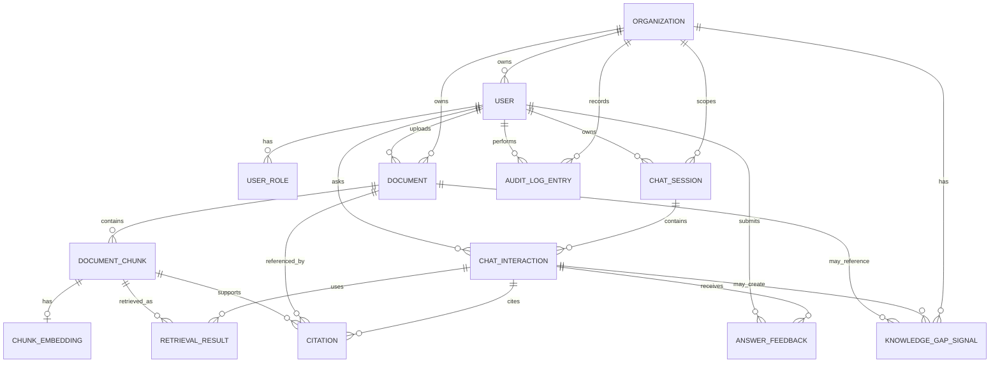
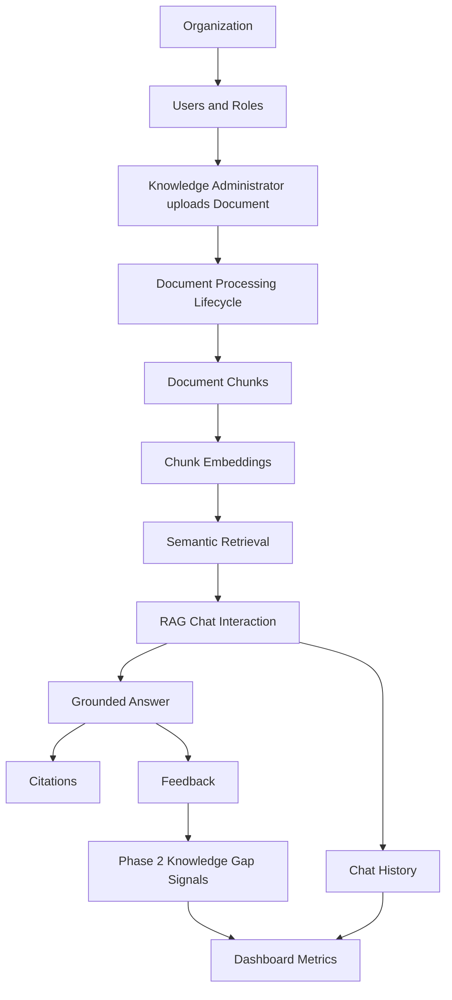

# Domain Model

## 1. Purpose

This document defines the core business concepts, relationships, lifecycle states, constraints, and shared language of **KnowledgeOps-AI**.

This document is the canonical source for MVP domain terminology and conceptual relationships.

The Domain Model is the conceptual foundation for:

- Entity design.
- Database design.
- API design.
- Authorization rules.
- Business logic.
- Background processing.
- RAG orchestration.
- Dashboard queries.
- Testing strategy.
- AI agent implementation guidance.

KnowledgeOps-AI is an enterprise AI-powered internal knowledge assistant for contact centers and support operations. The system allows authorized users to upload internal documents, process them into searchable knowledge, ask questions through a Retrieval-Augmented Generation workflow, receive source-grounded answers, review citations, submit feedback, and monitor operational metrics.

This document should be created before database design and API design so that implementation follows business language instead of accidental technical structures.

---

## 2. Domain Language

The system should use consistent business language across documentation, code, APIs, database objects, tests, and UI.

| Term | Meaning |
|---|---|
| Organization | A business boundary that separates users, documents, chats, feedback, and dashboard data. |
| User | A person who accesses the system. |
| Role | A permission category assigned to a user. |
| Document | An internal knowledge source uploaded into the system. |
| Document Chunk | A searchable segment of extracted document text. |
| Embedding | A vector representation of text used for semantic retrieval. |
| Chat Session | A logical grouping of one or more user questions and assistant responses. |
| Chat Interaction | A single user question and system answer exchange. |
| Retrieval Result | A document chunk selected as relevant for a user question. |
| Citation | A source reference returned with an answer to show which document content supported it. |
| Feedback | A user rating indicating whether an answer was useful or not useful. |
| Knowledge Gap | A question or pattern that indicates missing, weak, unclear, or unavailable knowledge. |
| Processing Status | The lifecycle state of a document as it moves through ingestion. |
| AI Provider | The external or internal service used for embeddings or answer generation. |
| Dashboard Metric | An aggregated operational measurement such as question count, latency, cost, feedback, or document status. |

---

# 3. Core Domain Concepts

## 3.1 Organization

An **Organization** represents a business boundary for users, documents, chat history, feedback, citations, and dashboard metrics.

In a contact center context, an organization may represent:

- A client account.
- A business unit.
- A support operation.
- A tenant-like boundary.
- A portfolio demo organization.

The exact implementation may evolve, but the domain rule is stable: users must only access knowledge and operational data within their authorized organization scope.

## 3.2 User

A **User** represents a person who interacts with KnowledgeOps-AI.

Users may act as:

- Support Agents.
- Supervisors.
- Knowledge Administrators.
- Operations Managers.
- Quality Analysts.
- Trainers.
- System Administrators.

A user belongs to an organization or approved access scope and has one or more roles.

## 3.3 Role

A **Role** defines what actions a user may perform.

Minimum MVP roles may include:

- `Agent`
- `Supervisor`
- `KnowledgeAdmin`
- `Manager`
- `Admin`

Roles are used for authorization decisions, but role checks must also respect organization boundaries.

## 3.4 Document

A **Document** is an internal knowledge source uploaded into the system.

Examples include:

- Policies.
- Procedures.
- PDFs.
- Knowledge articles.
- Escalation rules.
- Training material.
- Troubleshooting guides.
- Account-specific operational instructions.

A document must be uploaded, validated, stored, processed, chunked, embedded, and marked as eligible before it can be used in retrieval.

## 3.5 Document Chunk

A **Document Chunk** is a smaller section of extracted document text.

Chunks are the unit of retrieval used by the RAG workflow.

A chunk must preserve its relationship to:

- Source document.
- Organization.
- Chunk index.
- Page or section reference when available.
- Embedding or searchable vector representation.

## 3.6 Embedding

An **Embedding** is a numerical representation of text used for semantic similarity search.

Embeddings may be generated for:

- Document chunks.
- User questions.

The embedding implementation should be isolated behind provider abstractions. Business rules must not depend directly on a specific AI provider.

## 3.7 Chat Session

A **Chat Session** groups one or more chat interactions.

In the MVP, chat sessions may be simple or implicit. However, the concept is useful for future chat history, conversation continuity, and review workflows.

## 3.8 Chat Interaction

A **Chat Interaction** represents one user question and one assistant response.

It stores:

- User question.
- Generated answer.
- User.
- Organization.
- Timestamp.
- Retrieval metadata.
- Citations.
- Latency metadata.
- Estimated AI cost metadata when available.
- Feedback status when available.
- Insufficient-context marker when applicable.

## 3.9 Retrieval Result

A **Retrieval Result** represents a document chunk selected as relevant to a user question.

Retrieval results are used to build the RAG prompt and generate citations.

A retrieval result should include:

- Chunk reference.
- Document reference.
- Relevance score when available.
- Rank.
- Page or section reference when available.
- Organization scope.

## 3.10 Citation

A **Citation** identifies the source document content used to support an answer.

A citation should reference:

- Document.
- Document chunk.
- Page or section reference when available.
- Relevance score when practical.

Citations increase trust, reviewability, and auditability.

## 3.11 Feedback

**Feedback** is a user evaluation of an answer.

In the MVP, feedback values are:

- `Useful`
- `NotUseful`

Feedback must belong to a stored chat interaction. Feedback supports dashboard metrics, quality review, and knowledge gap detection.

## 3.12 Knowledge Gap

A **Knowledge Gap** represents a missing or weak knowledge condition.

Knowledge gaps may be inferred from:

- Insufficient-context events.
- Repeated unanswered questions.
- Negative feedback.
- Questions with weak retrieval results.
- Poor answer quality despite citations.
- Missing or outdated documents.

In the MVP, knowledge-gap visibility is represented by scoped insufficient-context and `NotUseful` dashboard counts. A dedicated review entity and workflow are Phase 2.

## 3.13 Dashboard Metric

A **Dashboard Metric** is an operational measurement derived from stored system activity.

Examples include:

- Number of questions.
- Active users.
- Average response latency.
- Estimated AI cost.
- Documents uploaded.
- Documents processed.
- Failed document processing attempts.
- Useful feedback count.
- Not useful feedback count.
- Insufficient-context count.

Dashboard metrics must respect role and organization boundaries.

---

# 4. Entity Definitions

## 4.1 Organization

### Description

Represents a business scope that owns users, documents, chat interactions, feedback, and dashboard metrics.

### Key Attributes

| Attribute | Description |
|---|---|
| OrganizationId | Unique organization identifier. |
| Name | Organization name. |
| Status | Indicates whether the organization is active or disabled. |
| CreatedAt | Creation timestamp. |
| UpdatedAt | Last update timestamp. |

### Primary Responsibilities

- Define access boundaries.
- Scope documents.
- Scope users.
- Scope chat history.
- Scope dashboard metrics.

### Domain Notes

- Organization scope must be enforced consistently.
- A user should not retrieve documents outside their organization scope.
- Dashboard metrics must be filtered by organization.

---

## 4.2 User

### Description

Represents an authenticated person using the system.

### Key Attributes

| Attribute | Description |
|---|---|
| UserId | Unique user identifier. |
| OrganizationId | Organization scope for the user. |
| DisplayName | User-facing name. |
| Email | User email or login identifier. |
| Status | Active, Disabled, or Pending. |
| CreatedAt | Creation timestamp. |
| UpdatedAt | Last update timestamp. |

### Primary Responsibilities

- Authenticate into the system.
- Perform actions according to assigned roles.
- Own chat interactions and feedback.
- Upload documents if authorized.

### Domain Notes

- A disabled user must not access protected functionality.
- User identity must be associated with protected actions.
- A user may have one or more roles depending on implementation design.

---

## 4.3 Role

### Description

Represents a permission category assigned to a user.

### Suggested Role Values

| Role | Description |
|---|---|
| Agent | Can ask questions, review citations, and submit feedback. |
| Supervisor | Can use chat and review scoped team knowledge signals where enabled. |
| KnowledgeAdmin | Can upload documents, review processing status, and disable documents. |
| Manager | Can review dashboard metrics and operational trends. |
| Admin | Can manage users, roles, access, documents, dashboard, and health views. |

### Primary Responsibilities

- Control access to business actions.
- Support authorization decisions.
- Protect restricted workflows.

### Domain Notes

- Roles do not replace organization boundaries.
- A valid role does not grant access to data outside the user’s organization scope.
- Role behavior should be enforced in application services and authorization policies.

---

## 4.4 UserRole

### Description

Represents the assignment of a role to a user.

### Key Attributes

| Attribute | Description |
|---|---|
| UserRoleId | Unique assignment identifier. |
| UserId | Associated user. |
| Role | Assigned role value. |
| AssignedAt | Assignment timestamp. |
| AssignedByUserId | User who assigned the role, when available. |

### Primary Responsibilities

- Support multiple roles per user if required.
- Provide traceability for role assignment.

### Domain Notes

- Role assignment should be restricted to authorized administrators.
- Invalid role assignment must be rejected.

---

## 4.5 Document

### Description

Represents an uploaded internal knowledge source.

### Key Attributes

| Attribute | Description |
|---|---|
| DocumentId | Unique document identifier. |
| OrganizationId | Owning organization. |
| UploadedByUserId | User who uploaded the document. |
| FileName | Original file name. |
| Title | Business-readable title. |
| ContentType | MIME type or file type. |
| FileSizeBytes | File size. |
| StorageLocation | Reference to stored file location. |
| ProcessingStatus | Current document lifecycle state. |
| FailureReason | Reason processing failed, when applicable. |
| IsRetrievalEnabled | Indicates whether document may be used for retrieval. |
| UploadedAt | Upload timestamp. |
| ProcessedAt | Processing completion timestamp, if successful. |
| CreatedAt | Creation timestamp. |
| UpdatedAt | Last update timestamp. |

### Primary Responsibilities

- Represent uploaded knowledge.
- Track processing lifecycle.
- Determine retrieval eligibility.
- Provide source identity for chunks and citations.

### Domain Notes

- A document must be processed before retrieval.
- Failed documents must not be searchable.
- Documents with `IsRetrievalEnabled = false` must not be searchable; disablement does not change `ProcessingStatus`.
- Failure reason should be visible to authorized users.
- Document metadata must be stored before processing.

---

## 4.6 DocumentChunk

### Description

Represents a smaller section of extracted document text used for retrieval.

### Key Attributes

| Attribute | Description |
|---|---|
| ChunkId | Unique chunk identifier. |
| DocumentId | Source document. |
| OrganizationId | Owning organization. |
| ChunkIndex | Sequential chunk number within the document. |
| Text | Chunk text. |
| PageNumber | Page reference when available. |
| SectionLabel | Section reference when available. |
| CharacterLength | Character count when available. |
| TokenEstimate | Token estimate when available. |
| CreatedAt | Creation timestamp. |

### Primary Responsibilities

- Store retrievable text.
- Preserve source document relationship.
- Support citations.
- Support embedding generation.

### Domain Notes

- Empty chunks must not be stored.
- Every chunk must reference a source document.
- Chunks must inherit organization scope from the document.
- Chunks from failed, retrieval-disabled, or soft-deleted documents must not be retrieved.

---

## 4.7 ChunkEmbedding

### Description

Represents the embedding or searchable vector representation of a document chunk.

### Key Attributes

| Attribute | Description |
|---|---|
| ChunkEmbeddingId | Unique embedding record identifier. |
| ChunkId | Associated document chunk. |
| OrganizationId | Owning organization. |
| ProviderName | Embedding provider name. |
| ModelName | Embedding model name, if available. |
| VectorData | Stored vector data or vector reference. |
| VectorDimensions | Embedding dimension count when available. |
| Status | Embedding status. |
| FailureReason | Failure reason when embedding generation fails. |
| CreatedAt | Creation timestamp. |

### Primary Responsibilities

- Enable semantic retrieval.
- Track embedding generation status.
- Preserve provider metadata for observability.

### Domain Notes

- Business rules must not depend on provider-specific SDK types.
- Chunks without valid embeddings must not be used for semantic retrieval.
- Provider metadata is operational metadata, not core business identity.

---

## 4.8 ChatSession

### Description

Represents a logical conversation container.

### Key Attributes

| Attribute | Description |
|---|---|
| ChatSessionId | Unique session identifier. |
| UserId | Owner user. |
| OrganizationId | Organization scope. |
| Title | Optional user-facing session title. |
| CreatedAt | Creation timestamp. |
| UpdatedAt | Last update timestamp. |
| Status | Active, Archived, or Deleted if supported. |

### Primary Responsibilities

- Group chat interactions.
- Support chat history navigation.
- Support future conversation continuity.

### Domain Notes

- MVP may keep sessions simple.
- Chat interactions must still be stored even if session behavior is minimal.
- Sessions must respect organization scope.

---

## 4.9 ChatInteraction

### Description

Represents a single user question and assistant answer.

### Key Attributes

| Attribute | Description |
|---|---|
| ChatInteractionId | Unique interaction identifier. |
| ChatSessionId | Associated chat session, if used. |
| UserId | User who asked the question. |
| OrganizationId | Organization scope. |
| QuestionText | User question. |
| AnswerText | Assistant answer. |
| AnswerStatus | Answer result state. |
| InsufficientContext | Indicates insufficient-context handling. |
| PromptVersion | Prompt template version when available. |
| RetrievalConfigurationVersion | Retrieval configuration version when available. |
| ResponseLatencyMs | Total response latency. |
| RetrievalLatencyMs | Retrieval latency when available. |
| GenerationLatencyMs | AI generation latency when available. |
| EstimatedCost | Estimated AI cost when available. |
| TokenUsage | Token usage when available. |
| CreatedAt | Creation timestamp. |

### Primary Responsibilities

- Preserve question and answer history.
- Support citations.
- Support feedback.
- Support dashboard metrics.
- Support review and evaluation.

### Domain Notes

- Chat interactions must belong to a user and organization.
- Interactions with insufficient context must be stored.
- Sensitive content rules must apply to logging and review.

---

## 4.10 RetrievalResult

### Description

Represents a chunk retrieved for a chat interaction.

### Key Attributes

| Attribute | Description |
|---|---|
| RetrievalResultId | Unique result identifier. |
| ChatInteractionId | Associated chat interaction. |
| ChunkId | Retrieved chunk. |
| DocumentId | Source document. |
| OrganizationId | Organization scope. |
| Rank | Retrieval rank. |
| RelevanceScore | Similarity or ranking score when available. |
| RetrievalStrategy | Strategy used, when available. |
| CreatedAt | Creation timestamp. |

### Primary Responsibilities

- Preserve retrieval traceability.
- Support citations.
- Support answer review.
- Support retrieval evaluation.

### Domain Notes

- Retrieval results must only reference authorized chunks.
- Unauthorized chunks must not be stored as retrieval results for a user.
- Retrieval metadata should support later review and dashboard analysis.

---

## 4.11 Citation

### Description

Represents a source reference shown to the user with an answer.

### Key Attributes

| Attribute | Description |
|---|---|
| CitationId | Unique citation identifier. |
| ChatInteractionId | Associated answer. |
| DocumentId | Source document. |
| ChunkId | Supporting chunk. |
| OrganizationId | Organization scope. |
| DisplayTitle | User-facing source title. |
| PageNumber | Page reference when available. |
| SectionLabel | Section reference when available. |
| RelevanceScore | Relevance score when available. |
| CreatedAt | Creation timestamp. |

### Primary Responsibilities

- Show source support for AI answers.
- Connect answers to source documents.
- Increase trust and reviewability.

### Domain Notes

- Grounded answers must include citations.
- Citations must not expose unauthorized documents.
- Historical citations may remain visible according to retention rules even if a document is later disabled from retrieval.

---

## 4.12 AnswerFeedback

### Description

Represents user feedback for a chat interaction.

### Key Attributes

| Attribute | Description |
|---|---|
| FeedbackId | Unique feedback identifier. |
| ChatInteractionId | Associated chat interaction. |
| UserId | User who submitted feedback. |
| OrganizationId | Organization scope. |
| Rating | Useful or NotUseful. |
| Comment | Optional comment, likely deferred beyond MVP. |
| CreatedAt | Creation timestamp. |
| UpdatedAt | Last update timestamp. |

### Primary Responsibilities

- Capture answer usefulness.
- Support dashboard metrics.
- Support review and quality improvement.

### Domain Notes

- Feedback must belong to a chat interaction.
- Duplicate feedback by the same user for the same answer must not inflate metrics.
- Feedback review must respect role and organization boundaries.

---

## 4.13 KnowledgeGapSignal

### Description

Represents a future Phase 2 signal that the organization may have missing, weak, outdated, or unclear knowledge.

### Key Attributes

| Attribute | Description |
|---|---|
| KnowledgeGapSignalId | Unique signal identifier. |
| OrganizationId | Organization scope. |
| SourceType | InsufficientContext, NotUsefulFeedback, RepeatedQuestion, WeakRetrieval, ProcessingFailure. |
| ChatInteractionId | Related chat interaction, when applicable. |
| DocumentId | Related document, when applicable. |
| Summary | Short description of the signal. |
| Status | Open, Reviewed, Dismissed, Resolved. |
| CreatedAt | Creation timestamp. |
| ReviewedAt | Review timestamp when applicable. |
| ReviewedByUserId | Reviewer user when applicable. |

### Primary Responsibilities

- Support operational improvement.
- Surface repeated missing knowledge.
- Help authorized reviewers and business stakeholders act on gaps in Phase 2.

### Domain Notes

- This is a Phase 2 conceptual entity; MVP stores insufficient-context events and `NotUseful` feedback and exposes basic scoped counts without a dedicated review workflow.
- The concept may inform future review design without adding an MVP persistence requirement.
- Review signals must respect organization boundaries.

---

## 4.14 DashboardMetric

### Description

Represents an aggregated operational measurement.

### Key Attributes

| Attribute | Description |
|---|---|
| MetricName | Name of the metric. |
| OrganizationId | Organization scope. |
| PeriodStart | Reporting period start. |
| PeriodEnd | Reporting period end. |
| Value | Metric value. |
| ComputedAt | Computation timestamp. |

### Primary Responsibilities

- Support operational visibility.
- Summarize usage, feedback, document status, latency, and cost.

### Domain Notes

- Metrics may be computed dynamically instead of stored.
- Dashboard values must respect access boundaries.
- Metrics must avoid exposing sensitive content.

---

## 4.15 AuditLogEntry

### Description

Represents an important business or system event.

### Key Attributes

| Attribute | Description |
|---|---|
| AuditLogEntryId | Unique log entry identifier. |
| OrganizationId | Organization scope when applicable. |
| UserId | User associated with the event when applicable. |
| EventType | Type of event. |
| EntityType | Related entity type. |
| EntityId | Related entity identifier. |
| Message | Safe event message. |
| CreatedAt | Event timestamp. |

### Primary Responsibilities

- Support traceability.
- Support operational review.
- Support security diagnostics.

### Domain Notes

- Logs must not expose sensitive document content unnecessarily.
- Authorization failures should be logged.
- Document processing and AI provider failures should be logged safely.

---

# 5. Value Objects

Value objects are concepts identified by their value rather than by independent identity.

The final implementation may choose records, owned entities, enums, or strongly typed identifiers depending on technology preferences.

## 5.1 OrganizationScope

### Description

Represents the boundary used to restrict access to users, documents, chats, feedback, and metrics.

### Example Fields

- OrganizationId.
- Optional account or client boundary if added later.

### Constraints

- Must be present for protected business data.
- Must be applied consistently to retrieval and dashboard queries.

---

## 5.2 DocumentMetadata

### Description

Represents descriptive information about an uploaded document.

### Example Fields

- FileName.
- Title.
- ContentType.
- FileSizeBytes.
- UploadedAt.
- UploadedByUserId.

### Constraints

- Required before processing.
- Must be visible to authorized users.

---

## 5.3 ProcessingFailureReason

### Description

Represents why a document or embedding operation failed.

### Example Values

- UnsupportedFileType.
- StorageFailure.
- TextExtractionFailed.
- EmptyExtractedText.
- ChunkingFailed.
- EmbeddingProviderFailed.
- UnknownFailure.

### Constraints

- Should be safe to display to authorized users.
- Must not expose sensitive content unnecessarily.

---

## 5.4 RetrievalScore

### Description

Represents a score used to rank retrieved chunks.

### Example Fields

- ScoreValue.
- Rank.
- StrategyName.

### Constraints

- May not be comparable across different retrieval strategies.
- Should be treated as retrieval metadata, not a business decision by itself.

---

## 5.5 CitationReference

### Description

Represents source information shown to the user.

### Example Fields

- DocumentId.
- ChunkId.
- DisplayTitle.
- PageNumber.
- SectionLabel.

### Constraints

- Must reference authorized content.
- Must not expose unauthorized documents.

---

## 5.6 AiUsageMetadata

### Description

Represents operational metadata from AI generation or embedding calls.

### Example Fields

- ProviderName.
- ModelName.
- PromptTokens.
- CompletionTokens.
- TotalTokens.
- EstimatedCost.
- LatencyMs.

### Constraints

- May be unavailable depending on provider.
- Unavailable cost must not be represented misleadingly as zero.
- Provider-specific metadata must not drive core business rules.

---

## 5.7 LatencyMeasurement

### Description

Represents timing information for important workflows.

### Example Fields

- TotalLatencyMs.
- RetrievalLatencyMs.
- GenerationLatencyMs.
- ProcessingLatencyMs.

### Constraints

- Used for observability and dashboard metrics.
- Should not affect business authorization decisions.

---

# 6. Relationships

## 6.1 Organization Relationships

- An Organization has many Users.
- An Organization has many Documents.
- An Organization has many DocumentChunks.
- An Organization has many ChatSessions.
- An Organization has many ChatInteractions.
- An Organization has many AnswerFeedback records.
- An Organization has many DashboardMetrics or scoped dashboard queries.
- An Organization may have many AuditLogEntries.

## 6.2 User Relationships

- A User belongs to one Organization or authorized access scope.
- A User may have many UserRole assignments.
- A User may upload many Documents.
- A User may own many ChatSessions.
- A User may create many ChatInteractions.
- A User may submit many AnswerFeedback records.
- A User may perform administrative actions recorded as AuditLogEntries.

## 6.3 Document Relationships

- A Document belongs to one Organization.
- A Document is uploaded by one User.
- A Document has many DocumentChunks.
- A Document may appear in many RetrievalResults.
- A Document may appear in many Citations.
- A Document may produce KnowledgeGapSignals if outdated, failed, missing, or negatively reviewed.

## 6.4 DocumentChunk Relationships

- A DocumentChunk belongs to one Document.
- A DocumentChunk belongs to one Organization.
- A DocumentChunk may have one ChunkEmbedding.
- A DocumentChunk may appear in many RetrievalResults.
- A DocumentChunk may appear in many Citations.

## 6.5 Chat Relationships

- A ChatSession belongs to one User.
- A ChatSession belongs to one Organization.
- A ChatSession has many ChatInteractions.
- A ChatInteraction belongs to one User.
- A ChatInteraction belongs to one Organization.
- A ChatInteraction may have many RetrievalResults.
- A ChatInteraction may have many Citations.
- A ChatInteraction may have one or more AnswerFeedback records depending on feedback policy.
- A ChatInteraction may produce a KnowledgeGapSignal.

## 6.6 Feedback and Review Relationships

- AnswerFeedback belongs to one ChatInteraction.
- AnswerFeedback belongs to one User.
- AnswerFeedback belongs to one Organization.
- KnowledgeGapSignal may reference a ChatInteraction.
- KnowledgeGapSignal may reference a Document.
- KnowledgeGapSignal belongs to one Organization.

---

# 7. Lifecycle States

## 7.1 User Status

| State | Meaning |
|---|---|
| Pending | User exists but is not fully active. |
| Active | User can authenticate and use allowed functionality. |
| Disabled | User must not access protected functionality. |

## 7.2 Organization Status

| State | Meaning |
|---|---|
| Active | Organization can use the system. |
| Disabled | Organization access should be restricted or blocked. |

## 7.3 Document Processing Status

| State | Meaning |
|---|---|
| Uploaded | File and metadata are stored, but processing has not started. |
| Processing | Background ingestion is currently running. |
| Processed | Text, chunks, and embeddings were produced successfully; retrieval still requires eligibility and authorization checks. |
| Failed | Processing failed and document is not searchable. |

Retrieval availability is represented by `IsRetrievalEnabled`, not by a processing status. A document is retrievable only when `ProcessingStatus = Processed`, `IsRetrievalEnabled = true`, it is not soft-deleted, and its organization scope is authorized.

## 7.4 Embedding Status

| State | Meaning |
|---|---|
| Pending | Embedding generation has not started. |
| Processing | Embedding generation is in progress. |
| Ready | Embedding is available for retrieval. |
| Failed | Embedding generation failed. |

## 7.5 Chat Interaction Answer Status

| State | Meaning |
|---|---|
| Answered | The assistant generated an answer using retrieved context. |
| InsufficientContext | The assistant could not answer safely from available documents. |
| Failed | The chat workflow failed due to retrieval, provider, or system error. |

## 7.6 Feedback Rating

| State | Meaning |
|---|---|
| Useful | User indicates the answer helped. |
| NotUseful | User indicates the answer did not help. |

## 7.7 Knowledge Gap Signal Status (Phase 2)

| State | Meaning |
|---|---|
| Open | Signal requires review. |
| Reviewed | Signal has been reviewed by an authorized user. |
| Dismissed | Reviewer determined no action is required. |
| Resolved | Follow-up action has addressed the gap. |

---

# 8. Domain Constraints

## 8.1 Access Constraints

- Protected data must belong to an organization scope.
- Users must not access data outside their authorized organization scope.
- Role permissions must be checked for restricted actions.
- Organization scope must be applied to retrieval, dashboard, feedback, chat history, and citations.

## 8.2 Document Constraints

- Documents must have required metadata before processing.
- Unsupported file types must be rejected.
- Documents must be processed before retrieval.
- Failed documents must not be searchable.
- Retrieval-disabled documents (`IsRetrievalEnabled = false`) must not be searchable.
- Documents without usable extracted text must not become retrievable.
- Processing failures must store safe failure reasons.

## 8.3 Chunk Constraints

- Chunks must belong to a source document.
- Chunks must belong to an organization.
- Empty chunks must not be stored.
- Chunks from ineligible documents must not be retrieved.
- Chunk metadata should preserve page or section references when available.

## 8.4 Embedding Constraints

- Retrieval-ready chunks should have valid embeddings or equivalent searchable vector representation.
- Failed embeddings must prevent affected chunks from being used in semantic retrieval.
- Provider details must be isolated from core business logic.
- Embedding metadata may be stored for observability.

## 8.5 Retrieval Constraints

- Retrieval must respect user authorization.
- Retrieval must exclude unauthorized documents.
- Retrieval must exclude failed, unprocessed, retrieval-disabled, or soft-deleted documents.
- Retrieval results must preserve chunk and document references.
- Weak or missing retrieval results must trigger insufficient-context behavior.

## 8.6 RAG Answer Constraints

- Grounded answers must be generated from retrieved context.
- Grounded answers must include citations.
- The assistant must not invent official policy when no relevant source exists.
- Insufficient context must be disclosed.
- The assistant must support human decision-making, not replace human authority.

## 8.7 Citation Constraints

- Citations must reference source documents.
- Citations must reference source chunks or equivalent source references.
- Citations must respect organization and authorization boundaries.
- Citation display must not expose unauthorized content.

## 8.8 Feedback Constraints

- Feedback must belong to a chat interaction.
- Duplicate feedback from the same user for the same interaction must not inflate metrics.
- Feedback must be organization-scoped.
- Negative feedback must be available for authorized review.

## 8.9 Metrics Constraints

- Dashboard metrics must respect organization and role boundaries.
- Metrics must avoid exposing sensitive document content.
- Estimated AI cost must not be misleading when unavailable.
- Latency should be captured for chat interactions.

## 8.10 Observability Constraints

- Important business events should be logged.
- Authorization failures should be logged.
- AI provider failures should be logged.
- Logs must avoid unnecessary sensitive content.
- Audit entries should support operational diagnosis without leaking confidential data.

---

# 9. Domain Diagram Reference

## 9.1 Conceptual Entity Diagram

## 9.2 High-Level Domain Flow

---

# 10. Domain Model to Requirement Traceability

| Domain Concept | Related Requirements |
|---|---|
| Organization | FR-005, FR-010, FR-018, FR-043, FR-046, FR-086 |
| User | FR-001 to FR-005, FR-087 |
| Role / UserRole | FR-006 to FR-010, FR-088 |
| Document | FR-011 to FR-027 |
| DocumentChunk | FR-028 to FR-033 |
| ChunkEmbedding | FR-034 to FR-038 |
| RetrievalResult | FR-039 to FR-046, FR-073, FR-074 |
| ChatSession | FR-064 to FR-067 |
| ChatInteraction | FR-047 to FR-057, FR-064 to FR-067 |
| Citation | FR-058 to FR-063 |
| AnswerFeedback | FR-068 to FR-072 |
| KnowledgeGapSignal | FR-075, FR-084 |
| DashboardMetric | FR-076 to FR-086 |
| AuditLogEntry | FR-092 to FR-099 |

---

# 11. Domain Model to Business Rule Traceability

| Domain Concept | Related Business Rules |
|---|---|
| Organization | BR-003, BR-015, BR-027, BR-028 |
| User | BR-001, BR-005, BR-038 |
| Role / UserRole | BR-002, BR-038 |
| Document | BR-006 to BR-012, BR-039, BR-040 |
| DocumentChunk | BR-013, BR-014, BR-015, BR-016 |
| ChunkEmbedding | BR-016, BR-036, BR-043 |
| RetrievalResult | BR-015 to BR-018, BR-020 |
| ChatInteraction | BR-017 to BR-023, BR-029, BR-032, BR-044, BR-045 |
| Citation | BR-019, BR-037, BR-044 |
| AnswerFeedback | BR-023 to BR-027, BR-030 |
| KnowledgeGapSignal | BR-026, BR-027 |
| DashboardMetric | BR-028 to BR-033 |
| AuditLogEntry | BR-034 to BR-037 |

---

# 12. Implementation Guidance

## 12.1 Domain-First Implementation

Implementation should start from the domain language in this document.

Developers and AI coding agents should avoid inventing alternate terms when stable domain concepts already exist.

For example:

- Prefer `Document` over `FileRecord` when referring to a business knowledge source.
- Prefer `DocumentChunk` over `TextPart` when referring to retrievable text segments.
- Prefer `ChatInteraction` over `MessagePair` when referring to a user question and assistant answer.
- Prefer `Citation` over `ReferenceItem` when referring to source support for an answer.
- Prefer `OrganizationScope` over generic `TenantFilter` unless tenancy is formally introduced.

## 12.2 Database Design Guidance

Database design should preserve the relationships defined in this document.

The database model should support:

- Organization-scoped data.
- User-role assignments.
- Document lifecycle status.
- Document-to-chunk relationships.
- Chunk-to-embedding relationships.
- Chat-to-retrieval result relationships.
- Chat-to-citation relationships.
- Chat-to-feedback relationships.
- Dashboard metric queries.
- Audit/event logs.

## 12.3 API Design Guidance

API endpoints should map to domain workflows rather than accidental technical operations.

Potential API areas include:

- Authentication.
- Users and roles.
- Documents.
- Document processing status.
- Chat.
- Citations.
- Feedback.
- Dashboard.
- Health.

## 12.4 Authorization Guidance

Authorization should be enforced with both:

- Role permissions.
- Organization scope.

Role permission alone is insufficient.

Organization scope alone is insufficient.

The system must enforce both for protected resources.

## 12.5 AI Provider Guidance

AI provider details must remain outside the core domain model where practical.

The domain may store provider metadata for observability, but core business rules should not depend on provider SDKs, model-specific types, or vendor-specific response structures.

---

# 13. Summary

The KnowledgeOps-AI domain model defines the business concepts required to build the system correctly.

The core domain centers on organizations, users, roles, documents, chunks, embeddings, chat interactions, retrieval results, citations, feedback, knowledge gap signals, dashboard metrics, and audit events.

This model supports the project’s central business workflow: controlled document ingestion, semantic retrieval, grounded AI answers, source citations, user feedback, and operational visibility.

The domain model should guide database design, API design, application services, authorization, business logic, tests, and AI coding agent behavior.
