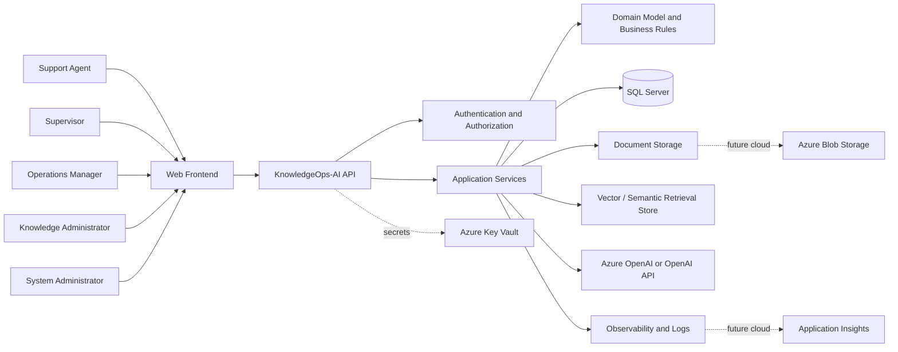
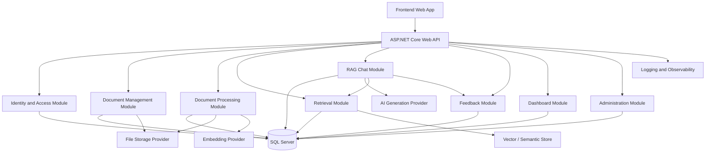
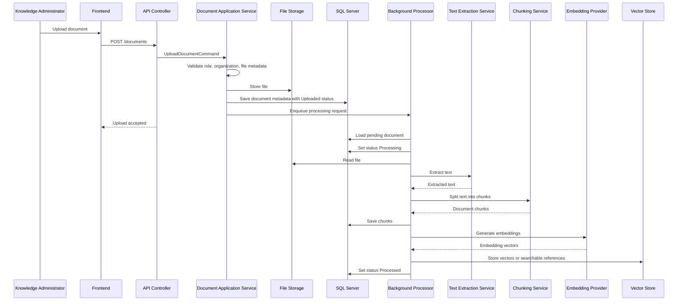
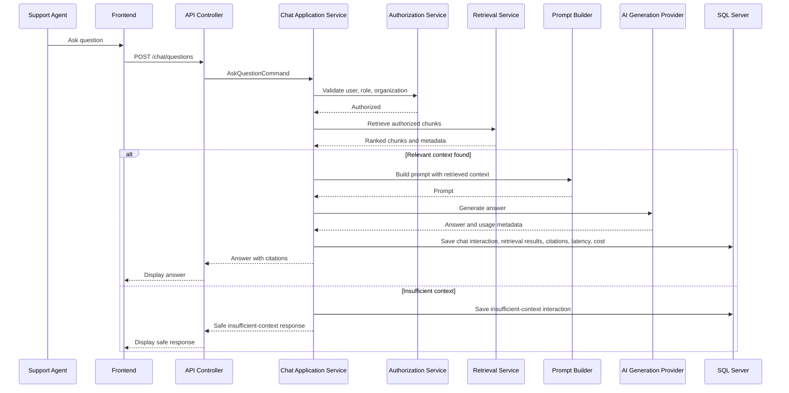
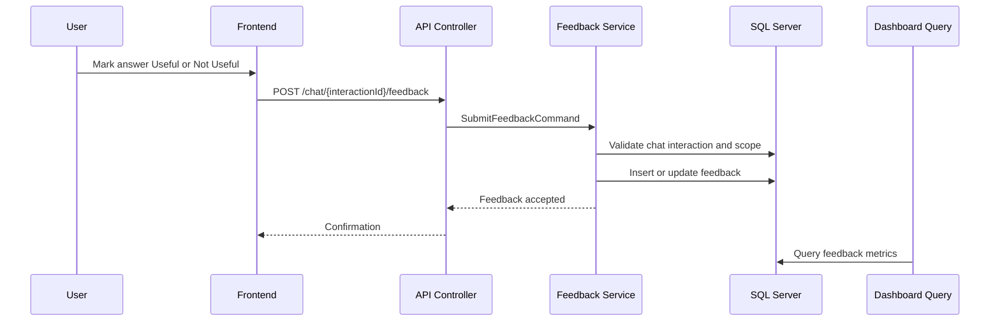
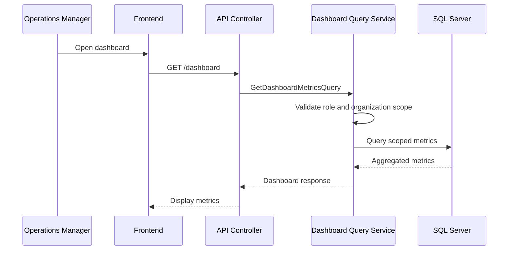
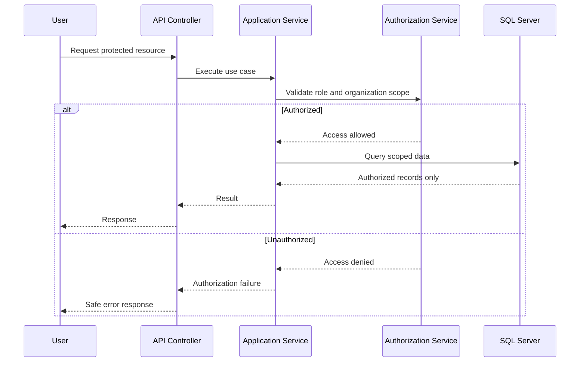
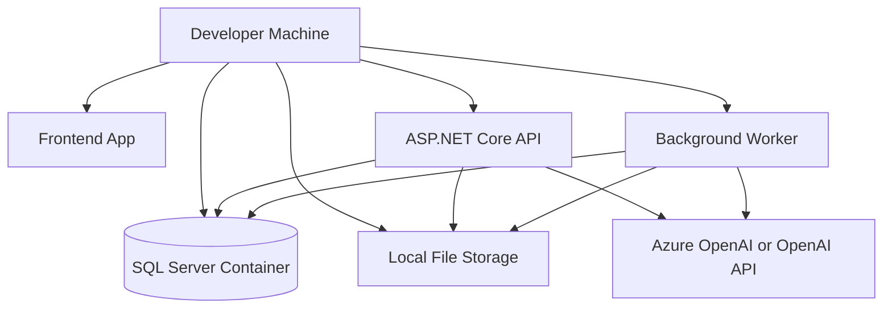
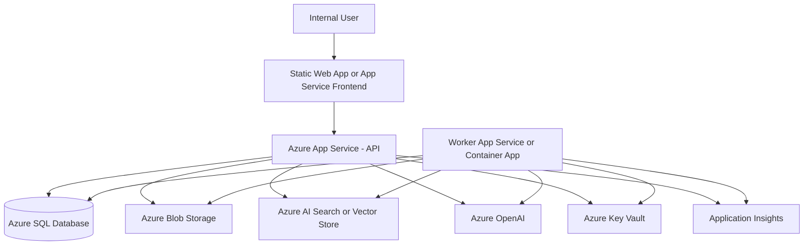

# Architecture Overview

## 1. Purpose

This document describes the architecture of **KnowledgeOps-AI** in a structured and modular way.

The purpose of this Architecture Overview is to explain how the system will be built and why the chosen architecture supports the business goals.

KnowledgeOps-AI is an enterprise AI-powered internal knowledge assistant for contact centers and support operations. The system allows authorized users to upload internal documents, process them into searchable knowledge, ask natural-language questions through a Retrieval-Augmented Generation workflow, receive source-grounded answers with citations, submit feedback, and monitor operational metrics.

This document should be used by:

- Human developers.
- AI coding agents.
- Technical reviewers.
- Portfolio reviewers.
- Future maintainers.
- Architecture reviewers.

The architecture must support the system’s business intent: helping contact center users access internal knowledge faster, more consistently, more securely, and with measurable operational visibility.

---

## 2. Introduction and Goals

## 2.1 Architecture Goals

The architecture of KnowledgeOps-AI is designed around the following goals:

1. Support a realistic enterprise AI knowledge assistant.
2. Keep business rules explicit and enforceable.
3. Protect sensitive internal documents through authentication, authorization, and organization-aware access.
4. Support document ingestion, processing, chunking, embedding generation, retrieval, RAG answering, citations, feedback, and dashboard metrics.
5. Keep AI provider details isolated from core business logic.
6. Allow the system to be tested without requiring live AI provider calls.
7. Support local development, Docker-based execution, CI validation, and Azure-ready deployment.
8. Provide observability for document processing, retrieval, AI generation, feedback, latency, cost, and failures.
9. Avoid overengineering while preserving modularity for future expansion.
10. Keep the project understandable for recruiters, technical reviewers, and AI agents.

## 2.2 Business Goals Supported by Architecture

The architecture directly supports the business goals of KnowledgeOps-AI:

| Business Goal | Architectural Support |
|---|---|
| Faster access to internal knowledge | RAG chat workflow, semantic retrieval, indexed document chunks. |
| More consistent operational answers | Grounded answer generation using retrieved internal documents. |
| Trust in AI responses | Source citations, retrieval metadata, insufficient-context handling. |
| Reduced supervisor dependency | Self-service chat assistant for documented knowledge. |
| Improved onboarding | Searchable and conversational access to procedures and training material. |
| Knowledge governance | Document metadata, processing status, feedback, and review signals. |
| Operational visibility | Dashboard metrics, latency tracking, estimated cost tracking, feedback counts. |
| Safe AI adoption | Access control, provider isolation, grounding rules, audit-friendly metadata. |

---

# 3. Architecture Constraints

## 3.1 Business Constraints

The architecture must respect the following business constraints:

- The assistant is internal-facing only during MVP.
- The assistant must not act as the final authority for business, HR, legal, compliance, or operational decisions.
- The system must clearly handle insufficient context.
- The system must not invent official policy when no relevant source exists.
- Answers generated from retrieved documents must include source citations.
- Document access must respect user role and organization scope.
- Operational metrics must not expose sensitive document content unnecessarily.
- The MVP must focus on the document-based knowledge assistant workflow.

## 3.2 Technical Constraints

The architecture must respect the following technical constraints:

- Backend implementation uses .NET 10 and ASP.NET Core Web API.
- Backend should follow Clean Architecture principles.
- SQL Server stores core application data.
- Entity Framework Core may be used for persistence.
- Document processing should be asynchronous.
- AI generation and embedding providers must be isolated behind application interfaces.
- File storage must be abstracted to support local and cloud-compatible storage.
- Retrieval implementation must support organization-aware filtering.
- Secrets must not be hardcoded.
- The system should support Docker and GitHub Actions.
- The system should be Azure-ready, even if full cloud deployment is deferred.

## 3.3 AI Constraints

The AI architecture must respect the following constraints:

- AI answers should be grounded in retrieved document context.
- Prompt construction must include retrieved context when available.
- The system must handle weak or missing retrieval results safely.
- AI provider details must not drive business rules.
- Retrieval, prompt, response, citation, latency, and cost metadata should be captured where practical.
- Critical application behavior must be testable without live AI calls.

## 3.4 Scope Constraints

The MVP must not include:

- Real-time call transcription.
- Live agent assist.
- Customer-facing chatbot behavior.
- Autonomous ticket handling.
- Automatic policy enforcement.
- Custom model training.
- Advanced MLOps.
- Enterprise SSO.
- External enterprise integrations.
- Full document approval workflows.
- Full contact center platform replacement.

---

# 4. System Context

## 4.1 System Context Description

KnowledgeOps-AI sits between internal users, internal documents, AI providers, storage, persistence, retrieval infrastructure, and operational monitoring.

The system provides a controlled interface for users to upload documents, ask questions, review citations, provide feedback, and inspect metrics.

It does not replace existing contact center systems. Instead, it acts as an internal knowledge access layer.

## 4.2 Primary Users

The primary users are:

- Support Agents.
- Supervisors.
- Knowledge Administrators.
- Operations Managers.
- Quality Analysts.
- Trainers.
- System Administrators.

These stakeholders are defined in the stakeholder map and domain model. Support Agents need fast answers with citations, Knowledge Administrators manage documents, Operations Managers review metrics, and System Administrators manage access and operational configuration. MVP technical authorization uses the five roles defined by ADR-004; Quality Analyst and Trainer are business personas rather than additional MVP roles.

## 4.3 External Systems and Services

KnowledgeOps-AI may interact with the following external systems or services:

| External System | Purpose |
|---|---|
| Azure OpenAI or OpenAI API | Generate embeddings and AI answers. |
| SQL Server | Store users, roles, documents, chunks, chat history, feedback, metrics, and audit records. |
| Azure Blob Storage or local storage | Store uploaded document files. |
| Vector-capable storage or search service | Store and search embeddings or vector references. |
| Azure Key Vault or secure configuration provider | Store secrets and provider credentials. |
| Application Insights or structured logging provider | Monitor telemetry, errors, latency, and operational events. |
| GitHub Actions | Run CI validation. |
| Docker / Docker Compose | Support local development and deployment readiness. |

## 4.4 System Context Diagram



## 4.5 Context Boundaries

KnowledgeOps-AI is responsible for:

- Internal knowledge document ingestion.
- Document processing state.
- Chunk and embedding orchestration.
- Authenticated internal chat.
- Retrieval-aware answer generation.
- Source citations.
- Feedback and evaluation metadata.
- Operational dashboard metrics.
- Access control enforcement.

KnowledgeOps-AI is not responsible for:

- Customer-facing support conversations.
- Ticket routing.
- Workforce management.
- Real-time call transcription.
- CRM ownership.
- Legal or compliance certification.
- Autonomous business decisions.

---

# 5. Solution Strategy

## 5.1 Architectural Style

The backend will follow **Clean Architecture**.

The solution should separate:

- Domain concepts and rules.
- Application use cases.
- Infrastructure provider implementations.
- API presentation concerns.
- Frontend user experience.
- Background processing.
- Tests.

The core architectural intent is that business rules and use cases remain stable even if external providers change.

## 5.2 Main Architectural Principles

### 5.2.1 Domain-Centered Design

The system should use the domain language defined in the Domain Model.

Core concepts include:

- Organization.
- User.
- Role.
- Document.
- DocumentChunk.
- ChunkEmbedding.
- ChatInteraction.
- RetrievalResult.
- Citation.
- AnswerFeedback.
- KnowledgeGapSignal.
- AuditLogEntry.

The Domain Model should guide entity design, database schema, API contracts, authorization rules, and tests.

### 5.2.2 Application Services Own Use Case Orchestration

Application services should orchestrate use cases such as:

- Upload document.
- Process document.
- Generate embeddings.
- Retrieve chunks.
- Ask chat question.
- Generate RAG answer.
- Submit feedback.
- Query dashboard metrics.
- Manage users and roles.

Controllers should remain thin and should not contain business rules.

### 5.2.3 Infrastructure Details Stay Behind Interfaces

Provider-specific integrations should live in the Infrastructure layer.

Examples:

- Azure OpenAI embedding client.
- OpenAI chat generation client.
- Azure Blob Storage document storage.
- SQL Server persistence.
- Vector search implementation.
- Application Insights telemetry.
- Key Vault secrets.

Application and Domain layers should not depend directly on provider SDKs.

### 5.2.4 Security Is Built Into the Workflow

Authentication, role authorization, and organization-aware access checks are not optional.

The architecture must enforce access rules for:

- Documents.
- Chunks.
- Retrieval.
- Chat history.
- Citations.
- Feedback.
- Dashboard metrics.
- Admin actions.

### 5.2.5 AI Must Be Grounded and Observable

AI behavior must be implemented as a controlled workflow.

The RAG process should:

1. Validate user context.
2. Apply authorization.
3. Retrieve authorized chunks.
4. Detect insufficient context.
5. Build a prompt from retrieved context.
6. Generate an answer.
7. Return citations.
8. Store metadata.
9. Track latency and estimated cost.
10. Allow feedback.

### 5.2.6 MVP First, Extensible Later

The system should be modular enough to evolve, but the MVP should remain focused.

Future capabilities such as enterprise SSO, advanced analytics, document approval workflows, Teams integrations, SharePoint integrations, live agent assist, and multi-language optimization should not be implemented in the MVP unless scope is formally revised.

---

# 6. Building Block View

## 6.1 High-Level Building Blocks



## 6.2 Backend Project Structure

A recommended backend structure:

```text
src/
  KnowledgeOps.Api/
    Controllers/
    Middleware/
    Filters/
    Authentication/
    Program.cs

  KnowledgeOps.Application/
    Abstractions/
      Identity/
      Persistence/
      Storage/
      AI/
      Retrieval/
      Observability/
      Time/
    Documents/
      Commands/
      Queries/
      Services/
    Processing/
      Commands/
      Services/
    Chat/
      Commands/
      Services/
      Prompting/
    Feedback/
      Commands/
      Queries/
    Dashboard/
      Queries/
    Administration/
      Commands/
      Queries/
    Common/
      Behaviors/
      DTOs/
      Results/

  KnowledgeOps.Domain/
    Organizations/
    Users/
    Documents/
    Chunks/
    Chat/
    Feedback/
    Metrics/
    Audit/
    Shared/

  KnowledgeOps.Infrastructure/
    Persistence/
      DbContext/
      Configurations/
      Migrations/
      Repositories/
    Storage/
      Local/
      AzureBlob/
    AI/
      AzureOpenAI/
      OpenAI/
    Retrieval/
      SqlVector/
      AzureAISearch/
      InMemory/
    Observability/
    Security/
    BackgroundJobs/

  KnowledgeOps.Worker/
    DocumentProcessingWorker.cs
    EmbeddingGenerationWorker.cs

tests/
  KnowledgeOps.UnitTests/
  KnowledgeOps.IntegrationTests/
```

This structure may be adjusted during implementation, but the core separation should remain stable.

---

## 6.3 Frontend Building Blocks

The frontend is implemented with Angular, as selected by ADR-003.

Recommended frontend modules:

| Module | Responsibility |
|---|---|
| Authentication UI | Login, logout, session handling. |
| App Shell | Navigation, layout, role-aware menus. |
| Chat UI | Question input, answer display, citations, feedback. |
| Document Management UI | Upload documents, list documents, view processing status. |
| Dashboard UI | Display usage, latency, cost, feedback, and document metrics. |
| Admin UI | Manage users, roles, and access boundaries. |
| Shared Components | Buttons, cards, tables, alerts, loading states. |
| API Client Layer | Typed access to backend endpoints. |
| State Management | Manage user session, chat state, dashboard state, and document status. |

## 6.4 Backend Modules

## 6.4.1 Identity and Access Module

Responsibilities:

- Authenticate users.
- Load user identity context.
- Load roles.
- Load organization scope.
- Enforce role-based authorization.
- Support user and role management.

Key concepts:

- User.
- Role.
- UserRole.
- Organization.
- OrganizationScope.

## 6.4.2 Document Management Module

Responsibilities:

- Validate document uploads.
- Store document metadata.
- Store uploaded files through a storage abstraction.
- Assign organization scope.
- List documents.
- View document details.
- Disable documents from retrieval.

Key concepts:

- Document.
- DocumentMetadata.
- ProcessingStatus.
- StorageLocation.

## 6.4.3 Document Processing Module

Responsibilities:

- Process uploaded documents asynchronously.
- Extract text.
- Split text into chunks.
- Store chunks.
- Generate embeddings.
- Track processing states.
- Track failure reasons.

Key concepts:

- Document.
- DocumentChunk.
- ChunkEmbedding.
- ProcessingFailureReason.

## 6.4.4 Retrieval Module

Responsibilities:

- Generate query embeddings.
- Search indexed chunks.
- Apply organization-aware filters.
- Exclude failed, unprocessed, retrieval-disabled, soft-deleted, or unauthorized documents.
- Return ranked retrieval results.
- Provide retrieval metadata.

Key concepts:

- RetrievalResult.
- RetrievalScore.
- DocumentChunk.
- ChunkEmbedding.

## 6.4.5 RAG Chat Module

Responsibilities:

- Accept user questions.
- Validate chat permissions.
- Orchestrate retrieval.
- Detect insufficient context.
- Build prompt from retrieved chunks.
- Call AI generation provider.
- Return answer and citations.
- Store chat interaction.
- Store retrieval and AI metadata.

Key concepts:

- ChatSession.
- ChatInteraction.
- Citation.
- AiUsageMetadata.
- LatencyMeasurement.

## 6.4.6 Feedback Module

Responsibilities:

- Accept useful / not useful feedback.
- Associate feedback with chat interaction.
- Prevent duplicate metric inflation.
- Expose feedback data for dashboard and review.

Key concepts:

- AnswerFeedback.
- FeedbackRating.
- ChatInteraction.

## 6.4.7 Dashboard Module

Responsibilities:

- Aggregate operational metrics.
- Scope metrics by organization and role.
- Display question counts.
- Display document counts.
- Display feedback counts.
- Display insufficient-context counts.
- Display latency and estimated cost.

Key concepts:

- DashboardMetric.
- ChatInteraction.
- AnswerFeedback.
- Document.
- KnowledgeGapSignal.

## 6.4.8 Administration Module

Responsibilities:

- Manage users.
- Manage roles.
- Manage organization access.
- View system health.
- View document processing failures.
- Support operational diagnostics.

Key concepts:

- User.
- UserRole.
- Organization.
- AuditLogEntry.

## 6.4.9 Observability Module

Responsibilities:

- Structured logging.
- Correlation IDs.
- Error diagnostics.
- Operational event recording.
- AI usage metadata.
- Background job failure visibility.
- Authorization failure logging.

Key concepts:

- AuditLogEntry.
- LatencyMeasurement.
- AiUsageMetadata.

---

# 7. Runtime View

## 7.1 Runtime Scenario: Document Upload and Processing



## 7.2 Runtime Scenario: Ask Question and Generate RAG Answer



## 7.3 Runtime Scenario: Submit Feedback



## 7.4 Runtime Scenario: Review Dashboard



## 7.5 Runtime Scenario: Access Boundary Enforcement



---

# 8. Deployment View

## 8.1 MVP Local Development Deployment

The MVP should support local development using Docker or Docker Compose.



## 8.2 Azure-Ready Deployment

The architecture should be structured so that it can later run on Azure.



## 8.3 Deployment Units

| Deployment Unit | Responsibility |
|---|---|
| Frontend Web App | Provides chat, upload, citations, feedback, dashboard, and admin UI. |
| ASP.NET Core API | Exposes authenticated APIs and orchestrates application use cases. |
| Background Worker | Processes uploaded documents, extracts text, chunks, and generates embeddings. |
| SQL Server / Azure SQL | Stores relational application data. |
| File Storage / Azure Blob Storage | Stores uploaded documents. |
| Vector Store / Azure AI Search | Stores and retrieves searchable embeddings or vector indexes. |
| Azure OpenAI / OpenAI API | Provides embeddings and answer generation. |
| Key Vault / Secure Configuration | Stores secrets and provider credentials. |
| Application Insights / Logging | Provides telemetry, errors, traces, and operational diagnostics. |

## 8.4 Environment Strategy

Recommended environments:

| Environment | Purpose |
|---|---|
| Local | Developer workflow using local settings, Docker, and mockable providers. |
| Test | Automated validation with test database and fake or stubbed AI providers. |
| Demo | Portfolio or stakeholder demonstration environment. |
| Production-like | Optional future environment for Azure-ready validation. |

## 8.5 Configuration Strategy

Configuration must be environment-based.

Configuration should include:

- Database connection string.
- File storage provider.
- AI provider settings.
- Embedding model settings.
- Chat model settings.
- Retrieval settings.
- Maximum retrieval result count.
- Prompt template version.
- Allowed file types.
- Maximum upload size.
- Logging level.
- Feature flags, if used.
- Cost estimation settings.

Secrets must not be committed to source control.

---

# 9. Cross-Cutting Concepts

## 9.1 Authentication and Authorization

Authentication identifies the user.

Authorization determines what the user can do.

KnowledgeOps-AI must enforce both:

- Role-based permissions.
- Organization-aware data access.

Role checks alone are insufficient. Organization checks alone are insufficient.

Protected resources include:

- Documents.
- Chunks.
- Retrieval results.
- Chat history.
- Citations.
- Feedback.
- Dashboard metrics.
- Admin actions.
- Health views.

## 9.2 Organization-Aware Data Isolation

Most business records must include an organization boundary.

This includes:

- Documents.
- Document chunks.
- Chat sessions.
- Chat interactions.
- Retrieval results.
- Citations.
- Feedback.
- Knowledge gap signals.
- Dashboard metrics.
- Audit entries where applicable.

All queries that return business data must apply organization filtering unless explicitly documented otherwise.

## 9.3 RAG Grounding

The RAG pipeline must be designed as a controlled application workflow.

Minimum RAG stages:

1. Receive question.
2. Validate user and access scope.
3. Generate query embedding or retrieval representation.
4. Retrieve eligible chunks.
5. Evaluate retrieval sufficiency.
6. Build grounded prompt.
7. Generate answer.
8. Map citations.
9. Store metadata.
10. Return response.

The assistant must not invent official policy when insufficient context exists.

## 9.4 Provider Isolation

Provider-specific details must remain in infrastructure.

The application layer should depend on abstractions such as:

```text
IEmbeddingProvider
IAiAnswerGenerator
IDocumentStorage
IDocumentTextExtractor
IRetrievalService
IVectorIndex
ICostEstimator
ICurrentUserContext
IClock
IAuditLogger
```

Provider implementations may include:

```text
AzureOpenAIEmbeddingProvider
OpenAIAnswerGenerator
AzureBlobDocumentStorage
LocalDocumentStorage
SqlVectorRetrievalService
AzureAiSearchRetrievalService
ApplicationInsightsTelemetrySink
```

## 9.5 Error Handling

The system should distinguish between:

| Error Type | Expected Behavior |
|---|---|
| Validation error | Return clear user-facing validation message. |
| Authorization error | Return safe access denied response. |
| Not found | Return safe not-found response without leaking existence across organizations. |
| Processing failure | Mark document failed and store safe failure reason. |
| AI provider failure | Return safe failure response and log provider error. |
| Retrieval failure | Return safe degraded response and log error. |
| Unexpected system error | Return generic error and log details safely. |

## 9.6 Observability

The system should use structured logging and operational metadata.

Important events include:

- Document upload.
- Processing started.
- Processing completed.
- Processing failed.
- Embedding generation failed.
- Chat question received.
- Retrieval completed.
- AI generation completed.
- AI generation failed.
- Insufficient context detected.
- Feedback submitted.
- Authorization failure.
- Dashboard viewed.
- User role changed.

Telemetry should support:

- Latency tracking.
- Estimated AI cost tracking.
- Token usage when available.
- Failure diagnostics.
- Usage trends.
- Processing status.
- Feedback analysis.

## 9.7 Security and Secret Management

Security requirements include:

- No hardcoded secrets.
- Environment-based configuration.
- Secure provider credentials.
- Restricted access to admin and health views.
- Safe error messages.
- Sensitive content protection in logs.
- Organization-aware data access.
- Retrieval access filtering.

Future Azure deployment should use Azure Key Vault or equivalent secure configuration storage.

## 9.8 Testing Strategy

The architecture must support testing at multiple levels.

| Test Type | Purpose |
|---|---|
| Unit tests | Validate domain logic, application services, validators, prompt construction, and business rules. |
| Integration tests | Validate API, persistence, authorization, and workflows. |
| Contract tests | Validate provider abstractions and expected request/response shapes. |
| Background worker tests | Validate document processing lifecycle. |
| Retrieval tests | Validate eligible chunk filtering and ranking behavior. |
| RAG orchestration tests | Validate retrieval-before-generation, citations, and insufficient-context behavior. |
| Dashboard tests | Validate metric aggregation and scoped access. |
| Security tests | Validate authentication, role authorization, and organization isolation. |

Live AI provider calls should not be required for most tests.

Fake or stub providers should be used for deterministic testing.

## 9.9 Documentation as Architecture

Documentation is part of the system architecture.

Architecture-relevant documents include:

- Executive Summary.
- Business Context.
- Business Case.
- Project Charter.
- Stakeholder Map.
- Scope and Roadmap.
- Requirements.
- Use Cases.
- Business Process Flows.
- Business Rules.
- Domain Model.
- Architecture Overview.

AI agents must use these documents before proposing implementation work.

---

# 10. Architecture Decisions

This section records initial architecture decisions. More detailed ADRs may be created later.

## AD-001: Use Clean Architecture for Backend Structure

### Decision

Use Clean Architecture to separate Domain, Application, Infrastructure, and API responsibilities.

### Rationale

KnowledgeOps-AI combines business rules, AI providers, storage providers, retrieval infrastructure, and operational workflows. Clean Architecture keeps business behavior independent from external systems and supports testability.

### Consequences

- More project structure is required.
- Interfaces must be maintained.
- Business logic is easier to test.
- Provider implementations can change with lower risk.

---

## AD-002: Isolate AI Providers Behind Application Interfaces

### Decision

Embedding generation and AI answer generation must be accessed through abstractions.

### Rationale

The system may use Azure OpenAI, OpenAI API, or another compatible provider. Business rules must not depend on provider SDKs.

### Consequences

- Fake providers can be used in tests.
- Provider changes are easier.
- Some provider-specific capabilities may need adapter mapping.
- Application code remains more stable.

---

## AD-003: Use Asynchronous Document Processing

### Decision

Uploaded documents should be processed asynchronously.

### Rationale

Document extraction, chunking, and embedding generation may take time. Upload requests should not block until the full ingestion pipeline completes.

### Consequences

- Document status tracking is required.
- Background worker reliability matters.
- Users need visibility into processing state.
- Failure reasons must be stored.

---

## AD-004: Store Chat Interactions and Retrieval Metadata

### Decision

Chat interactions, sources, citations, retrieval metadata, latency, and estimated cost should be stored.

### Rationale

The system must be measurable and reviewable. Feedback, dashboard metrics, and knowledge gap analysis depend on stored interaction data.

### Consequences

- More persistence design is required.
- Sensitive content handling must be considered.
- Dashboard queries become more valuable.
- Review workflows become possible.

---

## AD-005: Enforce Organization-Aware Retrieval

### Decision

Retrieval must filter candidate chunks by organization and access permissions before answer generation.

### Rationale

The system handles internal documents. Unauthorized documents must not influence answers or citations.

### Consequences

- Retrieval implementation must include access filters.
- Tests must validate cross-organization isolation.
- Data model must preserve organization scope across documents, chunks, chats, and citations.

---

## AD-006: Include Source Citations for Grounded Answers

### Decision

Generated answers based on retrieved chunks must include source citations.

### Rationale

Citations improve trust, reviewability, compliance posture, and operational confidence.

### Consequences

- Retrieval results must preserve source references.
- The frontend must display citations clearly.
- Citation mapping must be tested.
- Answers without enough context must be handled safely.

---

## AD-007: Keep MVP Document-Based and Internal-Only

### Decision

The MVP will focus on internal document-based knowledge retrieval and will not include customer-facing chatbot behavior, real-time call transcription, or autonomous operational actions.

### Rationale

The project must prove the core knowledge assistant workflow before expanding into larger contact center automation.

### Consequences

- Scope remains controlled.
- Portfolio story is clearer.
- Advanced features are deferred.
- Implementation can focus on quality and traceability.

---

## AD-008: Use SQL Server for Core Application Persistence

### Decision

Use SQL Server for users, roles, organizations, documents, chunks, chat history, feedback, metrics, and audit records.

### Rationale

SQL Server aligns with enterprise .NET development and supports relational modeling for core business data.

### Consequences

- Entity Framework Core can be used for persistence.
- Relational constraints can support data integrity.
- Vector search may require either SQL vector support, an extension strategy, or a separate vector-capable retrieval service depending on implementation choice.

---

## AD-009: Support Azure-Ready Deployment Without Requiring Full Azure Deployment in MVP

### Decision

The architecture should be Azure-ready but should not require full production-grade Azure deployment during early MVP development.

### Rationale

The project should demonstrate cloud readiness while avoiding unnecessary deployment complexity before the core workflow is validated.

### Consequences

- Local development should work with Docker.
- Provider abstractions should support Azure later.
- Deployment documentation should explain the intended Azure path.
- Full Azure hardening can be deferred to later phases.

---

# 11. Risks and Technical Debt

## 11.1 Retrieval Quality Risk

### Risk

Poor chunking, missing metadata, weak embeddings, or simple retrieval strategy may produce low-quality answers.

### Impact

- Low user trust.
- Poor feedback.
- More insufficient-context events.
- Weak portfolio demonstration.

### Mitigation

- Keep chunking strategy consistent and testable.
- Store retrieval metadata.
- Track not useful feedback.
- Support iterative retrieval improvements.
- Include insufficient-context handling.

## 11.2 AI Hallucination Risk

### Risk

The AI provider may generate unsupported answers if prompts are weak or retrieval context is insufficient.

### Impact

- Incorrect operational guidance.
- Loss of trust.
- Governance risk.

### Mitigation

- Use grounded prompt templates.
- Require citations for grounded answers.
- Detect insufficient context.
- Store prompt and response metadata.
- Add RAG orchestration tests.

## 11.3 Authorization Leakage Risk

### Risk

Retrieval or citations may expose unauthorized documents if organization filters are not applied correctly.

### Impact

- Security breach.
- Loss of trust.
- Compliance concern.

### Mitigation

- Store organization scope on documents, chunks, chats, feedback, and citations.
- Apply access filters before retrieval.
- Test cross-organization retrieval.
- Log authorization failures safely.

## 11.4 Provider Coupling Risk

### Risk

Business logic may become tightly coupled to Azure OpenAI, OpenAI API, Azure Blob Storage, or a specific vector search service.

### Impact

- Difficult testing.
- Difficult migration.
- Leaky infrastructure concerns.
- Reduced maintainability.

### Mitigation

- Use provider interfaces.
- Keep SDK types in Infrastructure.
- Use fake providers in tests.
- Map provider responses into application DTOs.

## 11.5 Background Processing Reliability Risk

### Risk

Document processing may fail due to file errors, extraction issues, provider errors, or worker interruptions.

### Impact

- Documents unavailable for retrieval.
- Poor admin experience.
- Incomplete knowledge base.

### Mitigation

- Track document status.
- Store safe failure reasons.
- Log processing events.
- Show processing state in UI.
- Add worker tests.

## 11.6 Cost and Latency Risk

### Risk

AI usage may become slow or expensive depending on token volume, retrieval size, provider latency, and document volume.

### Impact

- Poor user experience.
- Unclear operating cost.
- Lower adoption.

### Mitigation

- Limit retrieved context.
- Track latency.
- Estimate cost when available.
- Store token usage where provider supports it.
- Keep MVP prompts focused.

## 11.7 Scope Creep Risk

### Risk

The project may expand into real-time agent assist, customer chatbot, workflow automation, integrations, or enterprise governance too early.

### Impact

- Delayed MVP.
- Confusing architecture.
- Reduced portfolio clarity.

### Mitigation

- Follow Scope and Roadmap.
- Reject out-of-scope features unless formally revised.
- Keep MVP focused on document ingestion, RAG chat, citations, feedback, and dashboard metrics.

## 11.8 Technical Debt: Initial Retrieval Implementation

### Debt

The initial retrieval implementation may be simpler than a production-grade enterprise retrieval system.

### Acceptable for MVP

Yes, if it supports:

- Semantic retrieval.
- Organization-aware filtering.
- Source references.
- Testability.
- Iterative replacement.

### Future Improvement

Upgrade retrieval through Azure AI Search, hybrid search, better ranking, or improved chunking.

## 11.9 Technical Debt: Basic Dashboard Metrics

### Debt

The MVP dashboard may use simple aggregate queries instead of advanced analytics.

### Acceptable for MVP

Yes, if it shows:

- Question count.
- Feedback counts.
- Document counts.
- Failed processing counts.
- Latency.
- Estimated cost when available.
- Insufficient-context count.

### Future Improvement

Add trends, topic clustering, cost analysis, retrieval quality analysis, and knowledge gap workflows in later phases.

---

# 12. Architecture Traceability

## 12.1 Architecture to Business Goals

| Architecture Element | Business Goal Supported |
|---|---|
| RAG Chat Module | Fast access to grounded operational answers. |
| Citation Mapping | Trust and auditability. |
| Document Processing Pipeline | Converts static documents into searchable knowledge. |
| Feedback Module | Continuous improvement and quality review. |
| Dashboard Module | Operational visibility and measurable AI usage. |
| Organization-Aware Authorization | Protection of sensitive internal knowledge. |
| Provider Abstractions | Maintainability and future flexibility. |
| Structured Logging | Operational support and diagnostics. |

## 12.2 Architecture to Requirements

| Architecture Element | Related Requirements |
|---|---|
| Identity and Access Module | FR-001 to FR-010, NFR-001 to NFR-007 |
| Document Management Module | FR-011 to FR-018 |
| Document Processing Module | FR-019 to FR-038 |
| Retrieval Module | FR-039 to FR-046 |
| RAG Chat Module | FR-047 to FR-067 |
| Feedback Module | FR-068 to FR-075 |
| Dashboard Module | FR-076 to FR-086 |
| Administration Module | FR-087 to FR-091 |
| Observability Module | FR-092 to FR-099, NFR-024 to NFR-028 |
| Testing Strategy | FR-100 to FR-108 |

## 12.3 Architecture to Business Rules

| Architecture Element | Related Business Rules |
|---|---|
| Authentication Middleware | BR-001, BR-005 |
| Authorization Policies | BR-002, BR-004, BR-038, BR-041 |
| Organization Scope Filters | BR-003, BR-015, BR-027, BR-028 |
| Document Processing Pipeline | BR-006 to BR-014 |
| Retrieval Service | BR-015 to BR-016 |
| Prompt Builder | BR-017, BR-018, BR-020, BR-021, BR-042, BR-045 |
| Citation Mapper | BR-019, BR-044 |
| Feedback Service | BR-023 to BR-027 |
| Dashboard Query Service | BR-028 to BR-033 |
| Observability Services | BR-034 to BR-037 |
| Provider Interfaces | BR-043 |
| Scope Governance | BR-046 to BR-049 |

---

# 13. Guidance for AI Coding Agents

AI coding agents must use this Architecture Overview together with the existing requirements, business rules, use cases, domain model, and roadmap before proposing implementation.

## 13.1 AI Agents Must

- Preserve Clean Architecture boundaries.
- Keep controllers thin.
- Put use case orchestration in Application services.
- Keep provider SDKs in Infrastructure.
- Enforce authentication, role permissions, and organization scope.
- Keep retrieval organization-aware.
- Preserve source citations for grounded answers.
- Preserve insufficient-context behavior.
- Add or update tests for implemented workflows.
- Avoid hardcoded secrets.
- Avoid logging sensitive document or prompt content.
- Keep MVP scope focused.

## 13.2 AI Agents Must Not

- Add customer-facing chatbot behavior during MVP.
- Add real-time call transcription during MVP.
- Add autonomous business actions during MVP.
- Move business rules into UI components.
- Put provider SDK types into Domain entities.
- Bypass authorization during retrieval.
- Generate answers from unauthorized documents.
- Remove citation requirements.
- Treat AI responses as final business authority.
- Add advanced integrations unless scope is formally revised.

---

# 14. Summary

KnowledgeOps-AI will be built as a modular, enterprise-oriented, AI-enabled knowledge assistant.

The architecture uses Clean Architecture principles to separate domain logic, application workflows, infrastructure providers, API presentation, frontend experience, and background processing.

The core workflow is document ingestion, text extraction, chunking, embedding generation, semantic retrieval, RAG answer generation, citations, feedback, and operational metrics.

The architecture supports the business goals by making internal knowledge faster to access, more consistent, more trustworthy, more measurable, and safer to use with AI.

The system must remain internal, source-grounded, organization-aware, observable, testable, and focused on the approved MVP scope.
