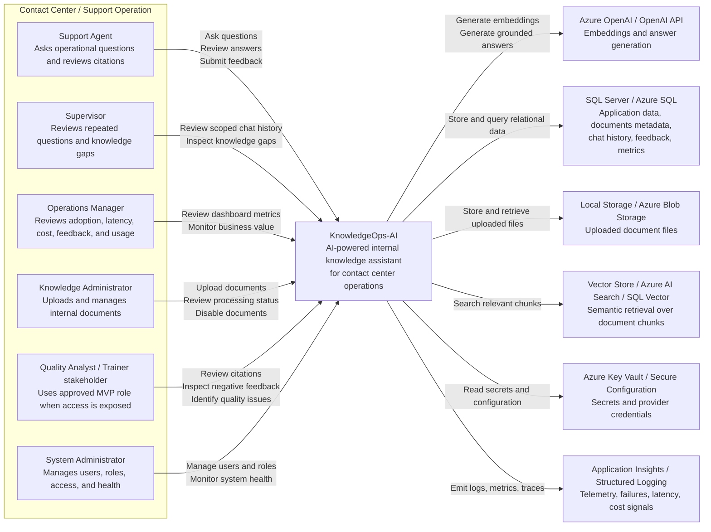
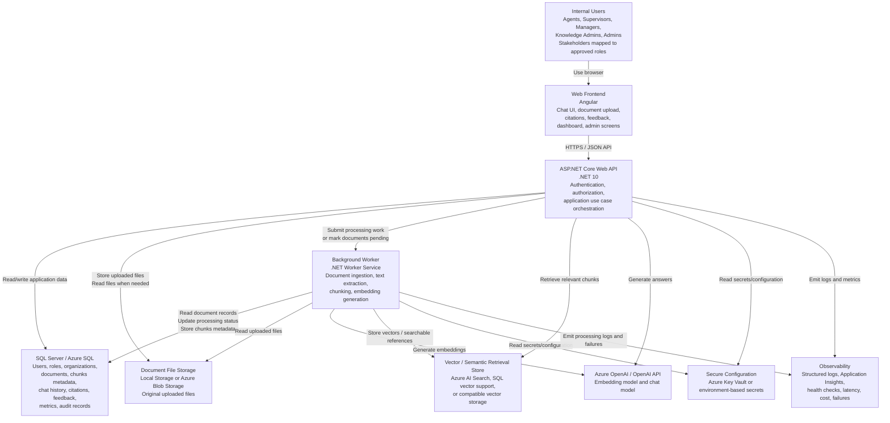

# C4 Architecture Diagrams

## 1. Purpose

This document explains the architecture of **KnowledgeOps-AI** using the C4 model.

The purpose of C4 diagrams is to help humans and AI agents understand the system at different levels of abstraction before diving into source code.

KnowledgeOps-AI is an enterprise AI-powered internal knowledge assistant for contact centers and support operations. The system allows authorized users to upload internal documents, process them into searchable knowledge, ask natural-language questions through a Retrieval-Augmented Generation workflow, receive grounded answers with citations, submit feedback, and monitor operational metrics.

This document supports:

- Architecture understanding.
- Developer onboarding.
- AI coding agent context.
- Portfolio review.
- Technical review.
- Implementation planning.
- Diagram export for repository documentation.

---

## 2. Diagram Files

The recommended exported diagram files are:

```text
docs/diagrams/architecture/c4-system-context.png
docs/diagrams/architecture/c4-container-diagram.png
docs/diagrams/architecture/c4-component-diagram.png
```

The Mermaid diagrams in this document are the source-of-truth version for documentation.

The PNG files should be treated as rendered artifacts generated from these diagrams.

---

## 3. C4 Levels Used

This document uses the following C4 levels:

| Level | Name | Purpose |
|---|---|---|
| C1 | System Context | Shows KnowledgeOps-AI as a system and its relationship with users and external systems. |
| C2 | Container Diagram | Shows the major deployable or runtime containers inside KnowledgeOps-AI. |
| C3 | Component Diagram | Shows the main backend components that implement the core application behavior. |

For most portfolio and enterprise documentation, **C1 and C2 are the most important diagrams**.

C3 is included because KnowledgeOps-AI has important backend structure around document processing, retrieval, RAG orchestration, citations, feedback, dashboard metrics, authorization, and provider isolation.

---

# 4. C1 — System Context Diagram

## 4.1 Purpose

The System Context Diagram shows KnowledgeOps-AI as a single system and explains how it interacts with users and external services.

At this level, the internal implementation details are hidden.

The goal is to answer:

- Who uses the system?
- What problem does the system solve?
- Which external systems does it depend on?
- What business boundary does the system own?

## 4.2 Diagram File

Recommended exported file:

```text
docs/diagrams/architecture/c4-system-context.png
```

## 4.3 Diagram



## 4.4 Explanation

KnowledgeOps-AI acts as an internal knowledge access layer for contact center operations.

Users do not interact directly with AI providers, storage, vector search, or application databases. They interact with KnowledgeOps-AI through a controlled application interface.

KnowledgeOps-AI is responsible for:

- Authenticating users.
- Enforcing role permissions.
- Enforcing organization-aware access boundaries.
- Accepting internal document uploads.
- Processing documents into chunks and embeddings.
- Retrieving relevant authorized chunks.
- Generating grounded AI answers.
- Returning source citations.
- Capturing feedback.
- Tracking usage, latency, cost, and processing status.
- Supporting dashboard visibility.

External services support storage, AI generation, vector retrieval, secrets, and observability.

## 4.5 Important Context Boundaries

KnowledgeOps-AI is responsible for:

- Internal knowledge document ingestion.
- Internal RAG chat.
- Source citation mapping.
- Feedback capture.
- Basic operational metrics.
- Document processing status.
- Organization-aware access enforcement.

KnowledgeOps-AI is not responsible for:

- Customer-facing chatbot behavior.
- Real-time call transcription.
- Live agent assist.
- Ticket routing.
- Workforce management.
- CRM ownership.
- Autonomous policy enforcement.
- Final business, HR, legal, or compliance decisions.

---

# 5. C2 — Container Diagram

## 5.1 Purpose

The Container Diagram shows the major runtime and deployable units that make up KnowledgeOps-AI.

At this level, the focus is on applications, services, databases, workers, and external infrastructure.

The goal is to answer:

- What are the main executable parts of the system?
- Where does frontend logic live?
- Where does backend orchestration live?
- Where does asynchronous document processing happen?
- Where is data stored?
- Which external providers are used?

## 5.2 Diagram File

Recommended exported file:

```text
docs/diagrams/architecture/c4-container-diagram.png
```

## 5.3 Diagram



## 5.4 Container Responsibilities

| Container | Responsibility |
|---|---|
| Web Frontend | Provides the user interface for chat, citations, feedback, document upload, document status, dashboard, and administration. |
| ASP.NET Core Web API | Exposes authenticated APIs, enforces access rules, orchestrates application use cases, and coordinates retrieval/RAG flows. |
| Background Worker | Processes uploaded documents asynchronously, extracts text, creates chunks, generates embeddings, and updates processing status. |
| SQL Server / Azure SQL | Stores relational business and operational data. |
| Document File Storage | Stores original uploaded files through an abstraction that can later map to Azure Blob Storage. |
| Vector / Semantic Retrieval Store | Stores searchable embeddings or vector references and supports semantic retrieval. |
| Azure OpenAI / OpenAI API | Provides embedding generation and grounded answer generation. |
| Secure Configuration | Stores secrets, provider credentials, and environment-specific configuration. |
| Observability | Captures logs, metrics, traces, latency, estimated cost, and failures. |

## 5.5 Container Notes

The API and Worker are separated because document processing can be slow and should not block upload requests.

The API owns user-facing request orchestration, while the Worker owns ingestion execution.

SQL Server stores the core relational state, while the vector store supports retrieval. Depending on implementation maturity, the MVP may use a simpler vector-capable storage approach and evolve later toward Azure AI Search or another production-grade retrieval service.

Provider-specific details must stay behind infrastructure abstractions. Application and domain logic should not depend directly on Azure OpenAI, OpenAI SDKs, Azure Blob SDKs, or vector database SDKs.

---

# 6. C3 — Component Diagram

## 6.1 Purpose

The Component Diagram shows the main backend components inside the ASP.NET Core API and related application layer.

This level clarifies how backend responsibilities are separated.

The goal is to answer:

- Which backend components implement the main use cases?
- Where do authorization and organization scope checks happen?
- Which components orchestrate RAG?
- Which components manage documents, feedback, dashboard metrics, and provider integrations?
- Which components should be mocked or stubbed in tests?

## 6.2 Diagram File

Recommended exported file:

```text
docs/diagrams/architecture/c4-component-diagram.png
```

## 6.3 Diagram

```mermaid
flowchart TD
    Frontend["Web Frontend<br/>Angular"]

    subgraph Api["ASP.NET Core Web API"]
        Controllers["API Controllers<br/>Thin HTTP endpoints"]
        Middleware["Middleware<br/>Authentication, authorization,<br/>correlation, error handling"]
        AuthPolicies["Authorization Policies<br/>Role and organization checks"]
    end

    subgraph Application["Application Layer"]
        CurrentUser["Current User Context<br/>User ID, roles, organization scope"]
        DocumentService["Document Application Service<br/>Upload, list, details, disable"]
        ProcessingService["Processing Orchestration Service<br/>Start processing, update status,<br/>record failures"]
        RetrievalService["Retrieval Service<br/>Query embedding, top-K retrieval,<br/>organization-aware filtering"]
        ChatService["RAG Chat Service<br/>Ask question, orchestrate retrieval,<br/>build prompt, generate answer"]
        PromptBuilder["Prompt Builder<br/>Grounding instructions,<br/>retrieved context, prompt version"]
        CitationMapper["Citation Mapper<br/>Map retrieval results to source citations"]
        FeedbackService["Feedback Service<br/>Useful / not useful feedback,<br/>duplicate handling"]
        DashboardService["Dashboard Query Service<br/>Usage, latency, cost, feedback,<br/>document metrics"]
        AdminService["Administration Service<br/>Users, roles, access boundaries"]
        AuditService["Audit / Observability Service<br/>Business events, failures,<br/>authorization events"]
    end

    subgraph Domain["Domain Layer"]
        Entities["Domain Entities<br/>Organization, User, Role,<br/>Document, Chunk, ChatInteraction,<br/>Citation, Feedback"]
        Rules["Business Rules<br/>Access, document lifecycle,<br/>retrieval, RAG, feedback,<br/>metrics, AI governance"]
        ValueObjects["Value Objects<br/>OrganizationScope, DocumentMetadata,<br/>RetrievalScore, CitationReference,<br/>AiUsageMetadata"]
    end

    subgraph Infrastructure["Infrastructure Layer"]
        Persistence["Persistence<br/>EF Core, SQL Server repositories"]
        FileStorage["Document Storage Provider<br/>Local or Azure Blob"]
        TextExtraction["Text Extraction Provider<br/>PDF, TXT, Markdown, DOCX where supported"]
        Chunking["Chunking Service<br/>Consistent document splitting"]
        EmbeddingProvider["Embedding Provider<br/>Azure OpenAI / OpenAI adapter"]
        AiGenerator["AI Answer Generator<br/>Azure OpenAI / OpenAI adapter"]
        VectorIndex["Vector Index / Search Adapter<br/>SQL vector, Azure AI Search,<br/>or compatible store"]
        Telemetry["Telemetry Sink<br/>Structured logs, metrics,<br/>Application Insights"]
        SecretProvider["Secret Provider<br/>Environment variables or Key Vault"]
    end

    Frontend --> Controllers
    Controllers --> Middleware
    Controllers --> DocumentService
    Controllers --> ChatService
    Controllers --> FeedbackService
    Controllers --> DashboardService
    Controllers --> AdminService

    Middleware --> CurrentUser
    AuthPolicies --> CurrentUser

    DocumentService --> CurrentUser
    DocumentService --> Persistence
    DocumentService --> FileStorage
    DocumentService --> AuditService

    ProcessingService --> Persistence
    ProcessingService --> FileStorage
    ProcessingService --> TextExtraction
    ProcessingService --> Chunking
    ProcessingService --> EmbeddingProvider
    ProcessingService --> VectorIndex
    ProcessingService --> AuditService

    ChatService --> CurrentUser
    ChatService --> RetrievalService
    ChatService --> PromptBuilder
    ChatService --> AiGenerator
    ChatService --> CitationMapper
    ChatService --> Persistence
    ChatService --> AuditService

    RetrievalService --> CurrentUser
    RetrievalService --> EmbeddingProvider
    RetrievalService --> VectorIndex
    RetrievalService --> Persistence

    FeedbackService --> CurrentUser
    FeedbackService --> Persistence
    FeedbackService --> AuditService

    DashboardService --> CurrentUser
    DashboardService --> Persistence

    AdminService --> CurrentUser
    AdminService --> Persistence
    AdminService --> AuditService

    AuditService --> Telemetry

    DocumentService --> Entities
    ProcessingService --> Entities
    RetrievalService --> Rules
    ChatService --> Rules
    CitationMapper --> ValueObjects
    FeedbackService --> Entities
    DashboardService --> Entities

    Persistence --> SecretProvider
    FileStorage --> SecretProvider
    EmbeddingProvider --> SecretProvider
    AiGenerator --> SecretProvider
    VectorIndex --> SecretProvider
```



## 6.4 Component Responsibilities

## 6.4.1 API Controllers

Controllers expose HTTP endpoints and should remain thin.

They are responsible for:

- Receiving requests.
- Validating request shape where appropriate.
- Calling application services.
- Returning HTTP responses.

Controllers should not contain business rules, RAG logic, retrieval logic, provider SDK calls, or persistence logic.

---

## 6.4.2 Middleware

Middleware handles cross-cutting request concerns.

Responsibilities include:

- Authentication.
- Error handling.
- Correlation identifiers.
- Request logging.
- Safe failure responses.

---

## 6.4.3 Authorization Policies

Authorization policies enforce:

- Role-based access.
- Organization-aware access boundaries.
- Admin-only operations.
- Dashboard access.
- Document management permissions.
- Chat access permissions.

Role checks alone are not enough. Organization scope must also be enforced.

---

## 6.4.4 Current User Context

The Current User Context provides application services with:

- User identifier.
- Assigned roles.
- Organization scope.
- Authentication state.

Application services should use this context to enforce access rules.

---

## 6.4.5 Document Application Service

The Document Application Service owns document-facing use cases.

Responsibilities include:

- Validate upload permissions.
- Validate file type, size, and metadata.
- Store uploaded file through a storage abstraction.
- Create document metadata.
- Assign organization scope.
- List documents.
- View document details.
- Disable documents from retrieval.
- Record document-related audit events.

---

## 6.4.6 Processing Orchestration Service

The Processing Orchestration Service coordinates document ingestion.

Responsibilities include:

- Move document from `Uploaded` to `Processing`.
- Read the uploaded file.
- Extract text.
- Validate extracted text.
- Create chunks.
- Request embeddings.
- Store vector references.
- Mark document as `Processed`.
- Mark document as `Failed` when processing fails.
- Store safe failure reasons.
- Emit processing events.

This service may run inside a dedicated Worker container.

---

## 6.4.7 Retrieval Service

The Retrieval Service owns semantic retrieval behavior.

Responsibilities include:

- Generate query embedding or query representation.
- Search relevant chunks.
- Apply organization-aware filtering.
- Exclude failed, unprocessed, retrieval-disabled, soft-deleted, or unauthorized documents.
- Return ranked retrieval results.
- Provide retrieval metadata for answer generation and evaluation.

---

## 6.4.8 RAG Chat Service

The RAG Chat Service owns the core assistant workflow.

Responsibilities include:

1. Validate authenticated user context.
2. Validate chat permission.
3. Retrieve relevant authorized chunks.
4. Detect insufficient context.
5. Build grounded prompt.
6. Call AI answer generator.
7. Map citations.
8. Store chat interaction.
9. Store retrieval and AI metadata.
10. Return answer with citations or safe insufficient-context response.

The RAG Chat Service must not generate unsupported official policy when context is insufficient.

---

## 6.4.9 Prompt Builder

The Prompt Builder owns prompt composition.

Responsibilities include:

- Apply system instructions.
- Include retrieved document context.
- Include grounding instructions.
- Include insufficient-context behavior.
- Track prompt template version.
- Control prompt size.

Prompt templates should be testable without live AI provider calls.

---

## 6.4.10 Citation Mapper

The Citation Mapper converts retrieval results into user-facing source citations.

Responsibilities include:

- Map source document references.
- Map source chunk references.
- Include page or section references where available.
- Include relevance metadata where practical.
- Avoid exposing unauthorized source metadata.

---

## 6.4.11 Feedback Service

The Feedback Service owns answer feedback behavior.

Responsibilities include:

- Validate user access to the chat interaction.
- Store useful / not useful feedback.
- Prevent duplicate feedback metric inflation.
- Update feedback-related metrics.
- Support review workflows.

---

## 6.4.12 Dashboard Query Service

The Dashboard Query Service owns operational metric queries.

Responsibilities include:

- Validate dashboard access.
- Apply organization scope.
- Aggregate question count.
- Aggregate active user count where available.
- Aggregate document counts.
- Aggregate processing failures.
- Aggregate feedback counts.
- Aggregate insufficient-context count.
- Aggregate latency and estimated cost where available.

Dashboard metrics must not expose sensitive document content.

---

## 6.4.13 Administration Service

The Administration Service owns user and access management.

Responsibilities include:

- Manage users.
- Manage roles.
- Manage organization access.
- Support system health views.
- Support processing failure visibility.
- Record administrative audit events.

---

## 6.4.14 Audit / Observability Service

The Audit / Observability Service records important business and technical events.

Responsibilities include:

- Document upload events.
- Processing started/completed/failed events.
- Chat workflow events.
- Retrieval events.
- AI provider failures.
- Feedback submission events.
- Authorization failures.
- Administrative changes.

Sensitive content must not be logged unnecessarily.

---

# 7. C4 Traceability

## 7.1 C4 to Requirements

| C4 Element | Related Requirements |
|---|---|
| Web Frontend | FR-063, FR-065, FR-076 to FR-086, NFR-029 to NFR-033 |
| ASP.NET Core Web API | FR-001 to FR-010, FR-047 to FR-057, FR-087 to FR-099 |
| Background Worker | FR-019 to FR-038, NFR-008, NFR-009, NFR-016 |
| SQL Server / Azure SQL | FR-012, FR-021, FR-030, FR-064, FR-069, FR-076 to FR-086 |
| Document File Storage | FR-017 |
| Vector / Semantic Retrieval Store | FR-036, FR-039 to FR-046 |
| Azure OpenAI / OpenAI API | FR-034, FR-040, FR-049, FR-052 |
| Secure Configuration | NFR-004, NFR-005, NFR-041 |
| Observability | FR-092 to FR-099, NFR-024 to NFR-028 |

---

## 7.2 C4 to Business Rules

| C4 Element | Related Business Rules |
|---|---|
| Web Frontend | BR-001, BR-002, BR-019, BR-023, BR-028, BR-037 |
| ASP.NET Core Web API | BR-001 to BR-005, BR-038 to BR-041 |
| Background Worker | BR-006 to BR-014, BR-034, BR-036 |
| SQL Server / Azure SQL | BR-003, BR-013, BR-023, BR-028 to BR-033, BR-044 |
| Document File Storage | BR-006, BR-007, BR-037, BR-043 |
| Vector / Semantic Retrieval Store | BR-015, BR-016, BR-043 |
| Azure OpenAI / OpenAI API | BR-017, BR-018, BR-020 to BR-022, BR-036, BR-042, BR-043, BR-045 |
| Secure Configuration | BR-037, BR-043 |
| Observability | BR-034 to BR-037, BR-044 |

---

## 7.3 C4 to Domain Concepts

| C4 Element | Related Domain Concepts |
|---|---|
| Web Frontend | User, Role, Document, ChatInteraction, Citation, AnswerFeedback, DashboardMetric |
| ASP.NET Core Web API | User, Role, Organization, Document, ChatInteraction, Citation, AnswerFeedback |
| Background Worker | Document, DocumentChunk, ChunkEmbedding, ProcessingFailureReason |
| SQL Server / Azure SQL | Organization, User, Role, Document, DocumentChunk, ChatInteraction, RetrievalResult, Citation, AnswerFeedback, AuditLogEntry |
| Document File Storage | Document, DocumentMetadata, StorageLocation |
| Vector / Semantic Retrieval Store | DocumentChunk, ChunkEmbedding, RetrievalResult, RetrievalScore |
| Azure OpenAI / OpenAI API | Embedding, AiUsageMetadata |
| Observability | AuditLogEntry, LatencyMeasurement, AiUsageMetadata |

---

# 8. Diagram Export Guidance

## 8.1 Source Format

The diagrams in this document use Mermaid syntax.

Recommended workflow:

1. Keep Mermaid diagrams in this Markdown document.
2. Export diagrams to PNG when needed.
3. Store exported PNG files under:

```text
docs/diagrams/architecture/
```

## 8.2 Recommended Exported Files

```text
docs/diagrams/architecture/c4-system-context.png
docs/diagrams/architecture/c4-container-diagram.png
docs/diagrams/architecture/c4-component-diagram.png
```

## 8.3 Export Options

Possible export approaches include:

- Mermaid CLI.
- Markdown preview export.
- GitHub-compatible Mermaid rendering.
- VS Code Mermaid extensions.
- Documentation site generator that supports Mermaid.

Example Mermaid CLI commands may be added later after the repository tooling is selected.

---

# 9. AI Agent Guidance

AI coding agents must use this document before generating architecture-sensitive implementation work.

## 9.1 AI Agents Must

- Understand C1 before proposing system integrations.
- Understand C2 before proposing deployment or project structure changes.
- Understand C3 before modifying backend components.
- Preserve the separation between API, Application, Domain, Infrastructure, Worker, and Frontend responsibilities.
- Keep provider-specific SDK code inside Infrastructure.
- Keep controllers thin.
- Keep RAG orchestration in application services.
- Preserve authorization and organization-aware filtering.
- Preserve source citations.
- Preserve insufficient-context behavior.
- Avoid adding out-of-scope containers or integrations during MVP.

## 9.2 AI Agents Must Not

- Treat the system as a generic public chatbot.
- Add customer-facing chatbot behavior during MVP.
- Add real-time call transcription during MVP.
- Add autonomous ticket or workflow actions during MVP.
- Put business rules inside frontend components.
- Put provider SDK types inside domain entities.
- Bypass retrieval access filters.
- Generate answers using unauthorized documents.
- Remove citation mapping.
- Remove observability from document processing or chat workflows.

---

# 10. Summary

This document explains KnowledgeOps-AI using C4 architecture diagrams.

The C1 System Context Diagram shows KnowledgeOps-AI as an internal knowledge assistant used by contact center stakeholders and supported by AI, storage, retrieval, persistence, configuration, and observability services.

The C2 Container Diagram shows the main deployable units: Web Frontend, ASP.NET Core Web API, Background Worker, SQL Server, Document Storage, Vector Store, AI Provider, Secure Configuration, and Observability.

The C3 Component Diagram clarifies the backend structure: controllers, middleware, authorization, application services, domain concepts, and infrastructure providers.

Together, these diagrams help humans and AI agents understand the system without immediately diving into source code.
