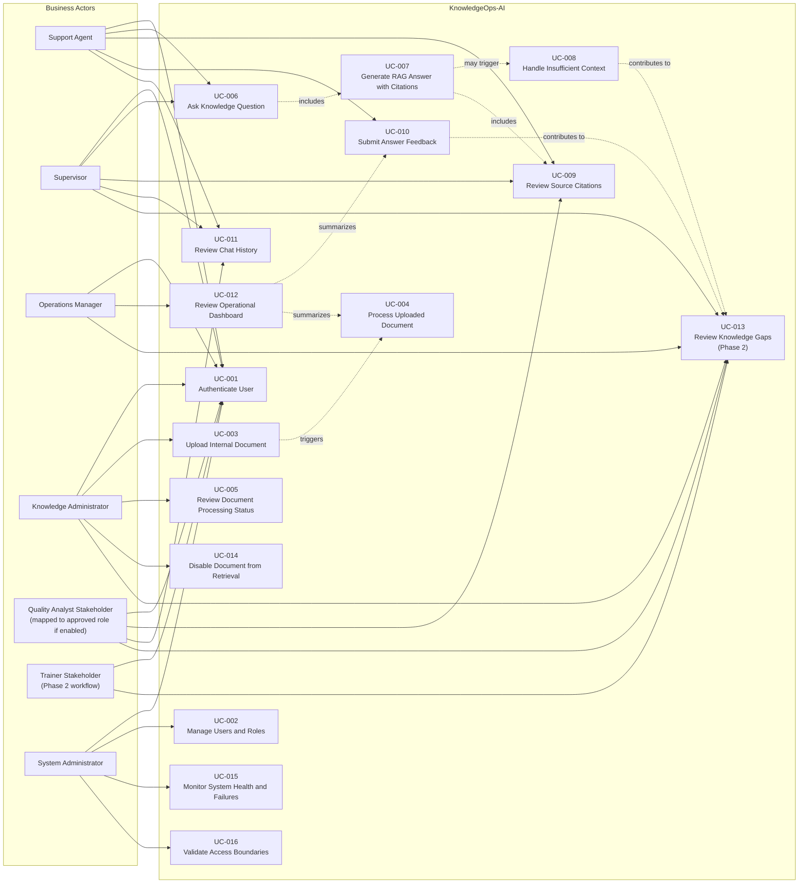
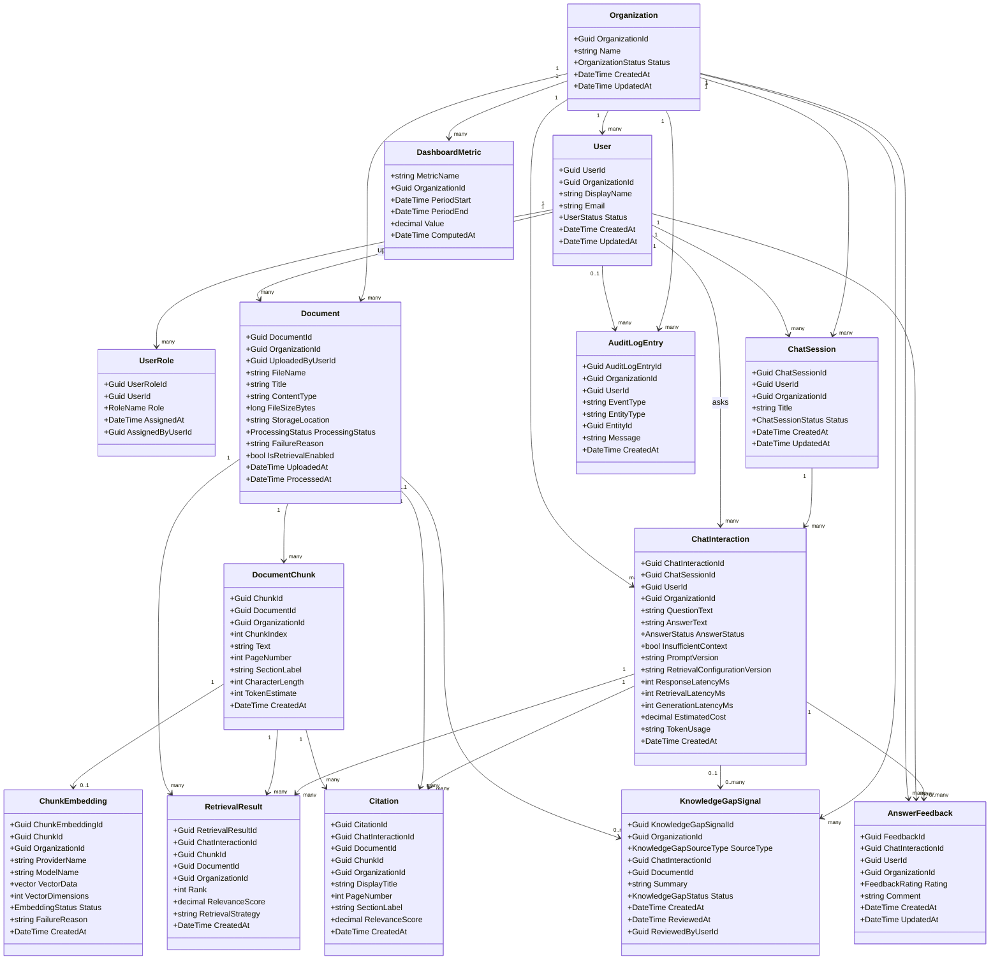
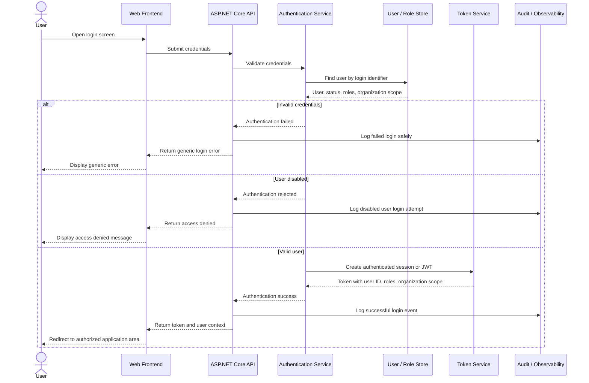
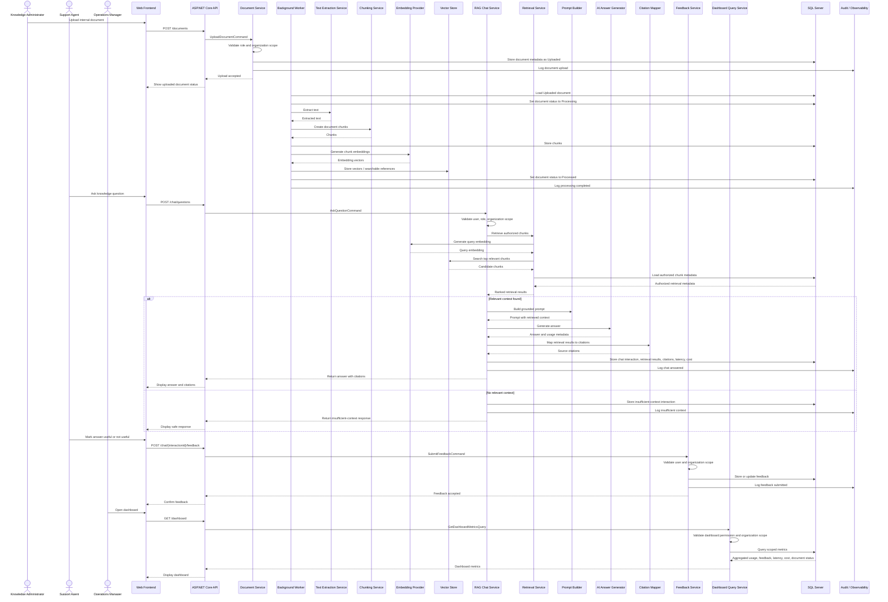
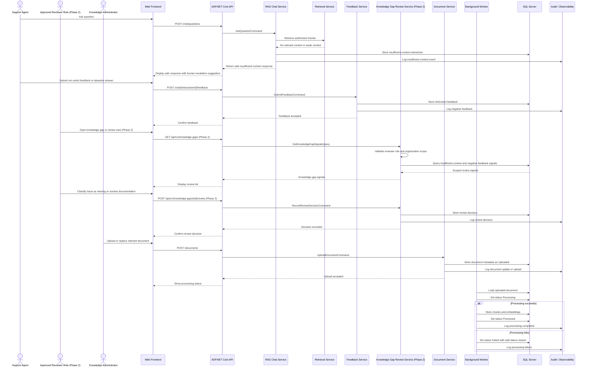
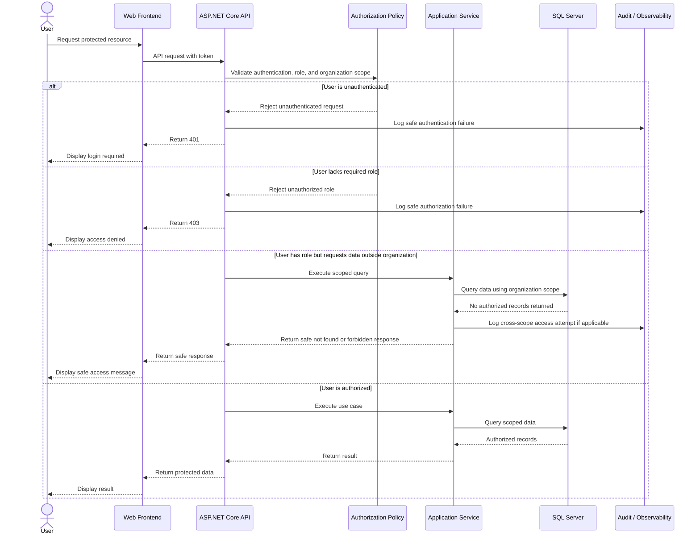

# UML Diagrams

## 1. Purpose

This document provides UML diagrams for **KnowledgeOps-AI**.

UML diagrams are used here to clarify system behavior, actor interactions, domain structure, and important runtime sequences.

UML is not the starting point for this project. These diagrams are created after the project has already defined:

- Stakeholders.
- Use cases.
- Business process flows.
- Business rules.
- Domain model.
- Architecture overview.
- C4 architecture diagrams.

The purpose of this document is to help developers, reviewers, and AI coding agents understand how business actors, domain concepts, and system components interact before implementation.

---

## 2. Diagram Format

The diagrams in this document use **Mermaid syntax**.

This keeps diagrams:

- Versionable in Markdown.
- Easy to review in pull requests.
- Readable by humans and AI agents.
- Compatible with GitHub Markdown rendering where supported.
- Exportable later as PNG/SVG artifacts.

Recommended exported location for rendered diagrams:

```text
docs/diagrams/uml/
```

Recommended exported files:

```text
docs/diagrams/uml/use-case-diagram.png
docs/diagrams/uml/domain-class-diagram.png
docs/diagrams/uml/sequence-authentication.png
docs/diagrams/uml/sequence-primary-business-flow.png
docs/diagrams/uml/sequence-escalation-exception-flow.png
```

---

## 3. UML Usage Guidance

## 3.1 Recommended Timing

UML should be created after the project context is reasonably clear.

| UML Diagram | Recommended Timing |
|---|---|
| Use Case Diagram | After stakeholders and use cases are defined. |
| Class Diagram | After the domain model is defined. |
| Sequence Diagrams | After architecture and API direction are defined. |

## 3.2 UML Role in This Project

UML diagrams should support implementation, not replace requirements.

These diagrams should be used to:

- Clarify actor interactions.
- Validate use case coverage.
- Clarify domain relationships.
- Support API and service design.
- Support testing strategy.
- Guide AI coding agents.
- Improve reviewer understanding.

## 3.3 UML Should Not Be Used To

UML should not be used to:

- Invent new scope.
- Replace business requirements.
- Replace C4 architecture diagrams.
- Hide business rules inside diagrams.
- Force premature database design.
- Introduce out-of-scope features.
- Justify implementation not aligned with the roadmap.

---

# 4. Use Case Diagram

## 4.1 Purpose

The Use Case Diagram shows how the main business actors interact with KnowledgeOps-AI.

This diagram connects stakeholder needs to system capabilities.

It is especially useful for:

- Validating MVP scope.
- Explaining system functionality to reviewers.
- Mapping actors to use cases.
- Guiding frontend navigation.
- Guiding API boundary planning.

## 4.2 Diagram



## 4.3 Notes

The Use Case Diagram reinforces that KnowledgeOps-AI is an internal operational assistant.

The most important MVP user flows are:

1. Authenticate.
2. Upload documents.
3. Process documents.
4. Ask questions.
5. Generate grounded answers.
6. Review citations.
7. Submit feedback.
8. Review dashboard metrics.
9. Enforce access boundaries.

The diagram also shows that document processing is triggered by document upload, and that RAG answer generation includes retrieval, citations, and possible insufficient-context handling.

---

# 5. Domain or Class Diagram

## 5.1 Purpose

The Domain or Class Diagram shows the main business concepts and their relationships.

This diagram should be treated as a conceptual domain model, not as a final database schema.

The goal is to clarify:

- Core entities.
- Ownership relationships.
- Source traceability.
- Organization boundaries.
- Chat and citation relationships.
- Feedback and review signals.
- Audit and metric concepts.

## 5.2 Diagram



## 5.3 Notes

This class diagram is conceptual.

Implementation may choose:

- Entity Framework Core entities.
- Value objects.
- Owned types.
- Records.
- Enums.
- DTOs.
- Read models.
- Separate persistence models.

The diagram should not force every concept into an MVP database table immediately.

For example:

- `KnowledgeGapSignal` is a Phase 2 conceptual entity; MVP stores insufficient-context events and feedback and exposes basic scoped counts.
- `DashboardMetric` may be computed dynamically instead of stored.
- `ChatSession` may be simple or implicit in the MVP.
- `ChunkEmbedding` may store vector data directly or reference an external vector index.

---

# 6. Sequence Diagram — Authentication

## 6.1 Purpose

This sequence diagram describes how a user authenticates and receives access to protected functionality.

It supports:

- Login flow planning.
- API design.
- Authorization testing.
- Frontend session behavior.
- AI agent implementation guidance.

## 6.2 Diagram



## 6.3 Business Rules Reinforced

This sequence reinforces:

- Authenticated access is required.
- Role permissions apply.
- Organization boundaries apply.
- Disabled users must not access protected functionality.
- Authentication errors must not expose sensitive details.
- Protected actions require user identity context.

## 6.4 Acceptance Expectations

Authentication is acceptable when:

- Valid users can log in.
- Invalid credentials are rejected.
- Disabled users are rejected.
- User ID, roles, and organization scope are available after login.
- Protected endpoints reject unauthenticated requests.
- Login failures are logged safely.

---

# 7. Sequence Diagram — Primary Business Flow

## 7.1 Purpose

This sequence diagram describes the primary KnowledgeOps-AI business flow.

It covers:

1. Document upload.
2. Asynchronous document processing.
3. Question submission.
4. Retrieval.
5. RAG answer generation.
6. Citation mapping.
7. Chat metadata storage.
8. Feedback submission.
9. Dashboard metric visibility.

This is the most important end-to-end flow for the MVP.

## 7.2 Diagram



## 7.3 Business Rules Reinforced

This sequence reinforces:

- Only authorized roles may upload documents.
- Documents must be processed before retrieval.
- Failed, retrieval-disabled, or soft-deleted documents are not searchable.
- Retrieval must respect authorization.
- Retrieved context must be passed to the RAG prompt.
- Grounded answers require citations.
- Insufficient context must be disclosed.
- Feedback must belong to a chat interaction.
- Metrics must respect access boundaries.
- Important events must be logged.

## 7.4 Acceptance Expectations

The primary business flow is acceptable when:

- Authorized users can upload documents.
- Documents enter the processing lifecycle.
- Processed documents produce chunks and embeddings.
- Support agents can ask questions.
- Retrieval uses authorized chunks only.
- Answers include citations when sources are found.
- Insufficient context is handled safely.
- Chat interactions are stored.
- Feedback is stored.
- Dashboard metrics reflect usage, feedback, latency, cost, and document status.

---

# 8. Sequence Diagram — Escalation or Exception Flow

## 8.1 Purpose

This sequence diagram describes how KnowledgeOps-AI handles exceptions, review signals, and escalation-like business behavior.

It covers:

- Insufficient context.
- Negative feedback.
- Knowledge gap review (Phase 2).
- Document update or replacement.
- Failed document processing.
- Human ownership of improvement actions.

This sequence reinforces that the AI assistant does not pretend to know unsupported information and does not replace human decision-making.

## 8.2 Diagram



## 8.3 Business Rules Reinforced

This sequence reinforces:

- Insufficient context must be disclosed.
- AI must not invent missing knowledge.
- Human escalation should be suggested when context is insufficient.
- Negative feedback must be available for review.
- Phase 2 review signals must respect access boundaries.
- Knowledge administrators own document upload or replacement.
- Processing failures must store a safe reason.
- Failed documents are not searchable.
- The assistant supports human decision-making, not final authority.

## 8.4 Acceptance Expectations

The exception flow is acceptable when:

- Weak or missing retrieval context produces a safe response.
- The assistant does not fabricate policy details.
- Not useful feedback is stored.
- Insufficient-context events are stored.
- In Phase 2, authorized reviewers can inspect review signals.
- Review data is organization-scoped.
- Knowledge administrators can upload corrective documents.
- Document processing status reflects success or failure.
- Failed documents remain excluded from retrieval.

---

# 9. Optional Sequence Diagram — Access Boundary Enforcement

## 9.1 Purpose

This optional sequence diagram shows how protected resources enforce authentication, role permissions, and organization boundaries.

This is especially important because KnowledgeOps-AI handles internal documents that may contain sensitive operational information.

## 9.2 Diagram



## 9.3 Business Rules Reinforced

This sequence reinforces:

- Protected functionality requires authentication.
- Role permissions apply.
- Organization boundaries apply.
- Unauthorized access must be rejected safely.
- User identity must be available for protected actions.
- Authorization failures must be logged.
- Sensitive content must be protected.

---

# 10. UML to Use Case Traceability

| UML Diagram | Related Use Cases |
|---|---|
| Use Case Diagram | UC-001 to UC-016 |
| Domain / Class Diagram | UC-001 to UC-016 |
| Sequence Diagram — Authentication | UC-001, UC-002, UC-016 |
| Sequence Diagram — Primary Business Flow | UC-003, UC-004, UC-005, UC-006, UC-007, UC-009, UC-010, UC-012 |
| Sequence Diagram — Escalation or Exception Flow | UC-008, UC-010, UC-013, UC-014 |
| Optional Access Boundary Sequence | UC-001, UC-002, UC-016 |

---

# 11. UML to Business Rule Traceability

| UML Diagram | Related Business Rules |
|---|---|
| Use Case Diagram | BR-001 to BR-049 |
| Domain / Class Diagram | BR-001 to BR-045 |
| Sequence Diagram — Authentication | BR-001, BR-002, BR-003, BR-004, BR-005, BR-035, BR-037, BR-038 |
| Sequence Diagram — Primary Business Flow | BR-006 to BR-023, BR-028 to BR-037, BR-039, BR-043, BR-044 |
| Sequence Diagram — Escalation or Exception Flow | BR-010, BR-012, BR-020 to BR-027, BR-034 to BR-037, BR-040, BR-042, BR-045 |
| Optional Access Boundary Sequence | BR-001 to BR-005, BR-015, BR-028, BR-035, BR-037 |

---

# 12. UML to Architecture Traceability

| UML Diagram | Related Architecture Area |
|---|---|
| Use Case Diagram | System context, user roles, application modules. |
| Domain / Class Diagram | Domain layer, persistence design, API contracts, authorization rules. |
| Authentication Sequence | Identity and Access Module, middleware, authorization policies. |
| Primary Business Flow Sequence | Document Management, Worker, Retrieval, RAG Chat, Feedback, Dashboard, Observability. |
| Escalation or Exception Flow Sequence | RAG Chat, Feedback, Phase 2 Knowledge Gap Review, Document Management, Worker, Observability. |
| Access Boundary Sequence | Authentication, authorization, organization-aware filtering, audit logging. |

---

# 13. Export Guidance

## 13.1 Recommended Exported Files

```text
docs/diagrams/uml/use-case-diagram.png
docs/diagrams/uml/domain-class-diagram.png
docs/diagrams/uml/sequence-authentication.png
docs/diagrams/uml/sequence-primary-business-flow.png
docs/diagrams/uml/sequence-escalation-exception-flow.png
docs/diagrams/uml/sequence-access-boundary-enforcement.png
```

## 13.2 Export Workflow

Recommended workflow:

1. Keep this Markdown file as the source of truth.
2. Render Mermaid diagrams in GitHub, VS Code, Mermaid Live Editor, or Mermaid CLI.
3. Export diagrams to PNG or SVG when needed.
4. Store rendered artifacts under:

```text
docs/diagrams/uml/
```

## 13.3 Mermaid CLI Example

The exact export commands can be added later when repository tooling is selected.

Example placeholder:

```bash
mmdc -i docs/diagrams/uml/source/use-case-diagram.mmd -o docs/diagrams/uml/use-case-diagram.png
mmdc -i docs/diagrams/uml/source/domain-class-diagram.mmd -o docs/diagrams/uml/domain-class-diagram.png
mmdc -i docs/diagrams/uml/source/sequence-authentication.mmd -o docs/diagrams/uml/sequence-authentication.png
mmdc -i docs/diagrams/uml/source/sequence-primary-business-flow.mmd -o docs/diagrams/uml/sequence-primary-business-flow.png
mmdc -i docs/diagrams/uml/source/sequence-escalation-exception-flow.mmd -o docs/diagrams/uml/sequence-escalation-exception-flow.png
```

---

# 14. AI Agent Guidance

AI coding agents must use this document as a supporting architecture and implementation reference.

## 14.1 AI Agents Must

- Treat UML as a clarification layer, not the primary source of scope.
- Use the Use Case Diagram to understand actor interactions.
- Use the Domain/Class Diagram to preserve domain language.
- Use sequence diagrams to understand expected workflow order.
- Preserve authentication, role checks, and organization scope.
- Preserve document processing lifecycle behavior.
- Preserve RAG retrieval-before-generation behavior.
- Preserve citations for grounded answers.
- Preserve insufficient-context behavior.
- Preserve feedback and dashboard metric relationships.
- Keep provider-specific implementation behind infrastructure abstractions.
- Add or update tests when implementing sequence behavior.

## 14.2 AI Agents Must Not

- Add new use cases only because a diagram could support them.
- Treat UML diagrams as permission to expand MVP scope.
- Bypass documented business rules.
- Put business rules inside controllers or UI components.
- Skip retrieval before answer generation.
- Generate answers from unauthorized documents.
- Remove citations.
- Remove insufficient-context handling.
- Treat AI as final business authority.
- Add customer-facing chatbot behavior during MVP.
- Add real-time call transcription during MVP.
- Add autonomous operational actions during MVP.

---

# 15. Summary

This document provides UML diagrams for KnowledgeOps-AI after the project has already defined stakeholders, use cases, business process flows, domain model, business rules, and architecture.

The Use Case Diagram shows how business actors interact with the system.

The Domain/Class Diagram shows the core conceptual entities and relationships.

The sequence diagrams show key runtime flows for authentication, the primary business workflow, exception handling, and access boundary enforcement.

Together, these UML diagrams support implementation planning, API design, frontend workflows, testing strategy, and AI coding agent alignment without replacing the project’s existing requirements, roadmap, business rules, or architecture documentation.
