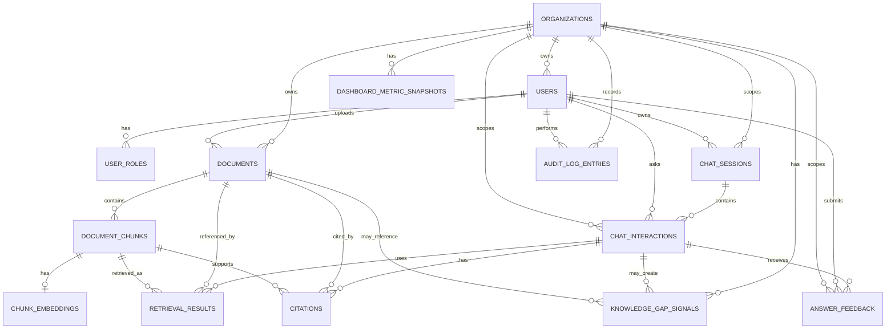

# Database Design

## 1. Purpose

This document defines the initial database design for **KnowledgeOps-AI**.

The database design is derived from the project’s:

- Domain Model.
- Use Cases.
- Business Rules.
- Software Requirements Specification.
- Business Process Flows.
- Architecture Overview.

The database design should not be invented independently from the business domain. It must support the approved MVP workflows:

1. User authentication and role-based access.
2. Organization-aware data isolation.
3. Document upload and metadata storage.
4. Asynchronous document processing.
5. Document chunking.
6. Embedding metadata and vector reference storage.
7. Retrieval traceability.
8. RAG chat interactions.
9. Source citations.
10. User feedback.
11. Operational dashboard metrics.
12. Audit and observability records.

This document is not a final migration script. It is the logical database design that should guide Entity Framework Core entity configuration, migrations, API design, testing, and future architecture decisions.

---

## 2. Database Design Principles

The database design follows these principles:

1. Business data must be organization-scoped.
2. Security and authorization boundaries must be represented in data.
3. Document lifecycle state must be explicit.
4. Retrieval must be traceable to source documents and chunks.
5. AI answers must be traceable to questions, retrieved context, citations, and feedback.
6. Metrics must be computable from stored operational data.
7. Provider-specific metadata may be stored, but must not drive core business rules.
8. Sensitive content should not be exposed unnecessarily.
9. Soft delete should be used where historical traceability matters.
10. The schema should support MVP requirements without prematurely overbuilding Phase 2 or Phase 3 features.

---

## 3. Recommended ERD File

Recommended exported ERD artifact:

```text
docs/diagrams/database/knowledgeops-ai-erd.png
```

The Mermaid ERD in this document is the source-of-truth diagram for version control.

The PNG file should be treated as a rendered artifact generated from the diagram.

---

# 4. ERD

## 4.1 Entity Relationship Diagram



## 4.2 ERD Notes

The ERD represents the intended relational structure for the MVP and near-future growth.

Some concepts may be implemented differently depending on delivery sequence:

- `DASHBOARD_METRIC_SNAPSHOTS` may be deferred if dashboard metrics are computed dynamically.
- `KNOWLEDGE_GAP_SIGNALS` may be introduced in Phase 2 if MVP only stores insufficient-context flags and negative feedback directly on chat records.
- `CHUNK_EMBEDDINGS` may store vector data directly or store an external vector index reference, depending on the selected vector retrieval approach.
- `CHAT_SESSIONS` may be simple in MVP but should exist if the UI supports conversation history grouped by session.

---

# 5. Tables

## 5.1 organizations

### Purpose

Stores the business boundary used to scope users, documents, chats, feedback, metrics, and audit records.

### Primary Key

| Column | Type | Notes |
|---|---|---|
| organization_id | uniqueidentifier | Primary key. |

### Main Fields

| Column | Type | Required | Notes |
|---|---:|---:|---|
| organization_id | uniqueidentifier | Yes | Primary key. |
| name | nvarchar(200) | Yes | Organization display name. |
| status | nvarchar(50) | Yes | Active, Disabled. |
| created_at | datetime2 | Yes | Creation timestamp. |
| updated_at | datetime2 | Yes | Last update timestamp. |

### Audit Fields

| Column | Type | Notes |
|---|---|---|
| created_at | datetime2 | Required. |
| updated_at | datetime2 | Required. |

### Indexes

| Index | Columns | Purpose |
|---|---|---|
| IX_organizations_name | name | Search or admin lookup. |
| IX_organizations_status | status | Filter active organizations. |

### Data Integrity Rules

- `name` must not be empty.
- `status` must be one of the supported organization statuses.
- Disabled organizations should not allow normal user activity.

---

## 5.2 users

### Purpose

Stores authenticated system users.

### Primary Key

| Column | Type | Notes |
|---|---|---|
| user_id | uniqueidentifier | Primary key. |

### Foreign Keys

| Column | References | Required |
|---|---|---|
| organization_id | organizations.organization_id | Yes |

### Main Fields

| Column | Type | Required | Notes |
|---|---:|---:|---|
| user_id | uniqueidentifier | Yes | Primary key. |
| organization_id | uniqueidentifier | Yes | Organization scope. |
| display_name | nvarchar(200) | Yes | User-facing name. |
| email | nvarchar(320) | Yes | Login identifier or contact email. |
| password_hash | nvarchar(max) | Conditional | Required if local authentication is used. |
| status | nvarchar(50) | Yes | Pending, Active, Disabled. |
| last_login_at | datetime2 | No | Last successful login timestamp. |
| created_at | datetime2 | Yes | Creation timestamp. |
| updated_at | datetime2 | Yes | Last update timestamp. |
| deleted_at | datetime2 | No | Soft delete timestamp, if deleted. |

### Indexes

| Index | Columns | Purpose |
|---|---|---|
| UX_users_email | email | Prevent duplicate login identifiers. |
| IX_users_organization_id | organization_id | Scope user queries. |
| IX_users_status | status | Filter active or disabled users. |
| IX_users_deleted_at | deleted_at | Support soft delete filtering. |

### Data Integrity Rules

- `email` must be unique.
- `status` must be a supported user status.
- Disabled users must not access protected functionality.
- User data must always be scoped to an organization.
- Soft-deleted users should not appear in normal user management lists.

---

## 5.3 user_roles

### Purpose

Stores role assignments for users.

### Primary Key

| Column | Type | Notes |
|---|---|---|
| user_role_id | uniqueidentifier | Primary key. |

### Foreign Keys

| Column | References | Required |
|---|---|---|
| user_id | users.user_id | Yes |
| assigned_by_user_id | users.user_id | No |

### Main Fields

| Column | Type | Required | Notes |
|---|---:|---:|---|
| user_role_id | uniqueidentifier | Yes | Primary key. |
| user_id | uniqueidentifier | Yes | User receiving the role. |
| role_name | nvarchar(50) | Yes | Agent, Supervisor, KnowledgeAdmin, Manager, Admin. |
| assigned_at | datetime2 | Yes | Role assignment timestamp. |
| assigned_by_user_id | uniqueidentifier | No | Administrator who assigned the role. |

### Indexes

| Index | Columns | Purpose |
|---|---|---|
| IX_user_roles_user_id | user_id | Load roles for a user. |
| UX_user_roles_user_role | user_id, role_name | Prevent duplicate role assignment. |
| IX_user_roles_role_name | role_name | Role-based administration queries. |

### Data Integrity Rules

- `role_name` must be one of the supported role values.
- A user must not have duplicate assignments for the same role.
- Only authorized administrators may assign roles.

---

## 5.4 documents

### Purpose

Stores uploaded document metadata and processing lifecycle state.

### Primary Key

| Column | Type | Notes |
|---|---|---|
| document_id | uniqueidentifier | Primary key. |

### Foreign Keys

| Column | References | Required |
|---|---|---|
| organization_id | organizations.organization_id | Yes |
| uploaded_by_user_id | users.user_id | Yes |

### Main Fields

| Column | Type | Required | Notes |
|---|---:|---:|---|
| document_id | uniqueidentifier | Yes | Primary key. |
| organization_id | uniqueidentifier | Yes | Organization scope. |
| uploaded_by_user_id | uniqueidentifier | Yes | User who uploaded the document. |
| file_name | nvarchar(500) | Yes | Original file name. |
| title | nvarchar(300) | Yes | Business-readable title. |
| content_type | nvarchar(150) | Yes | MIME type or supported file type. |
| file_size_bytes | bigint | Yes | File size. |
| storage_location | nvarchar(1000) | Yes | Local path or blob reference. |
| processing_status | nvarchar(50) | Yes | Uploaded, Processing, Processed, Failed. |
| failure_reason | nvarchar(1000) | No | Safe processing failure reason. |
| is_retrieval_enabled | bit | Yes | Indicates whether document can be retrieved. |
| uploaded_at | datetime2 | Yes | Upload timestamp. |
| processing_started_at | datetime2 | No | Processing start timestamp. |
| processed_at | datetime2 | No | Processing completion timestamp. |
| created_at | datetime2 | Yes | Creation timestamp. |
| updated_at | datetime2 | Yes | Last update timestamp. |
| deleted_at | datetime2 | No | Soft delete timestamp. |

### Indexes

| Index | Columns | Purpose |
|---|---|---|
| IX_documents_organization_id | organization_id | Organization-scoped document queries. |
| IX_documents_uploaded_by_user_id | uploaded_by_user_id | User upload history. |
| IX_documents_processing_status | processing_status | Processing queue and admin status views. |
| IX_documents_retrieval_eligibility | organization_id, processing_status, is_retrieval_enabled | Retrieval filtering. |
| IX_documents_deleted_at | deleted_at | Soft delete filtering. |
| IX_documents_uploaded_at | uploaded_at | Sorting and recent uploads. |

### Data Integrity Rules

- Documents must belong to an organization.
- Documents must have required metadata before processing.
- Unsupported file types must be rejected before document creation or marked invalid before processing.
- Only documents where `processing_status = Processed`, `is_retrieval_enabled = true`, `deleted_at IS NULL`, and organization scope is authorized may contribute chunks to retrieval.
- Failed documents must not be searchable.
- Retrieval-disabled documents must not be searchable; disabling retrieval does not change `processing_status`.
- `failure_reason` should be populated when `processing_status = Failed`.
- Soft-deleted documents must be excluded from normal queries and retrieval.

---

## 5.5 document_chunks

### Purpose

Stores extracted document text segments used for retrieval and citations.

### Primary Key

| Column | Type | Notes |
|---|---|---|
| chunk_id | uniqueidentifier | Primary key. |

### Foreign Keys

| Column | References | Required |
|---|---|---|
| document_id | documents.document_id | Yes |
| organization_id | organizations.organization_id | Yes |

### Main Fields

| Column | Type | Required | Notes |
|---|---:|---:|---|
| chunk_id | uniqueidentifier | Yes | Primary key. |
| document_id | uniqueidentifier | Yes | Source document. |
| organization_id | uniqueidentifier | Yes | Organization scope. |
| chunk_index | int | Yes | Sequential index within the document. |
| text | nvarchar(max) | Yes | Extracted chunk text. |
| page_number | int | No | Page number when available. |
| section_label | nvarchar(300) | No | Section reference when available. |
| character_length | int | No | Character count. |
| token_estimate | int | No | Estimated token count. |
| created_at | datetime2 | Yes | Creation timestamp. |
| deleted_at | datetime2 | No | Soft delete timestamp, if used. |

### Indexes

| Index | Columns | Purpose |
|---|---|---|
| IX_document_chunks_document_id | document_id | Load chunks for a document. |
| IX_document_chunks_organization_id | organization_id | Organization-scoped retrieval. |
| UX_document_chunks_document_index | document_id, chunk_index | Prevent duplicate chunk index per document. |
| IX_document_chunks_deleted_at | deleted_at | Soft delete filtering. |

### Data Integrity Rules

- Each chunk must belong to a document.
- Each chunk must belong to an organization.
- `organization_id` should match the source document’s organization.
- Empty chunks must not be stored.
- Chunks from failed, retrieval-disabled, unprocessed, or deleted documents must not be used for retrieval.
- `chunk_index` must be unique within a document.

---

## 5.6 chunk_embeddings

### Purpose

Stores embeddings or references to embeddings for document chunks.

### Primary Key

| Column | Type | Notes |
|---|---|---|
| chunk_embedding_id | uniqueidentifier | Primary key. |

### Foreign Keys

| Column | References | Required |
|---|---|---|
| chunk_id | document_chunks.chunk_id | Yes |
| organization_id | organizations.organization_id | Yes |

### Main Fields

| Column | Type | Required | Notes |
|---|---:|---:|---|
| chunk_embedding_id | uniqueidentifier | Yes | Primary key. |
| chunk_id | uniqueidentifier | Yes | Associated chunk. |
| organization_id | uniqueidentifier | Yes | Organization scope. |
| provider_name | nvarchar(100) | Yes | Embedding provider name. |
| model_name | nvarchar(150) | Yes | Embedding model name. |
| vector_data | varbinary(max) / nvarchar(max) / vector | Conditional | Depends on selected storage strategy. |
| vector_reference | nvarchar(1000) | Conditional | External vector index reference, if vector stored outside SQL. |
| vector_dimensions | int | No | Embedding dimension count. |
| status | nvarchar(50) | Yes | Pending, Processing, Ready, Failed. |
| failure_reason | nvarchar(1000) | No | Safe failure reason. |
| created_at | datetime2 | Yes | Creation timestamp. |
| updated_at | datetime2 | Yes | Last update timestamp. |

### Indexes

| Index | Columns | Purpose |
|---|---|---|
| UX_chunk_embeddings_chunk_id | chunk_id | One active embedding record per chunk for MVP. |
| IX_chunk_embeddings_organization_id | organization_id | Organization-scoped retrieval. |
| IX_chunk_embeddings_status | status | Filter ready or failed embeddings. |
| IX_chunk_embeddings_provider_model | provider_name, model_name | Provider/model diagnostics. |

### Data Integrity Rules

- Each embedding must belong to a chunk.
- A retrieval-ready chunk must have a valid embedding or vector reference.
- Failed embeddings must prevent the affected chunk from semantic retrieval.
- Provider metadata is operational metadata and must not drive core business rules.
- Either `vector_data` or `vector_reference` should be present when status is `Ready`.

---

## 5.7 chat_sessions

### Purpose

Stores logical chat containers for user conversations.

### Primary Key

| Column | Type | Notes |
|---|---|---|
| chat_session_id | uniqueidentifier | Primary key. |

### Foreign Keys

| Column | References | Required |
|---|---|---|
| user_id | users.user_id | Yes |
| organization_id | organizations.organization_id | Yes |

### Main Fields

| Column | Type | Required | Notes |
|---|---:|---:|---|
| chat_session_id | uniqueidentifier | Yes | Primary key. |
| user_id | uniqueidentifier | Yes | Owner user. |
| organization_id | uniqueidentifier | Yes | Organization scope. |
| title | nvarchar(300) | No | Optional display title. |
| status | nvarchar(50) | Yes | Active, Archived, Deleted. |
| created_at | datetime2 | Yes | Creation timestamp. |
| updated_at | datetime2 | Yes | Last update timestamp. |
| deleted_at | datetime2 | No | Soft delete timestamp. |

### Indexes

| Index | Columns | Purpose |
|---|---|---|
| IX_chat_sessions_user_id | user_id | Load user chat sessions. |
| IX_chat_sessions_organization_id | organization_id | Organization-scoped review. |
| IX_chat_sessions_status | status | Filter active or archived sessions. |
| IX_chat_sessions_created_at | created_at | Sort recent sessions. |

### Data Integrity Rules

- Chat sessions must belong to a user.
- Chat sessions must belong to an organization.
- Chat sessions must respect organization access boundaries.
- Soft-deleted sessions must not appear in normal chat history.

---

## 5.8 chat_interactions

### Purpose

Stores individual user question and assistant answer exchanges.

### Primary Key

| Column | Type | Notes |
|---|---|---|
| chat_interaction_id | uniqueidentifier | Primary key. |

### Foreign Keys

| Column | References | Required |
|---|---|---|
| chat_session_id | chat_sessions.chat_session_id | No / Yes depending on implementation |
| user_id | users.user_id | Yes |
| organization_id | organizations.organization_id | Yes |

### Main Fields

| Column | Type | Required | Notes |
|---|---:|---:|---|
| chat_interaction_id | uniqueidentifier | Yes | Primary key. |
| chat_session_id | uniqueidentifier | Conditional | Required if sessions are implemented explicitly. |
| user_id | uniqueidentifier | Yes | User who asked the question. |
| organization_id | uniqueidentifier | Yes | Organization scope. |
| question_text | nvarchar(max) | Yes | User question. |
| answer_text | nvarchar(max) | No | Assistant answer. |
| answer_status | nvarchar(50) | Yes | Answered, InsufficientContext, Failed. |
| insufficient_context | bit | Yes | True if context was insufficient. |
| prompt_version | nvarchar(100) | No | Prompt template version. |
| retrieval_configuration_version | nvarchar(100) | No | Retrieval configuration version. |
| response_latency_ms | int | No | Total chat response latency. |
| retrieval_latency_ms | int | No | Retrieval latency. |
| generation_latency_ms | int | No | AI generation latency. |
| estimated_cost | decimal(18, 8) | No | Estimated AI cost when available. |
| prompt_tokens | int | No | Prompt token count when available. |
| completion_tokens | int | No | Completion token count when available. |
| total_tokens | int | No | Total token count when available. |
| created_at | datetime2 | Yes | Creation timestamp. |
| deleted_at | datetime2 | No | Soft delete timestamp. |

### Indexes

| Index | Columns | Purpose |
|---|---|---|
| IX_chat_interactions_user_id | user_id | User chat history. |
| IX_chat_interactions_organization_id | organization_id | Organization-scoped review and metrics. |
| IX_chat_interactions_session_id | chat_session_id | Load interactions by session. |
| IX_chat_interactions_created_at | created_at | Time-based dashboard metrics. |
| IX_chat_interactions_answer_status | answer_status | Filter answered, failed, insufficient-context records. |
| IX_chat_interactions_insufficient_context | organization_id, insufficient_context | Knowledge gap and dashboard metrics. |

### Data Integrity Rules

- Every interaction must belong to a user.
- Every interaction must belong to an organization.
- Insufficient-context interactions must be stored.
- Failed interactions should store a safe failure state.
- Estimated cost must be nullable when unavailable and must not be represented misleadingly as zero.
- Sensitive prompt content should not be stored unless intentionally required and protected.

---

## 5.9 retrieval_results

### Purpose

Stores retrieved document chunks used during a chat interaction.

### Primary Key

| Column | Type | Notes |
|---|---|---|
| retrieval_result_id | uniqueidentifier | Primary key. |

### Foreign Keys

| Column | References | Required |
|---|---|---|
| chat_interaction_id | chat_interactions.chat_interaction_id | Yes |
| chunk_id | document_chunks.chunk_id | Yes |
| document_id | documents.document_id | Yes |
| organization_id | organizations.organization_id | Yes |

### Main Fields

| Column | Type | Required | Notes |
|---|---:|---:|---|
| retrieval_result_id | uniqueidentifier | Yes | Primary key. |
| chat_interaction_id | uniqueidentifier | Yes | Related chat interaction. |
| chunk_id | uniqueidentifier | Yes | Retrieved chunk. |
| document_id | uniqueidentifier | Yes | Source document. |
| organization_id | uniqueidentifier | Yes | Organization scope. |
| rank | int | Yes | Retrieval rank. |
| relevance_score | decimal(18, 8) | No | Similarity or ranking score. |
| retrieval_strategy | nvarchar(100) | No | Strategy name. |
| created_at | datetime2 | Yes | Creation timestamp. |

### Indexes

| Index | Columns | Purpose |
|---|---|---|
| IX_retrieval_results_chat_interaction_id | chat_interaction_id | Load retrieval context for a chat. |
| IX_retrieval_results_chunk_id | chunk_id | Retrieval evaluation by chunk. |
| IX_retrieval_results_document_id | document_id | Document usage analytics. |
| IX_retrieval_results_organization_id | organization_id | Organization-scoped analytics. |
| UX_retrieval_results_chat_rank | chat_interaction_id, rank | Preserve unique rank per interaction. |

### Data Integrity Rules

- Retrieval results must belong to a stored chat interaction.
- Retrieval results must reference authorized chunks only.
- `organization_id` should match the chat interaction, document, and chunk organization.
- Retrieval results must not reference failed, retrieval-disabled, unprocessed, or deleted documents.
- Retrieval rank should be unique per chat interaction.

---

## 5.10 citations

### Purpose

Stores source citations shown with AI-generated answers.

### Primary Key

| Column | Type | Notes |
|---|---|---|
| citation_id | uniqueidentifier | Primary key. |

### Foreign Keys

| Column | References | Required |
|---|---|---|
| chat_interaction_id | chat_interactions.chat_interaction_id | Yes |
| document_id | documents.document_id | Yes |
| chunk_id | document_chunks.chunk_id | Yes |
| organization_id | organizations.organization_id | Yes |

### Main Fields

| Column | Type | Required | Notes |
|---|---:|---:|---|
| citation_id | uniqueidentifier | Yes | Primary key. |
| chat_interaction_id | uniqueidentifier | Yes | Answer being supported. |
| document_id | uniqueidentifier | Yes | Source document. |
| chunk_id | uniqueidentifier | Yes | Supporting chunk. |
| organization_id | uniqueidentifier | Yes | Organization scope. |
| display_title | nvarchar(300) | Yes | User-facing citation title. |
| page_number | int | No | Page reference when available. |
| section_label | nvarchar(300) | No | Section reference when available. |
| relevance_score | decimal(18, 8) | No | Source relevance score when available. |
| created_at | datetime2 | Yes | Creation timestamp. |

### Indexes

| Index | Columns | Purpose |
|---|---|---|
| IX_citations_chat_interaction_id | chat_interaction_id | Load answer citations. |
| IX_citations_document_id | document_id | Citation analytics by document. |
| IX_citations_chunk_id | chunk_id | Citation analytics by chunk. |
| IX_citations_organization_id | organization_id | Organization-scoped review. |

### Data Integrity Rules

- Grounded answers must include citations.
- Citations must reference source documents and chunks.
- Citations must not expose unauthorized documents.
- Historical citations may remain for review even if a document is later disabled from retrieval, subject to retention policy.
- `organization_id` should match the chat interaction, document, and chunk organization.

---

## 5.11 answer_feedback

### Purpose

Stores useful / not useful feedback for chat answers.

### Primary Key

| Column | Type | Notes |
|---|---|---|
| feedback_id | uniqueidentifier | Primary key. |

### Foreign Keys

| Column | References | Required |
|---|---|---|
| chat_interaction_id | chat_interactions.chat_interaction_id | Yes |
| user_id | users.user_id | Yes |
| organization_id | organizations.organization_id | Yes |

### Main Fields

| Column | Type | Required | Notes |
|---|---:|---:|---|
| feedback_id | uniqueidentifier | Yes | Primary key. |
| chat_interaction_id | uniqueidentifier | Yes | Related chat interaction. |
| user_id | uniqueidentifier | Yes | User who submitted feedback. |
| organization_id | uniqueidentifier | Yes | Organization scope. |
| rating | nvarchar(50) | Yes | Useful, NotUseful. |
| comment | nvarchar(1000) | No | Optional, likely Phase 2. |
| created_at | datetime2 | Yes | Creation timestamp. |
| updated_at | datetime2 | Yes | Last update timestamp. |

### Indexes

| Index | Columns | Purpose |
|---|---|---|
| IX_answer_feedback_chat_interaction_id | chat_interaction_id | Load feedback for an answer. |
| IX_answer_feedback_user_id | user_id | User feedback history. |
| IX_answer_feedback_organization_id | organization_id | Organization-scoped dashboard metrics. |
| IX_answer_feedback_rating | organization_id, rating | Useful / not useful metrics. |
| UX_answer_feedback_interaction_user | chat_interaction_id, user_id | Prevent duplicate feedback inflation. |

### Data Integrity Rules

- Feedback must belong to a chat interaction.
- Feedback must belong to a user.
- Feedback must belong to an organization.
- The same user must not inflate metrics by rating the same interaction repeatedly.
- Feedback review must respect organization scope.

---

## 5.12 knowledge_gap_signals

### Purpose

Stores review signals indicating missing, weak, outdated, unclear, or insufficient knowledge.

### MVP Status

This table is deferred to Phase 2. MVP uses `chat_interactions.insufficient_context` and `answer_feedback.rating = NotUseful` as the source of basic scoped knowledge-gap indicators and does not require a review workflow.

### Primary Key

| Column | Type | Notes |
|---|---|---|
| knowledge_gap_signal_id | uniqueidentifier | Primary key. |

### Foreign Keys

| Column | References | Required |
|---|---|---|
| organization_id | organizations.organization_id | Yes |
| chat_interaction_id | chat_interactions.chat_interaction_id | No |
| document_id | documents.document_id | No |
| reviewed_by_user_id | users.user_id | No |

### Main Fields

| Column | Type | Required | Notes |
|---|---:|---:|---|
| knowledge_gap_signal_id | uniqueidentifier | Yes | Primary key. |
| organization_id | uniqueidentifier | Yes | Organization scope. |
| source_type | nvarchar(100) | Yes | InsufficientContext, NotUsefulFeedback, RepeatedQuestion, WeakRetrieval, ProcessingFailure. |
| chat_interaction_id | uniqueidentifier | No | Related chat, if applicable. |
| document_id | uniqueidentifier | No | Related document, if applicable. |
| summary | nvarchar(1000) | No | Human-readable summary. |
| status | nvarchar(50) | Yes | Open, Reviewed, Dismissed, Resolved. |
| reviewed_at | datetime2 | No | Review timestamp. |
| reviewed_by_user_id | uniqueidentifier | No | Reviewer. |
| created_at | datetime2 | Yes | Creation timestamp. |
| updated_at | datetime2 | Yes | Last update timestamp. |

### Indexes

| Index | Columns | Purpose |
|---|---|---|
| IX_knowledge_gap_signals_organization_id | organization_id | Organization-scoped review. |
| IX_knowledge_gap_signals_source_type | organization_id, source_type | Filter by signal source. |
| IX_knowledge_gap_signals_status | organization_id, status | Review workflow filtering. |
| IX_knowledge_gap_signals_chat_interaction_id | chat_interaction_id | Trace signal to chat. |
| IX_knowledge_gap_signals_document_id | document_id | Trace signal to document. |

### Data Integrity Rules

- Knowledge gap signals must belong to an organization.
- Review data must respect organization boundaries.
- A signal may reference a chat interaction, a document, both, or neither depending on source type.
- If `status` is Reviewed, Dismissed, or Resolved, review metadata should be populated when practical.

---

## 5.13 dashboard_metric_snapshots

### Purpose

Stores precomputed dashboard metrics when snapshotting is needed.

### MVP Status

This table may be deferred if metrics are computed dynamically from source tables.

### Primary Key

| Column | Type | Notes |
|---|---|---|
| dashboard_metric_snapshot_id | uniqueidentifier | Primary key. |

### Foreign Keys

| Column | References | Required |
|---|---|---|
| organization_id | organizations.organization_id | Yes |

### Main Fields

| Column | Type | Required | Notes |
|---|---:|---:|---|
| dashboard_metric_snapshot_id | uniqueidentifier | Yes | Primary key. |
| organization_id | uniqueidentifier | Yes | Organization scope. |
| metric_name | nvarchar(150) | Yes | Metric name. |
| metric_value | decimal(18, 8) | Yes | Metric value. |
| period_start | datetime2 | Yes | Reporting period start. |
| period_end | datetime2 | Yes | Reporting period end. |
| computed_at | datetime2 | Yes | Computation timestamp. |

### Indexes

| Index | Columns | Purpose |
|---|---|---|
| IX_dashboard_metric_snapshots_org_metric | organization_id, metric_name | Metric lookup. |
| IX_dashboard_metric_snapshots_period | organization_id, period_start, period_end | Time-based reporting. |
| UX_dashboard_metric_snapshots_unique | organization_id, metric_name, period_start, period_end | Prevent duplicate metric snapshots. |

### Data Integrity Rules

- Metrics must be organization-scoped.
- Metrics must not expose sensitive document content.
- Snapshot values must be recomputable or explainable from source data.
- If cost metadata is unavailable, it should not be misleadingly stored as zero.

---

## 5.14 audit_log_entries

### Purpose

Stores important business and system events for traceability and diagnostics.

### Primary Key

| Column | Type | Notes |
|---|---|---|
| audit_log_entry_id | uniqueidentifier | Primary key. |

### Foreign Keys

| Column | References | Required |
|---|---|---|
| organization_id | organizations.organization_id | No |
| user_id | users.user_id | No |

### Main Fields

| Column | Type | Required | Notes |
|---|---:|---:|---|
| audit_log_entry_id | uniqueidentifier | Yes | Primary key. |
| organization_id | uniqueidentifier | No | Organization scope when applicable. |
| user_id | uniqueidentifier | No | User associated with event. |
| event_type | nvarchar(150) | Yes | Event category. |
| entity_type | nvarchar(150) | No | Related entity type. |
| entity_id | uniqueidentifier | No | Related entity ID. |
| message | nvarchar(1000) | Yes | Safe diagnostic message. |
| severity | nvarchar(50) | Yes | Info, Warning, Error, Critical. |
| correlation_id | nvarchar(100) | No | Request or workflow correlation ID. |
| created_at | datetime2 | Yes | Event timestamp. |

### Indexes

| Index | Columns | Purpose |
|---|---|---|
| IX_audit_log_entries_organization_id | organization_id | Organization-scoped diagnostics. |
| IX_audit_log_entries_user_id | user_id | User activity review. |
| IX_audit_log_entries_event_type | event_type | Event filtering. |
| IX_audit_log_entries_created_at | created_at | Time-based diagnostics. |
| IX_audit_log_entries_correlation_id | correlation_id | Trace request/workflow. |

### Data Integrity Rules

- Important business events should be logged.
- Authorization failures should be logged safely.
- AI provider failures should be logged safely.
- Logs must not expose sensitive document text, prompt content, credentials, or secrets.
- Audit logs should support diagnosis without becoming the source of business truth.

---

# 6. Relationships

## 6.1 Organization-Centered Relationships

Most tables are organization-scoped.

The following tables must include `organization_id`:

- users.
- documents.
- document_chunks.
- chunk_embeddings.
- chat_sessions.
- chat_interactions.
- retrieval_results.
- citations.
- answer_feedback.
- knowledge_gap_signals.
- dashboard_metric_snapshots.
- audit_log_entries when applicable.

This supports organization-aware access control and dashboard scoping.

## 6.2 Document Relationships

- One organization has many documents.
- One user uploads many documents.
- One document has many chunks.
- One chunk may have one embedding record.
- One document may appear in many retrieval results.
- One document may appear in many citations.

## 6.3 Chat Relationships

- One user may have many chat sessions.
- One chat session may have many chat interactions.
- One chat interaction may have many retrieval results.
- One chat interaction may have many citations.
- One chat interaction may receive feedback.
- One chat interaction may create a knowledge gap signal.

## 6.4 Feedback and Review Relationships

- Feedback belongs to a chat interaction.
- Feedback belongs to a user.
- Feedback belongs to an organization.
- Knowledge gap signals may be derived from insufficient context, negative feedback, weak retrieval, processing failures, or repeated questions.

## 6.5 Audit Relationships

- Audit log entries may reference a user.
- Audit log entries may reference an organization.
- Audit log entries may reference an entity by type and ID.
- Audit records should not enforce strong foreign keys to every possible entity type unless implementation complexity is justified.

---

# 7. Primary Keys

## 7.1 Primary Key Strategy

All main business tables should use `uniqueidentifier` primary keys.

Recommended pattern:

```text
<table_name>_id uniqueidentifier primary key
```

Examples:

- `organization_id`
- `user_id`
- `document_id`
- `chunk_id`
- `chat_interaction_id`
- `feedback_id`

## 7.2 Rationale

GUID-style identifiers support:

- Stable references across layers.
- Safer public API identifiers.
- Easier future distributed or cloud-ready operation.
- Clear entity identity.

## 7.3 Notes

The implementation may use sequential GUIDs or database-generated identifiers depending on performance and EF Core strategy.

---

# 8. Foreign Keys

## 8.1 Required Foreign Keys

The following foreign key relationships are required for MVP:

| Table | Foreign Key | References |
|---|---|---|
| users | organization_id | organizations.organization_id |
| user_roles | user_id | users.user_id |
| documents | organization_id | organizations.organization_id |
| documents | uploaded_by_user_id | users.user_id |
| document_chunks | document_id | documents.document_id |
| document_chunks | organization_id | organizations.organization_id |
| chunk_embeddings | chunk_id | document_chunks.chunk_id |
| chunk_embeddings | organization_id | organizations.organization_id |
| chat_sessions | user_id | users.user_id |
| chat_sessions | organization_id | organizations.organization_id |
| chat_interactions | chat_session_id | chat_sessions.chat_session_id |
| chat_interactions | user_id | users.user_id |
| chat_interactions | organization_id | organizations.organization_id |
| retrieval_results | chat_interaction_id | chat_interactions.chat_interaction_id |
| retrieval_results | chunk_id | document_chunks.chunk_id |
| retrieval_results | document_id | documents.document_id |
| retrieval_results | organization_id | organizations.organization_id |
| citations | chat_interaction_id | chat_interactions.chat_interaction_id |
| citations | document_id | documents.document_id |
| citations | chunk_id | document_chunks.chunk_id |
| citations | organization_id | organizations.organization_id |
| answer_feedback | chat_interaction_id | chat_interactions.chat_interaction_id |
| answer_feedback | user_id | users.user_id |
| answer_feedback | organization_id | organizations.organization_id |

## 8.2 Optional or Deferred Foreign Keys

The following relationships may be optional or deferred:

| Table | Foreign Key | Reason |
|---|---|---|
| knowledge_gap_signals.chat_interaction_id | chat_interactions.chat_interaction_id | Some signals may not come from a specific chat. |
| knowledge_gap_signals.document_id | documents.document_id | Some signals may not reference a specific document. |
| knowledge_gap_signals.reviewed_by_user_id | users.user_id | Not required until review workflow exists. |
| dashboard_metric_snapshots.organization_id | organizations.organization_id | Required only if metric snapshots are stored. |
| audit_log_entries.entity_id | Polymorphic reference | Avoid complex polymorphic FK design for MVP. |

---

# 9. Main Index Strategy

## 9.1 Organization Scope Indexes

Most business queries will filter by `organization_id`.

Every organization-scoped table should have an index on `organization_id`.

Examples:

```text
IX_documents_organization_id
IX_document_chunks_organization_id
IX_chat_interactions_organization_id
IX_answer_feedback_organization_id
IX_citations_organization_id
```

## 9.2 Retrieval Indexes

Retrieval requires fast access to eligible chunks and embeddings.

Recommended supporting indexes:

```text
IX_documents_retrieval_eligibility
IX_document_chunks_document_id
IX_document_chunks_organization_id
IX_chunk_embeddings_status
IX_chunk_embeddings_organization_id
```

If vector search is implemented directly in SQL Server, additional vector-specific indexes may be needed depending on the selected SQL Server capabilities.

If vector search is delegated to Azure AI Search or another vector store, SQL should store traceability metadata while vector indexing is handled by the retrieval provider.

## 9.3 Chat and Dashboard Indexes

Dashboard queries require time-based and organization-scoped aggregation.

Recommended indexes:

```text
IX_chat_interactions_organization_id
IX_chat_interactions_created_at
IX_chat_interactions_answer_status
IX_answer_feedback_rating
IX_documents_processing_status
IX_retrieval_results_document_id
```

## 9.4 Audit Indexes

Audit diagnostics require filtering by time, event type, user, and correlation ID.

Recommended indexes:

```text
IX_audit_log_entries_created_at
IX_audit_log_entries_event_type
IX_audit_log_entries_user_id
IX_audit_log_entries_correlation_id
```

---

# 10. Audit Fields

## 10.1 Standard Audit Fields

Most mutable tables should include:

| Column | Type | Purpose |
|---|---|---|
| created_at | datetime2 | Creation timestamp. |
| updated_at | datetime2 | Last update timestamp. |
| deleted_at | datetime2 nullable | Soft delete timestamp when applicable. |

## 10.2 Tables Requiring Audit Fields

Recommended:

- organizations.
- users.
- documents.
- document_chunks, if mutable or soft deletable.
- chunk_embeddings.
- chat_sessions.
- chat_interactions.
- answer_feedback.
- knowledge_gap_signals.
- dashboard_metric_snapshots.
- audit_log_entries.

## 10.3 Created By / Updated By

Optional fields may be added for some tables:

| Column | Applies To | Purpose |
|---|---|---|
| created_by_user_id | documents, knowledge_gap_signals, admin-managed records | Track creator. |
| updated_by_user_id | documents, users, roles, review records | Track modifier. |
| uploaded_by_user_id | documents | Required business field. |
| assigned_by_user_id | user_roles | Required when available. |
| reviewed_by_user_id | knowledge_gap_signals | Required when review workflow exists. |

## 10.4 Audit Log vs Audit Fields

Audit fields answer:

```text
When was this row created or updated?
```

Audit logs answer:

```text
What important business or system event happened?
```

Both are useful and should not be confused.

---

# 11. Soft Delete Strategy

## 11.1 General Strategy

Soft delete should be used for records where historical traceability matters.

Recommended soft delete column:

```text
deleted_at datetime2 null
```

A row is considered active when:

```text
deleted_at is null
```

## 11.2 Tables Recommended for Soft Delete

| Table | Soft Delete? | Reason |
|---|---|---|
| users | Yes | Preserve historical chat, feedback, and audit references. |
| documents | Yes | Preserve historical citations and processing history. |
| document_chunks | Optional | Usually tied to document lifecycle; may be soft-deleted with document. |
| chat_sessions | Yes | Allow user history cleanup without losing audit integrity. |
| chat_interactions | Optional | Usually retained for evaluation; soft delete may support privacy policies. |
| answer_feedback | No / Optional | Usually retained for metrics unless privacy policy requires deletion. |
| knowledge_gap_signals | Optional | Review workflow may prefer status-based closure. |
| audit_log_entries | No | Audit logs should generally be retained according to retention policy. |

## 11.3 Document Disablement vs Soft Delete

Document disablement and soft delete are not the same.

| Action | Meaning |
|---|---|
| Disable document | Document remains visible to authorized admins but is excluded from retrieval. |
| Soft delete document | Document is hidden from normal views and should be excluded from retrieval and normal operations. |

For retrieval eligibility, documents with `is_retrieval_enabled = false` and soft-deleted documents must be excluded.

## 11.4 Historical Citations

If a document is disabled from retrieval after it was used in a historical answer:

- Future retrieval must exclude the document.
- Historical citations may remain visible according to retention and access rules.
- Citation display must not expose unauthorized content.
- If the document is soft-deleted, historical citation behavior should be defined by retention policy.

---

# 12. Data Integrity Rules

## 12.1 Access and Scope Integrity

- Every protected business record must be associated with an organization where applicable.
- A user must not access data outside their organization scope.
- Retrieval results must not reference chunks outside the user’s organization.
- Dashboard metrics must be scoped by organization.
- Feedback and review records must be organization-scoped.

## 12.2 Document Integrity

- Documents must have required metadata before processing.
- Unsupported file types must be rejected.
- Documents must enter a valid processing lifecycle.
- Failed documents must include a safe failure reason when practical.
- Only processed, retrieval-enabled, non-soft-deleted, organization-authorized documents may be retrieved.
- Retrieval-disabled or soft-deleted documents must be excluded from retrieval.

## 12.3 Chunk Integrity

- Chunks must belong to a source document.
- Chunks must inherit or match the source document’s organization.
- Empty chunks must not be stored.
- Chunk indexes must be unique within a document.
- Chunks from ineligible documents must not be retrieved.

## 12.4 Embedding Integrity

- Embeddings must belong to a chunk.
- Ready embeddings must have either vector data or an external vector reference.
- Failed embeddings must store a safe failure reason when practical.
- Chunks without valid embeddings must not be used in semantic retrieval.
- Provider metadata must not drive core business behavior.

## 12.5 Chat Integrity

- Chat interactions must belong to a user.
- Chat interactions must belong to an organization.
- Chat interactions must store answer status.
- Insufficient-context interactions must be stored.
- Failed chat interactions should be stored when useful for diagnostics.
- Estimated cost must be nullable when unavailable.

## 12.6 Retrieval and Citation Integrity

- Retrieval results must belong to a chat interaction.
- Retrieval results must reference a document and chunk.
- Retrieval results must preserve rank where available.
- Citations must belong to a chat interaction.
- Citations must reference a document and chunk.
- Grounded answers must include citations.
- Citations must not expose unauthorized documents.

## 12.7 Feedback Integrity

- Feedback must belong to a chat interaction.
- Feedback must belong to a user.
- Feedback must belong to an organization.
- A user must not inflate metrics by repeatedly rating the same answer.
- Feedback rating must be one of the supported values.

## 12.8 Metrics Integrity

- Dashboard metrics must be scoped by organization.
- Metrics must be derived from stored events or documented snapshots.
- Cost must be nullable or unavailable when not known.
- Metrics must not expose sensitive document content.

## 12.9 Audit Integrity

- Important business events should be logged.
- Authorization failures should be logged safely.
- Provider failures should be logged safely.
- Audit messages must not expose secrets, credentials, full document text, or sensitive prompt content.
- Audit entries should include correlation IDs where practical.

---

# 13. Recommended Enumerations

The following enum values should be represented consistently in code and database constraints.

## 13.1 organization_status

```text
Active
Disabled
```

## 13.2 user_status

```text
Pending
Active
Disabled
```

## 13.3 role_name

```text
Agent
Supervisor
KnowledgeAdmin
Manager
Admin
```

## 13.4 document_processing_status

```text
Uploaded
Processing
Processed
Failed
```

## 13.5 embedding_status

```text
Pending
Processing
Ready
Failed
```

## 13.6 chat_answer_status

```text
Answered
InsufficientContext
Failed
```

## 13.7 feedback_rating

```text
Useful
NotUseful
```

## 13.8 knowledge_gap_source_type

```text
InsufficientContext
NotUsefulFeedback
RepeatedQuestion
WeakRetrieval
ProcessingFailure
```

## 13.9 knowledge_gap_status

```text
Open
Reviewed
Dismissed
Resolved
```

## 13.10 audit_severity

```text
Info
Warning
Error
Critical
```

---

# 14. Query and Read Model Considerations

## 14.1 Document List Read Model

The document list should be optimized for administrators and knowledge administrators.

Typical fields:

- Document ID.
- Title.
- File name.
- Processing status.
- Uploaded by.
- Uploaded at.
- Processed at.
- Failure reason.
- Retrieval enabled.
- Organization scope.

## 14.2 Chat History Read Model

The chat history read model should support:

- User’s own chat history.
- Phase 2 authorized scoped review, if introduced.
- Question.
- Answer status.
- Created timestamp.
- Feedback rating.
- Citation count.
- Insufficient-context marker.

## 14.3 Dashboard Read Model

The dashboard read model should support:

- Question count.
- Active user count.
- Average latency.
- Estimated AI cost.
- Document counts.
- Processed document counts.
- Failed processing counts.
- Useful feedback count.
- Not useful feedback count.
- Insufficient-context count.

## 14.4 Retrieval Evaluation Read Model

A future retrieval evaluation read model may support:

- Chat interaction.
- Retrieved chunks.
- Relevance scores.
- Citation coverage.
- Feedback rating.
- Prompt version.
- Retrieval configuration version.

This may be useful in Phase 2 or Phase 3.

---

# 15. MVP vs Deferred Tables

## 15.1 Recommended MVP Tables

The following tables are recommended for MVP:

```text
organizations
users
user_roles
documents
document_chunks
chunk_embeddings
chat_sessions
chat_interactions
retrieval_results
citations
answer_feedback
audit_log_entries
```

## 15.2 Deferred or Optional Tables

The following tables may be deferred:

```text
knowledge_gap_signals
dashboard_metric_snapshots
```

## 15.3 Deferral Rationale

`knowledge_gap_signals` is deferred because MVP computes basic knowledge gap indicators from:

- `chat_interactions.insufficient_context`
- `answer_feedback.rating = NotUseful`
- failed document processing counts

`dashboard_metric_snapshots` can be deferred because MVP dashboard metrics can be computed dynamically from source tables.

---

# 16. Database Design to Business Rule Traceability

| Database Area | Related Business Rules |
|---|---|
| Users and roles | BR-001 to BR-005, BR-038 |
| Organizations and scope | BR-003, BR-015, BR-027, BR-028 |
| Documents | BR-006 to BR-012, BR-039, BR-040 |
| Document chunks | BR-013, BR-014, BR-015, BR-016 |
| Chunk embeddings | BR-016, BR-036, BR-043 |
| Retrieval results | BR-015 to BR-020, BR-044 |
| Citations | BR-019, BR-037, BR-044 |
| Chat interactions | BR-020 to BR-023, BR-029, BR-032, BR-044, BR-045 |
| Feedback | BR-023 to BR-027, BR-030 |
| Dashboard metrics | BR-028 to BR-033 |
| Audit logs | BR-034 to BR-037 |
| Soft delete and disablement | BR-009 to BR-011, BR-040 |

---

# 17. Database Design to Requirement Traceability

| Database Area | Related Requirements |
|---|---|
| Users and roles | FR-001 to FR-010, FR-087 to FR-089 |
| Documents | FR-011 to FR-027 |
| Document chunks | FR-028 to FR-033 |
| Chunk embeddings | FR-034 to FR-038 |
| Retrieval results | FR-039 to FR-046, FR-073, FR-074 |
| Chat interactions | FR-047 to FR-057, FR-064 to FR-067 |
| Citations | FR-058 to FR-063 |
| Feedback | FR-068 to FR-072 |
| Dashboard data | FR-076 to FR-086 |
| Administration and health | FR-087 to FR-091 |
| Observability and audit | FR-092 to FR-099 |
| Testing support | FR-100 to FR-108 |

---

# 18. Database Design Guidance for AI Agents

AI coding agents must use this document as the source of truth for database-related implementation work.

## 18.1 AI Agents Must

- Preserve organization-scoped data boundaries.
- Use the domain model language when naming entities and tables.
- Keep document lifecycle status explicit.
- Enforce retrieval eligibility through status and access rules.
- Preserve source relationships between documents, chunks, retrieval results, and citations.
- Store chat interactions and feedback in traceable form.
- Prevent duplicate feedback metric inflation.
- Keep cost fields nullable when unavailable.
- Avoid logging or storing sensitive content unnecessarily.
- Add indexes that support scoped queries and dashboard metrics.
- Keep provider-specific vector implementation details isolated where practical.

## 18.2 AI Agents Must Not

- Invent unrelated tables outside MVP scope.
- Remove organization scope from business tables.
- Allow retrieval from failed, retrieval-disabled, soft-deleted, unprocessed, or unauthorized documents.
- Store feedback without a chat interaction.
- Store citations without source document and chunk references.
- Treat provider metadata as a core business rule.
- Hardcode secrets or provider credentials.
- Use dashboard snapshots as the only source of truth unless explicitly designed.
- Introduce customer-facing chatbot, real-time transcription, or autonomous action tables during MVP.

---

# 19. Summary

This database design defines the initial relational structure for KnowledgeOps-AI.

The schema is centered on organizations, users, roles, documents, chunks, embeddings, chat interactions, retrieval results, citations, feedback, metrics, and audit records.

The design supports the MVP business workflow:

1. Users authenticate.
2. Authorized users upload documents.
3. Documents are processed asynchronously.
4. Text is chunked and embedded.
5. Users ask questions.
6. Retrieval selects authorized chunks.
7. RAG generates grounded answers.
8. Citations preserve source traceability.
9. Feedback captures answer usefulness.
10. Dashboard metrics expose operational visibility.

The database design must remain aligned with the domain model, use cases, business rules, and architecture. It should evolve only when the business model or approved roadmap requires it.
